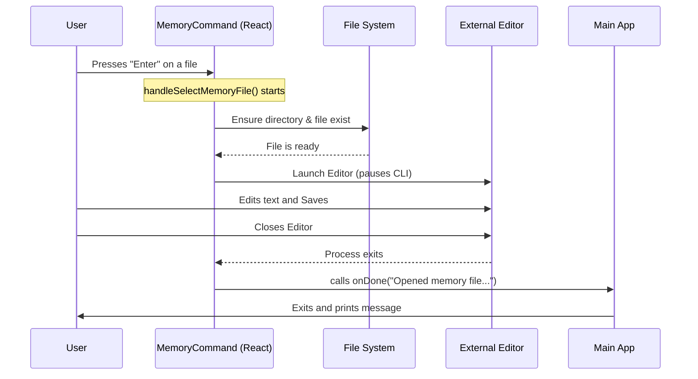

# Chapter 3: Interactive CLI Component

In the previous chapter, [Async Command Lifecycle](02_async_command_lifecycle.md), we learned how to prepare our data before showing anything to the user. We ended with the `call` function returning a line of code that looked like this:

```typescript
return <MemoryCommand onDone={onDone} />;
```

Now, we need to answer the big question: **What exactly is `<MemoryCommand />`?**

### The Concept: React in the Terminal

Usually, when you think of React, you think of websites with HTML, CSS, and buttons. But in this project, we are using a library called **Ink**. Ink allows us to use React components to build user interfaces inside the black-and-white text box of your terminal.

**The Use Case:**
We want to present the user with a list of "memory files." The user should be able to:
1.  Use arrow keys to highlight a file.
2.  Press `Enter` to edit it.
3.  Press `Esc` to cancel.

Instead of typing complex commands like `memory edit --file=project-alpha`, the user just sees a menu. The `MemoryCommand` component is the "brain" that manages this entire interaction.

---

### Step-by-Step Implementation

The `MemoryCommand` is a React Functional Component. It acts as a **Controller**: it listens for events (like a user selecting a file) and decides what to do next.

#### 1. The Component Structure

First, let's look at the basic shape of the component. It receives one important tool: `onDone`.

```typescript
// We accept 'onDone' as a prop (a tool passed down from the parent)
function MemoryCommand({ onDone }: { 
  onDone: (result?: string, options?: any) => void 
}): React.ReactNode {
  
  // Logic and Event Handlers will go here...

  // The UI (What the user sees) goes here...
  return <Dialog title="Memory" ...> ... </Dialog>;
}
```

**Explanation:**
*   **`onDone`**: Think of this as the "Eject Button." When the user finishes their task (or cancels), our component calls this function to tell the CLI app to shut down and print a message.

#### 2. The View (Rendering the UI)

Inside the `return` statement, we define what the user sees. We use a `Dialog` (a frame) and a `MemoryFileSelector` (the list of files).

```typescript
  return (
    <Dialog title="Memory" onCancel={handleCancel} color="remember">
      <Box flexDirection="column">
        <React.Suspense fallback={null}>
          <MemoryFileSelector 
            onSelect={handleSelectMemoryFile} 
            onCancel={handleCancel} 
          />
        </React.Suspense>
        {/* Footer Link code omitted for brevity */}
      </Box>
    </Dialog>
  );
```

**Explanation:**
*   **`<Dialog>`**: Draws a nice border around our content. It knows that if the user presses `Esc`, it should run `handleCancel`.
*   **`<MemoryFileSelector>`**: This is a sub-component that renders the actual list of files. We will learn how it finds files in [Memory File Provisioning](04_memory_file_provisioning.md).
*   **`onSelect`**: We pass a function here. It says, "When the user hits Enter on a file, run `handleSelectMemoryFile`."

#### 3. Handling Cancellation

What happens if the user changes their mind? We need a simple function to exit gracefully.

```typescript
  const handleCancel = () => {
    // Call the "Eject Button" with a message
    onDone('Cancelled memory editing', {
      display: 'system' // formatting style
    });
  };
```

**Explanation:**
*   This function doesn't edit anything. It simply tells the CLI application to stop running and print "Cancelled memory editing" to the screen.

#### 4. Handling Selection (The Core Logic)

This is the most complex part. When a user picks a file, we need to ensure the file exists and then open it.

**Part A: Ensuring the File Exists**
Before we open a file, we must make sure the computer actually has it on the disk.

```typescript
  const handleSelectMemoryFile = async (memoryPath: string) => {
    try {
      // 1. Create the folder if it's missing
      if (memoryPath.includes(getClaudeConfigHomeDir())) {
        await mkdir(getClaudeConfigHomeDir(), { recursive: true });
      }

      // 2. Create an empty file if it's missing
      // (We use a special flag 'wx' to avoid overwriting existing text)
      await writeFile(memoryPath, '', { encoding: 'utf8', flag: 'wx' });
```

**Explanation:**
*   **`mkdir`**: Makes the directory (folder) if it doesn't exist yet.
*   **`writeFile`**: Creates the file. The flag `'wx'` acts like a safety guard—it creates the file *only* if it doesn't exist. If the file is already there, it does nothing (preserving your data).

**Part B: Opening the Editor**
Once the file is safe on the disk, we hand control over to the text editor.

```typescript
      // 3. Pause the CLI and open the text editor (Vim, Nano, VS Code, etc.)
      await editFileInEditor(memoryPath);

      // 4. When the editor closes, we are done!
      onDone(`Opened memory file at ${getRelativeMemoryPath(memoryPath)}`, {
        display: 'system'
      });
      
    } catch (error) {
      // If anything exploded, log it and exit.
      onDone(`Error opening memory file: ${error}`);
    }
  };
```

**Explanation:**
*   **`editFileInEditor`**: This pauses our React app and launches a program like Vim or VS Code. We will cover how this integration works in detail in [External Editor Integration](05_external_editor_integration.md).
*   **`onDone` (Success)**: Once the user saves and closes the text editor, our code resumes, and we call `onDone` to tell the user "Success!"

---

### Under the Hood: The Flow of Interaction

How does a React component control a terminal window? Let's visualize the flow when a user selects a file.



#### Internal Implementation Details

1.  **Ink Rendering:** When we write `<Box>` or `<Text>`, Ink translates these into ANSI escape codes. These are special invisible characters that tell your terminal "make this text red" or "move the cursor to line 5."
2.  **Suspense:** You might have noticed `<React.Suspense>` in the code. Because reading the file list from the hard drive takes a few milliseconds, Suspense allows React to wait gracefully. However, thanks to our work in the [Async Command Lifecycle](02_async_command_lifecycle.md), the data is usually pre-loaded, so the user sees the list instantly.
3.  **Error Handling:** We wrap the file operations in a `try/catch` block. File systems are messy—permissions might be denied, or disks might be full. This ensures that if the file system fails, the application doesn't crash; it just informs the user via `onDone`.

### Summary

In this chapter, we built the **Interactive CLI Component**.
*   We used **React and Ink** to create a visual interface in the terminal.
*   We acted as a **Controller**, handling user inputs (Select vs. Cancel).
*   We managed **Side Effects**, creating files on the disk before opening them.

Right now, our component uses a sub-component called `MemoryFileSelector` to list the files. But how does that selector know *which* files to show? And where do these files actually live?

[Next Chapter: Memory File Provisioning](04_memory_file_provisioning.md)

---

Generated by [Code IQ](https://github.com/adityasoni99/Code-IQ)