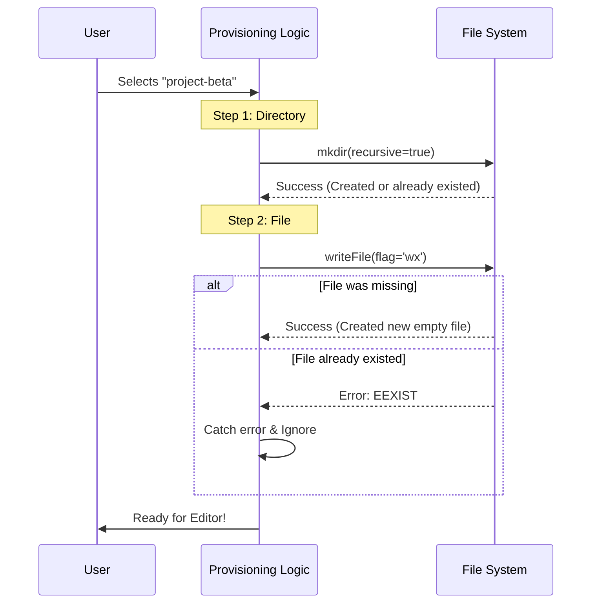

# Chapter 4: Memory File Provisioning

In the previous chapter, [Interactive CLI Component](03_interactive_cli_component.md), we built a beautiful user interface that allows users to select a file. But what happens exactly when the user hits `Enter`?

The computer can't just "open" a file that doesn't exist yet. If we try to open a text editor for a file inside a folder that isn't there, the program might crash or fail to save.

This brings us to **Memory File Provisioning**.

### The Problem: The Missing Countertop

Imagine you are a chef about to cook a meal. You reach for a bowl to mix ingredients, but the counter is empty. There is no bowl. There isn't even a counter! You can't cook in thin air.

In our application, the "Counter" is the **Directory (Folder)**, and the "Bowl" is the **File**.

**The Use Case:**
1.  The user selects a memory file named `project-beta` from the menu.
2.  This file has never been created before.
3.  The folder `~/.config/claude/memory/` might not even exist yet.
4.  We need to guarantee these exist *before* the text editor launches.

---

### Concept: Idempotency

We use a fancy programming concept called **Idempotency**.

*   **Non-Idempotent:** "Create the folder." (If you run this twice, it crashes the second time saying "Folder already exists").
*   **Idempotent:** "Ensure the folder exists." (If you run this 100 times, it creates it the first time, and does nothing the other 99 times. It never crashes).

Our provisioning logic acts like a **Prep Chef**: "I don't care if the bowl is already there or if I need to get a new one. I just promise that when you start cooking, there will be a bowl."

---

### Step-by-Step Implementation

This logic lives inside the `handleSelectMemoryFile` function in `memory.tsx`. Let's break it down into two simple steps.

#### Step 1: Ensuring the Directory Exists

First, we check if the file path we want to edit is inside our configuration folder. If it is, we force the creation of that folder.

```typescript
// 1. Create the directory if it's missing
if (memoryPath.includes(getClaudeConfigHomeDir())) {
  // 'recursive: true' means create parent folders too if needed
  await mkdir(getClaudeConfigHomeDir(), {
    recursive: true
  });
}
```

**Explanation:**
*   `mkdir`: This stands for "Make Directory."
*   `recursive: true`: This is the magic setting. If we need to create `folder A` inside `folder B`, but `folder B` doesn't exist, this setting creates both `B` and `A` automatically. It also acts **idempotently**—if the folder exists, it doesn't complain.

#### Step 2: Ensuring the File Exists

Now that we have a folder, we need to make sure the file exists. But we have to be very careful! **We must not overwrite existing data.**

```typescript
try {
  // 2. Try to create an empty file
  await writeFile(memoryPath, '', {
    encoding: 'utf8',
    // 'wx' means: Write, but fail if eXists
    flag: 'wx'
  });
} catch (e) {
  // If error is NOT "File Exists", then it's a real problem
  if (getErrnoCode(e) !== 'EEXIST') {
    throw e;
  }
}
```

**Explanation:**
*   `writeFile(path, '')`: We try to write an empty string to the file.
*   `flag: 'wx'`: This is our safety guard.
    *   **w**: Write mode.
    *   **x**: Exclusive mode. This tells the system: "Only write this file if it creates a *new* one. If the file is already there, throw an error."
*   `catch`: We catch that error. If the error says `EEXIST` (File Exists), we celebrate! It means our data is safe. We simply ignore the error and move on.

---

### Under the Hood: The Flow

Let's visualize how the "Prep Chef" prepares the kitchen before the "Head Chef" (the Editor) starts cooking.



### Deep Dive: Why not just check if it exists?

Beginners often ask: *Why don't we just use `fs.exists()`?*

Example of **Bad Logic (Race Condition):**
1.  Check if file exists? -> No.
2.  (Microsecond delay... maybe another process creates the file).
3.  Create new empty file. -> **Boom!** You just overwrote the file created in step 2.

By using the `wx` flag in `writeFile`, we ask the Operating System to perform an **Atomic Operation**. The check and the creation happen at the exact same instant. It is physically impossible for another process to slip in between. This makes our application robust and professional.

### Summary

In this chapter, we learned about **Memory File Provisioning**.

*   We solved the "Missing Countertop" problem ensuring folders exist before we use them.
*   We used **Idempotency** to make sure our code is safe to run multiple times.
*   We used the `wx` flag to safely create files without accidentally deleting user data.

Now that the file system is guaranteed to be ready (provisioned), we can finally hand off control to the user's preferred text editor (like Vim, Nano, or VS Code).

[Next Chapter: External Editor Integration](05_external_editor_integration.md)

---

Generated by [Code IQ](https://github.com/adityasoni99/Code-IQ)