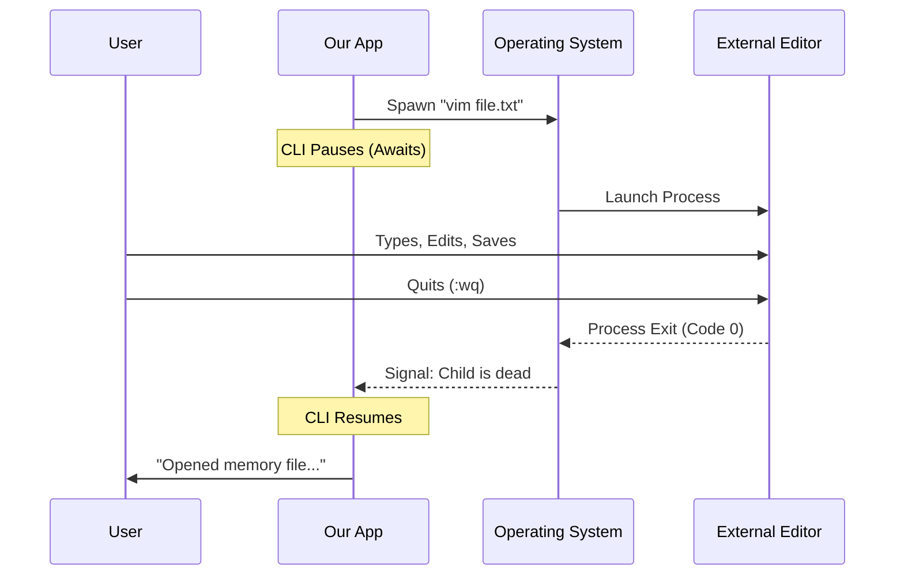

# Chapter 5: External Editor Integration

In the previous chapter, [Memory File Provisioning](04_memory_file_provisioning.md), we acted like a prep chef. We ensured the "kitchen" (directory) existed and placed a "bowl" (the file) on the counter.

But our CLI tool isn't a text editor. It doesn't know how to highlight syntax, move cursors, or handle shortcuts. Instead of trying to build a bad version of Microsoft Word inside our terminal, we are going to do something smarter: **we will hire a professional.**

This chapter covers **External Editor Integration**: how to pause our application, hand control over to a tool like Vim, Nano, or VS Code, and wait for the user to finish.

### The Problem: Reinventing the Wheel

Building a text editor is incredibly difficult. If we tried to let users type directly into our CLI prompt, they would miss features they love (like `Ctrl+Z` to undo or syntax highlighting).

**The Use Case:**
1.  The user selects a file to edit.
2.  Suddenly, their screen clears, and **Vim** (or their preferred editor) appears with the file open.
3.  They edit the text and save.
4.  When they quit the editor, they are instantly back in our CLI application.

---

### Step-by-Step Implementation

The heavy lifting is done by a utility function called `editFileInEditor`. This function acts as the bridge between our app and the system tools.

#### 1. The Handoff

In our main code (`memory.tsx`), inside the `handleSelectMemoryFile` function, we utilize this bridge.

```typescript
// We have the path to the file (from the previous chapter)
const memoryPath = '/Users/me/.config/claude/memory/project.md';

// PAUSE here and open the external program
await editFileInEditor(memoryPath);

// This line only runs AFTER the user closes the editor
console.log("Welcome back!");
```

**Explanation:**
*   **`await`**: This is crucial. It freezes our JavaScript execution.
*   **`editFileInEditor`**: This function takes over the terminal screen. It hides our app and shows the editor.
*   **Resuming**: Once the editor process ends (the user quits), our code unfreezes and continues to the next line.

#### 2. Identifying the Editor

How do we know which editor to open? Some people love **Vim**, others prefer **Nano** or **VS Code**. We shouldn't guess; we should ask the environment.

We check two standard "Environment Variables": `$VISUAL` and `$EDITOR`.

```typescript
// Determine which variable determines the editor
let editorSource = 'default';
let editorValue = '';

if (process.env.VISUAL) {
  editorSource = '$VISUAL';
  editorValue = process.env.VISUAL;
} else if (process.env.EDITOR) {
  editorSource = '$EDITOR';
  editorValue = process.env.EDITOR;
}
```

**Explanation:**
*   **`process.env`**: This accesses settings on the user's computer.
*   **`$VISUAL`**: Usually the preferred editor for full-screen terminal tasks (like Vim).
*   **`$EDITOR`**: The fallback editor (often simpler, like Nano or Ed).

#### 3. Providing User Feedback

It can be confusing if a program suddenly opens Vim and you don't know why. We want to be helpful and tell the user *what* we just did.

```typescript
// Create a helpful message based on what we found
const editorInfo = editorSource !== 'default' 
  ? `Using ${editorSource}="${editorValue}".` 
  : '';

const editorHint = editorInfo
  ? `> ${editorInfo} To change, set $EDITOR or $VISUAL.`
  : `> To change editor, set the $EDITOR env variable.`;
```

**Explanation:**
*   If we used their custom setting, we confirm it: *"Using $EDITOR=nano"*.
*   If we used the default, we teach them how to change it: *"To use a different editor, set the $EDITOR variable."*

---

### Under the Hood: The "Spawn" Concept

How does one program run another program? In Node.js, we use a feature called `spawn`.

Think of it like passing a baton in a relay race.
1.  **CLI** creates a "Child Process" (The Editor).
2.  **CLI** connects the user's Keyboard and Screen directly to the **Child**.
3.  **CLI** goes to sleep.
4.  When the **Child** finishes, it wakes up the **CLI**.



### Deep Dive: Internal Implementation

The `editFileInEditor` helper function (located in `utils/promptEditor.ts`) handles the complexity of `spawn`. Here is a simplified version of what that logic looks like.

#### The Spawn Logic

```typescript
import { spawn } from 'child_process';

export function editFileInEditor(path: string): Promise<void> {
  // 1. Pick the editor command (default to 'vi' if nothing is set)
  const editor = process.env.VISUAL || process.env.EDITOR || 'vi';

  return new Promise((resolve, reject) => {
    // 2. Launch the editor
    const child = spawn(editor, [path], {
      stdio: 'inherit' // THE SECRET SAUCE
    });
```

**Explanation:**
*   **`vi`**: The fallback. Almost every Unix system has `vi` installed, so it's a safe bet if the user hasn't configured anything.
*   **`stdio: 'inherit'`**: This is the most important line. It tells Node.js: *"Let the child process use my Input (Keyboard) and my Output (Screen)."* Without this, the editor would open in the background, invisible and unusable.

#### Handling the Exit

We wrap this in a Promise so we can `await` it. We listen for the `exit` event.

```typescript
    // 3. Listen for when the editor closes
    child.on('exit', (code) => {
      if (code === 0) {
        resolve(); // Success!
      } else {
        reject(new Error(`Editor exited with code ${code}`));
      }
    });
  });
}
```

**Explanation:**
*   **`code === 0`**: In computer systems, an exit code of `0` means "Everything went perfectly." Anything else usually indicates a crash or error.

### Summary of the Series

Congratulations! You have completed the **Memory** project tutorial. Let's recap the journey:

1.  **[Command Module Definition](01_command_module_definition.md)**: We taught the CLI that a command named `memory` exists.
2.  **[Async Command Lifecycle](02_async_command_lifecycle.md)**: We learned to load data *before* showing the UI to prevent flickering.
3.  **[Interactive CLI Component](03_interactive_cli_component.md)**: We built a visual menu using React and Ink.
4.  **[Memory File Provisioning](04_memory_file_provisioning.md)**: We ensured files safely exist on the hard drive before touching them.
5.  **External Editor Integration**: We learned to hand off control to system tools like Vim or Nano.

You now understand the architecture of a professional-grade CLI tool that integrates seamlessly with the user's environment!

---

Generated by [Code IQ](https://github.com/adityasoni99/Code-IQ)