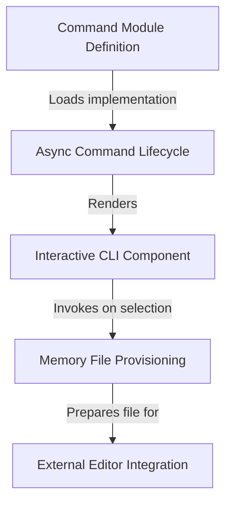

# Tutorial: memory

This tool provides a **CLI command** for managing and editing *Claude's memory files*. It features an interactive terminal UI that handles the **lifecycle** of selecting files, ensures necessary directories and files exist via **provisioning**, and seamlessly integrates with the user's default **external editor**.

## Chapters

1. [Command Module Definition](01_command_module_definition.md)
2. [Async Command Lifecycle](02_async_command_lifecycle.md)
3. [Interactive CLI Component](03_interactive_cli_component.md)
4. [Memory File Provisioning](04_memory_file_provisioning.md)
5. [External Editor Integration](05_external_editor_integration.md)

---

Generated by [Code IQ](https://github.com/adityasoni99/Code-IQ)