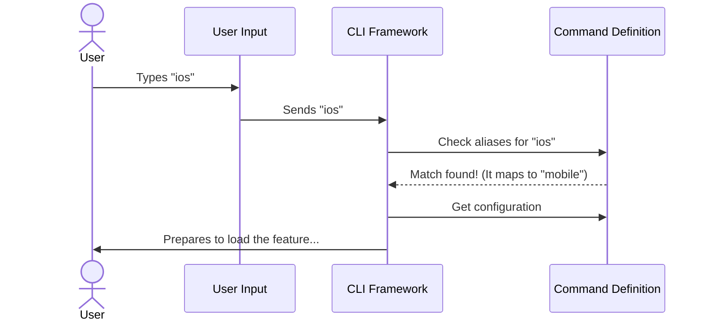

# Chapter 1: Command Definition

Welcome to the **mobile** project! In this tutorial, we will build a command-line interface (CLI) tool. By the end of this chapter, you will understand the very first step of creating a CLI feature: defining what the command is and how users call it.

## The Motivation: The Restaurant Menu

Imagine you walk into a restaurant. Before you can eat, you need to look at a **menu**. The menu tells you:
1.  **What is available** (e.g., "Cheeseburger").
2.  **A description** (e.g., "Beef patty with cheddar").
3.  **The code/number** to order it (e.g., "Item #5").

Without the menu, the kitchen has the food, but you have no way to ask for it.

In a CLI, the **Command Definition** is exactly like that menu item. The system (the CLI framework) needs to know that a feature exists, what name triggers it, and a helpful description to show users when they ask for help.

### The Use Case
We want to build a feature where a user can type:
`claude mobile`
...and see a QR code to download the mobile app.

We also want them to be able to type `claude ios` or `claude android` to get the same result.

## Defining the Command

To solve this, we need to create a "contract" or a definition object. This object tells the CLI framework exactly how to handle our new feature.

Let's look at the file `index.ts`. We will break it down into small pieces.

### Step 1: Naming the Command

First, we define the core identity of our command.

```typescript
// We import the 'Command' type to ensure we follow the rules
import type { Command } from '../../commands.js'

const mobile = {
  type: 'local-jsx',
  name: 'mobile',
```

**Explanation:**
*   `type: 'local-jsx'`: This tells the framework *how* to render the output. We will learn exactly what this means in [Chapter 2: Local JSX UI Handler](02_local_jsx_ui_handler.md).
*   `name: 'mobile'`: This is the primary keyword. When the user types `mobile`, this command is selected.

### Step 2: Aliases and Description

Next, we add flexibility and documentation.

```typescript
  // Alternative words that trigger this same command
  aliases: ['ios', 'android'],

  // A helpful text shown in the help menu
  description: 'Show QR code to download the Claude mobile app',
```

**Explanation:**
*   `aliases`: Just like a nickname. If a user types `ios` or `android` instead of `mobile`, the CLI knows to run this same command.
*   `description`: If the user types `claude --help`, this text appears next to the command name so they know what it does.

### Step 3: Connecting the Logic

Finally, we tell the command where to find the actual code to run, and we export the definition.

```typescript
  // Lazy load the actual code file
  load: () => import('./mobile.js'),
} satisfies Command

export default mobile
```

**Explanation:**
*   `load`: This function points to the file that contains the actual logic (the UI and QR code). This uses a technique called **Lazy Loading**, which we will cover in detail in [Chapter 5: Lazy Module Loading](05_lazy_module_loading.md).
*   `satisfies Command`: This is a TypeScript check. It acts like a spell-checker, ensuring our object creates a valid "Menu Item."

## Under the Hood: How it Works

When you run the CLI, the framework doesn't load every single feature immediately. Instead, it just reads these **Command Definitions**.

Here is what happens when a user interacts with the CLI:



### The Internal Contract

The `Command` type we imported acts as a strict form. If you try to create a command without a `name` or a `description`, the code will show an error (red squiggly lines) before you even run it.

This structure allows the CLI to be lightweight. It knows *about* the 'mobile' command (name, description, aliases) without having to load the heavy code required to generate QR codes until the user actually asks for it.

## Conclusion

You have just created the entry point for your feature!
1.  You gave it a **Name** (`mobile`).
2.  You gave it **Aliases** (`ios`, `android`).
3.  You described what it does.

However, right now, our command is just a menu item. If you order it, the kitchen doesn't know how to cook the dish yet. We need to define what the user actually *sees* when the command runs.

In the next chapter, we will build the user interface for this command.

[Next Chapter: Local JSX UI Handler](02_local_jsx_ui_handler.md)

---

Generated by [Code IQ](https://github.com/adityasoni99/Code-IQ)