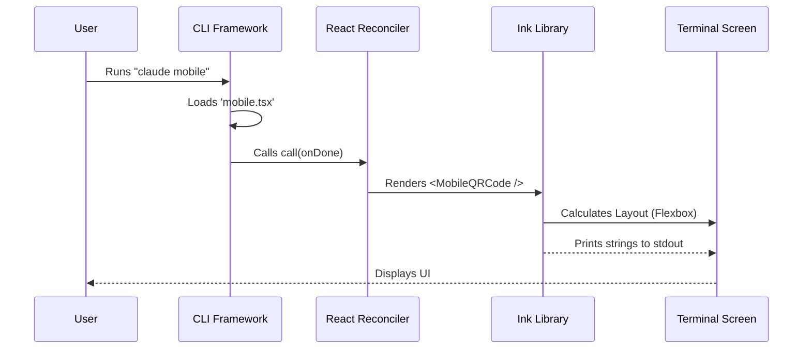

# Chapter 2: Local JSX UI Handler

In the previous chapter, [Chapter 1: Command Definition](01_command_definition.md), we added our "item to the menu." We told the CLI that a command named `mobile` exists.

However, if you try to run it now, nothing happens. It's like ordering a dish at a restaurant, but the plate arrives empty.

In this chapter, we will build the **Local JSX UI Handler**. This is the "View" layer. We will learn how to build a graphical interface inside the terminal using React.

## The Motivation: Plating the Dish

Most command-line tools just print text and exit:
```text
$ echo "Hello"
Hello
$ _
```

But we want something richer. We want a "mini-application" that stays open, displays a QR code, and lets the user switch between iOS and Android versions.

To do this, we use **React**. Yes, the same React used for websites! But instead of HTML elements like `<div>` or `<span>`, we use special terminal components like `<Box>` and `<Text>`.

## The Visual Components

We are working in the file `mobile.tsx`. Let's break down how we construct this interface.

### Step 1: The Component Structure

Just like a web app, our CLI feature is a React functional component. It receives a special prop called `onDone`.

```tsx
import * as React from 'react';
import { Box, Text } from '../../ink.js';

type Props = {
  onDone: () => void;
};

function MobileQRCode({ onDone }: Props) {
  // Logic goes here...
  return <Text>Hello World</Text>;
}
```

**Explanation:**
*   `MobileQRCode`: This is our main component.
*   `onDone`: This is a function passed down by the framework. When our command is finished (e.g., the user presses 'q'), we call this function to tell the CLI to close our window and return to the normal terminal prompt.

### Step 2: Managing State

We need our UI to be interactive. We want to toggle between "iOS" and "Android". We use standard React hooks for this.

```tsx
import { useState } from 'react';

// Inside MobileQRCode function:
const [platform, setPlatform] = useState<'ios' | 'android'>('ios');

// We also store the generated QR strings here
const [qrCodes, setQrCodes] = useState({ ios: '', android: '' });
```

**Explanation:**
*   `platform`: Tracks which tab is active. It starts as `'ios'`.
*   `useState`: This works exactly like it does in web development. When `platform` changes, the terminal redraws the screen to update the UI.

### Step 3: Layout with Boxes

In the terminal, we can't use CSS files. Instead, we use a component called `Box` (powered by Yoga Layout, similar to Flexbox in CSS).

```tsx
// Inside the return statement:
return (
  <Pane>
    <Box flexDirection="column" gap={1}>
      <Text>Scan the QR Code below:</Text>
      {/* QR Code Text Lines will go here */}
    </Box>
  </Pane>
);
```

**Explanation:**
*   `Pane`: A wrapper that handles basic spacing around our "window".
*   `Box`: Acts like a `<div>` with `display: flex`.
*   `flexDirection="column"`: Stacks items vertically.
*   `gap={1}`: Adds a space (1 character height) between the items.

### Step 4: Styling Text

We can make text bold, underlined, or colored using props on the `Text` component.

```tsx
<Box flexDirection="row" gap={2}>
  <Text bold={platform === 'ios'} underline={platform === 'ios'}>
    iOS
  </Text>
  <Text dimColor> / </Text>
  <Text bold={platform === 'android'} underline={platform === 'android'}>
    Android
  </Text>
</Box>
```

**Explanation:**
*   This draws our "Tabs".
*   `bold={platform === 'ios'}`: If we are currently on iOS, make that text bold. This gives the user visual feedback on which tab is selected.

## Connecting the Logic

Now that we have a Component, how does the CLI know to run it?

At the bottom of `mobile.tsx`, we export a specific function named `call`. This is the "bridge" between the CLI framework and our React code.

```tsx
import type { LocalJSXCommandOnDone } from '../../types/command.js';

export async function call(onDone: LocalJSXCommandOnDone) {
  return <MobileQRCode onDone={onDone} />;
}
```

**Explanation:**
*   Remember `type: 'local-jsx'` from Chapter 1? Because we used that type, the framework looks for this `call` function.
*   It passes the `onDone` capability to us.
*   We simply return our React component (`<MobileQRCode />`), and the framework handles the rendering.

## Under the Hood: Rendering to Terminal

It might seem like magic that React can render to a terminal window. Here is the flow of data:



1.  **Reconciler:** React calculates what the UI should look like.
2.  **Ink:** This library takes the React output and translates it into ANSI escape codes (special hidden characters that tell the terminal to move the cursor, change colors, or clear lines).
3.  **Stdout:** The CLI writes these characters to the standard output, just like `console.log`, but much faster and smarter.

## Putting it Together

We now have a visual interface!
1.  We created a **React Component**.
2.  We used **Box** and **Text** for layout.
3.  We connected it via the **call** function.

However, if you look at the full code, there are two major things missing from our explanation:
1.  The keys (Left/Right arrows) don't actually *do* anything yet.
2.  The QR code is just empty strings right now.

To make this interactive, we need to handle user input events and generate data asynchronously.

In the next chapter, we will learn how to make our interface respond to keyboard presses.

[Next Chapter: Event-Driven Input Handling](03_event_driven_input_handling.md)

---

Generated by [Code IQ](https://github.com/adityasoni99/Code-IQ)