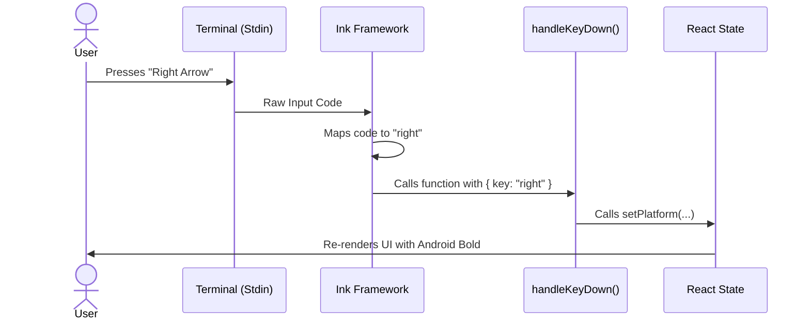

# Chapter 3: Event-Driven Input Handling

In the previous chapter, [Chapter 2: Local JSX UI Handler](02_local_jsx_ui_handler.md), we built the visual layer of our command. We created a component that displays "iOS" and "Android" tabs.

However, if you run the code now, it feels like a screenshot. You can press the Left or Right arrow keys, but the tabs don't switch. You can press 'Q' to quit, but the application stays open until you force-kill the terminal.

In this chapter, we will implement **Event-Driven Input Handling**. We will turn our static "screenshot" into a playable "game" by listening for user keystrokes.

## The Motivation: The Game Controller

Think of your CLI application like a video game.
*   **The Hardware:** The user's keyboard.
*   **The Events:** Pressing a key (like 'Tab', 'Q', or 'ArrowRight').
*   **The Action:** Changing the screen (switching tabs) or closing the game.

Without input handling, your application is playing a movie. With input handling, it becomes interactive.

### The Use Case
We want to achieve two specific interactions:
1.  **Navigation:** When the user presses **Tab** or **Arrow Keys**, switch the active platform (iOS <-> Android).
2.  **Exit:** When the user presses **Q** or **Ctrl+C**, close the application cleanly.

## Key Concepts

To make this work in a terminal (using the Ink library), we need three things: Focus, an Event Listener, and a Handler Function.

### 1. Focus (The Spotlight)
In a graphical window, you click a text box to type in it. In a terminal, we use `autoFocus`. This tells the system: "Direct all keyboard clicks to this specific component."

### 2. The Event Listener (`onKeyDown`)
This is a specific prop on the `<Box>` component. It acts like a sensor. It sits and waits specifically for a key to be pressed down.

### 3. The Handler Function
This is the brain. When the sensor triggers, it runs this function. We look at *which* key was pressed and decide what to do.

## Implementing the Logic

Let's look at `mobile.tsx`. We will build the `handleKeyDown` function.

### Step 1: Handling the Exit Logic

First, we need a way to leave. We look for 'q' or the standard interrupt command (Ctrl+C).

```tsx
// e represents the KeyboardEvent
function handleKeyDown(e: KeyboardEvent) {
  // Check if key is 'q' OR (Ctrl AND 'c')
  if (e.key === 'q' || (e.ctrl && e.key === 'c')) {
    // Stop the letter 'q' from being printed to the screen
    e.preventDefault(); 
    
    // Call the function provided by the CLI to close everything
    onDone();
    return;
  }
  // ... more logic coming
}
```

**Explanation:**
*   `e.key`: Tells us which button was pressed.
*   `e.preventDefault()`: This is crucial. Without it, the terminal might print the letter "q" into your nice UI before closing.
*   `onDone()`: This calls the function we accepted as a prop in Chapter 2, effectively saying "The command is finished."

### Step 2: Handling Navigation

Next, inside the *same* function, we add logic to switch tabs.

```tsx
  // ... exit logic from above matches here ...

  // Check for navigation keys
  if (e.key === 'tab' || e.key === 'left' || e.key === 'right') {
    e.preventDefault();
    
    // Toggle the state between 'ios' and 'android'
    setPlatform(prev => (prev === 'ios' ? 'android' : 'ios'));
  }
}
```

**Explanation:**
*   We listen for multiple keys (`tab`, `left`, `right`) to make the app feel intuitive.
*   `setPlatform`: We use the React state setter from Chapter 2. When this runs, React notices the data changed and automatically re-renders the UI to highlight the correct tab.

### Step 3: Connecting the Handler to the UI

Writing the function isn't enough; we have to attach it to our visual component.

```tsx
return (
  <Pane>
    <Box 
      flexDirection="column" 
      // 1. Give this box permission to listen
      tabIndex={0} 
      // 2. Automatically focus on start
      autoFocus={true} 
      // 3. Connect our brain (handler) to the box
      onKeyDown={handleKeyDown}
    >
      {/* ... UI Text Components ... */}
    </Box>
  </Pane>
);
```

**Explanation:**
*   `autoFocus={true}`: As soon as the command runs, this Box starts listening.
*   `onKeyDown={handleKeyDown}`: This connects our logic function to the component.

## Under the Hood: The Event Loop

How does a physical key press result in the screen changing? Here is the flow of data:



### Internal Implementation Details

The CLI framework uses a standard React event system adapted for Node.js.

1.  **Raw Input:** When you press keys in a terminal, they are sent as raw streams of text (Standard Input or `stdin`). For example, 'Right Arrow' might actually look like `^[[C` to the computer.
2.  **Normalization:** The Ink library acts as a translator. It converts `^[[C` into a clean object: `{ key: "right" }`.
3.  **Bubbling:** Just like in a web browser, the event allows you to `preventDefault`. If you don't prevent default on 'Ctrl+C', the Node.js process might crash immediately instead of closing gracefully.

## Putting it Together

By combining the **State** from Chapter 2 with the **Events** from Chapter 3, we have a working loop:
1.  **State** determines what the user sees.
2.  **Events** update the State.
3.  **React** updates the view.

We now have a responsive application! You can switch tabs and quit.

**But wait...** the QR codes are still empty strings! We are switching tabs, but the content isn't there yet. Generating a QR code takes computation power, and we shouldn't block the UI while calculating it.

In the next chapter, we will learn how to generate this data in the background without freezing our new responsive UI.

[Next Chapter: Asynchronous Data Generation](04_asynchronous_data_generation.md)

---

Generated by [Code IQ](https://github.com/adityasoni99/Code-IQ)