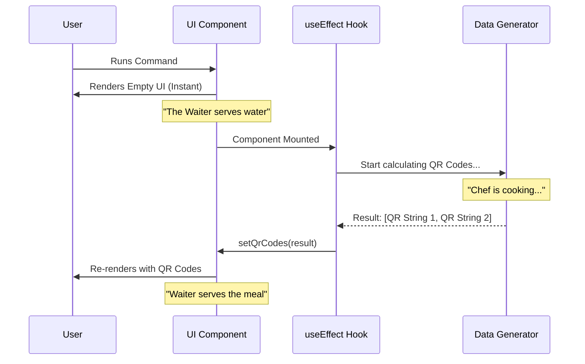

# Chapter 4: Asynchronous Data Generation

In the previous chapter, [Chapter 3: Event-Driven Input Handling](03_event_driven_input_handling.md), we brought our CLI to life. You can press keys to switch tabs and exit the app.

However, you may have noticed a missing piece: the actual QR code. Currently, our app switches between "iOS" and "Android" labels, but the content area is empty.

In this chapter, we will fill that empty space using **Asynchronous Data Generation**. We will learn how to perform "heavy" tasks (like generating complex QR images) without freezing your application.

## The Motivation: The Chef and The Waiter

To understand why we need this, let's go back to our restaurant analogy.

1.  **Synchronous (Blocking):** You order a steak. The waiter walks to the kitchen, cooks the steak himself, and brings it to you. While he is cooking, he cannot take anyone else's order. The entire dining room stops moving.
2.  **Asynchronous (Non-Blocking):** You order a steak. The waiter gives the ticket to the chef and immediately goes back to serving other tables (keeping the UI responsive). When the chef yells "Order up!", the waiter brings you the food.

Generating a QR code requires math. It converts a URL into a grid of black and white blocks. If we did this math on the "main thread" (the waiter), your terminal would freeze for a split second every time the app opens.

We want the **Asynchronous** approach: Show the UI immediately, calculate the QR code in the background, and update the screen when it's ready.

## The Solution: `useEffect`

In React (and Ink), we use a specific tool (hook) called `useEffect` to handle these background tasks.

Let's implement this in `mobile.tsx`.

### Step 1: Preparing the Plate (State)

First, we need a place to store the QR codes once they are "cooked." We use `useState` just like we did for the tabs.

```tsx
// Inside MobileQRCode function
const [qrCodes, setQrCodes] = useState({ 
  ios: '', 
  android: '' 
});
```

**Explanation:**
*   We start with empty strings `''`.
*   This ensures the UI can render *something* (even if it's blank) instantly.

### Step 2: The Recipe (Generation Logic)

We need a function that does the heavy lifting. We use the `qrcode` library to convert our URLs into terminal-friendly strings.

```tsx
// Inside useEffect (coming up next)
async function generateQRCodes() {
  // Generate both codes at the same time
  const [ios, android] = await Promise.all([
    qrToString(PLATFORMS.ios.url),
    qrToString(PLATFORMS.android.url)
  ]);
  
  // Serve the food (Update state)
  setQrCodes({ ios, android });
}
```

**Explanation:**
*   `async/await`: This tells JavaScript, "This might take a while, don't block the rest of the app."
*   `Promise.all`: This is like having two chefs. We cook the iOS code and Android code simultaneously to save time.
*   `setQrCodes`: Once the data is ready, we update the state. This triggers a re-render.

### Step 3: The Trigger (useEffect)

Now, we tell React *when* to run this logic. We want it to run exactly once: immediately after the component appears on the screen.

```tsx
useEffect(() => {
  // 1. Define the async work
  const work = async () => {
    await generateQRCodes();
  };

  // 2. Start the work
  work();
}, []); // <--- The empty array is important!
```

**Explanation:**
*   `useEffect`: A function that runs *after* the paint.
*   `[]` (Dependency Array): This list tells React when to re-run the effect. An empty list `[]` means "Run only on mount" (when the app first starts). Without this, the app might try to generate QR codes forever in a loop!

## Under the Hood: The Render Cycle

It is important to understand the sequence of events. The user sees the interface *before* the data is ready.



## Putting it Together

When we combine the input handling from [Chapter 3: Event-Driven Input Handling](03_event_driven_input_handling.md) with this data fetching, we get a complete experience.

1.  **Frame 1:** App opens. Tabs are visible. QR area is blank. Keys work immediately.
2.  **Background:** The CPU calculates the QR blocks.
3.  **Frame 2:** The QR code "pops" into existence a fraction of a second later.

Here is the combined code logic as seen in `mobile.tsx`:

```tsx
// 1. We get the current platform from State (Chapter 2)
const { url } = PLATFORMS[platform];
const qrCode = qrCodes[platform];

// 2. We split the long QR string into lines to draw them
const lines = qrCode.split('\n');

// 3. We map over the lines to draw them (The View)
return (
  <Box flexDirection="column">
    {lines.map((line, i) => (
      <Text key={i}>{line}</Text>
    ))}
  </Box>
);
```

**Explanation:**
*   If `qrCode` is still empty (waiting for the chef), `lines` will be empty, and nothing draws.
*   As soon as `setQrCodes` runs, React updates `qrCode`, recalculates `lines`, and draws the image.

## Why is this "Better"?

You might ask: "Computers are fast. Why not just generate the code normally?"

In a CLI, "jank" (stuttering) is very noticeable. If we generated the code synchronously:
1.  User types `mobile`.
2.  Terminal freezes for 200ms (feels like a lag).
3.  UI appears.

By doing it **Asynchronously**:
1.  User types `mobile`.
2.  UI appears instantly (0ms lag).
3.  Content fills in 200ms later.

This "perceived performance" makes the tool feel professional and snappy.

## Conclusion

We now have a fully functional feature!
1.  Defined the command.
2.  Built the UI layout.
3.  Added keyboard interaction.
4.  Generated data in the background.

However, there is one final optimization. Right now, the code for generating QR codes (`qrcode` library) is loaded into memory as soon as the CLI starts, even if the user just wants to check the `version`. This slows down the startup time of the entire CLI.

In the final chapter, we will learn how to keep the CLI fast by only loading this code when it is actually needed.

[Next Chapter: Lazy Module Loading](05_lazy_module_loading.md)

---

Generated by [Code IQ](https://github.com/adityasoni99/Code-IQ)