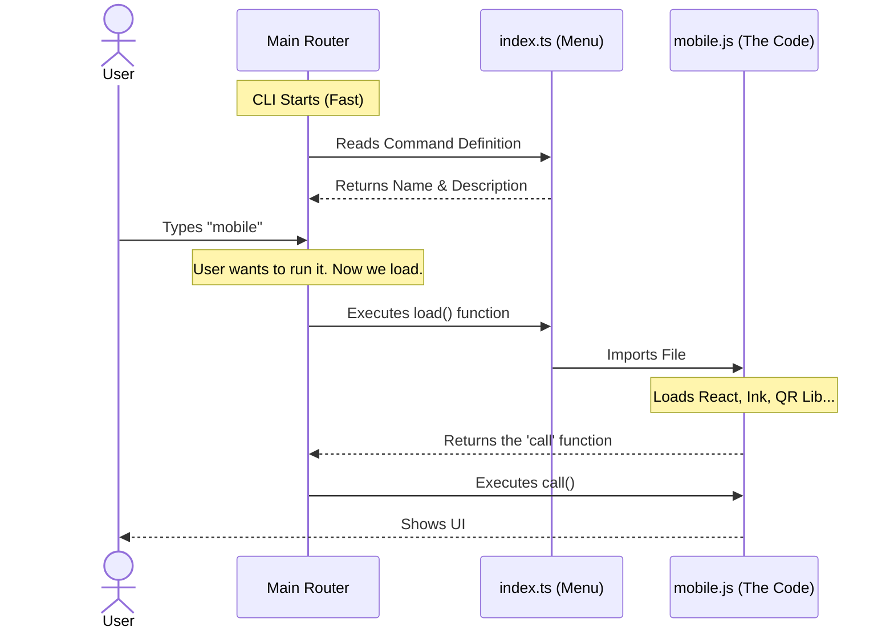

# Chapter 5: Lazy Module Loading

Welcome to the final chapter of the **mobile** project tutorial!

In the previous chapter, [Chapter 4: Asynchronous Data Generation](04_asynchronous_data_generation.md), we learned how to generate heavy data (QR codes) in the background so our UI appears instantly.

However, there is still one hidden performance issue. Even though the QR code generates in the background, the computer still has to **read and load** all the code for the `mobile` command just to start the CLI.

If your CLI has 100 different commands, loading all 100 files at startup would make the tool feel very slow.

In this chapter, we will implement **Lazy Module Loading**. We will ensure that the heavy code for our command is only loaded into memory when the user actually asks for it.

## The Motivation: The Backpack Analogy

Imagine you are packing your backpack for school. You have 8 different classes, and each class has a heavy textbook.

1.  **Eager Loading (The Slow Way):** You put **all 8 textbooks** in your bag every morning. Your bag is incredibly heavy, and it takes you a long time to walk to school.
2.  **Lazy Loading (The Fast Way):** You leave the books in your locker. You only take out the **Math textbook** right before Math class begins.

For a CLI, "Lazy Loading" means we keep the initial startup lightweight.

### The Use Case
When a user types:
`claude --help`

They should get a response immediately (in milliseconds). The CLI should simply read the list of names and descriptions. It should **not** load the heavy React libraries, QR generation logic, or networking code required for the `mobile` command yet.

## Implementing Lazy Loading

The secret to Lazy Loading lies in how we define the command in our entry file, `index.ts`.

### Step 1: Avoiding Static Imports

Usually, in TypeScript/JavaScript, we import code at the top of the file:

```typescript
// ❌ Eager Loading (Don't do this for commands)
// This loads the entire file immediately!
import { call } from './mobile.js'; 

const mobile = {
   // ...
   run: call
}
```

If we do this, the moment the CLI starts, it has to read `mobile.js`, which imports React, which imports Ink, which imports the QR library... this chain reaction slows everything down.

### Step 2: The `load` Function

Instead, we use a special property in our command definition called `load`.

Let's look at `index.ts`:

```typescript
import type { Command } from '../../commands.js'

const mobile = {
  type: 'local-jsx',
  name: 'mobile',
  // ... aliases and description ...
  
  // ✅ The Lazy Way
  load: () => import('./mobile.js'),
} satisfies Command
```

**Explanation:**
*   `() => import(...)`: This is a function. It is **not** executed immediately. It is just a set of instructions waiting to be run.
*   `import('./mobile.js')`: This is a "Dynamic Import." It tells JavaScript: "Go find this file and load it into memory, but only when I tell you to."

### Step 3: Exporting the Definition

The file `index.ts` remains tiny. It contains no logic, no React, and no heavy libraries. It is just a signpost.

```typescript
export default mobile
```

Because `index.ts` is so small, the main CLI can read it almost instantly to build the help menu.

## Under the Hood: How the CLI Framework Uses It

How does the framework know when to run the function? Let's trace the lifecycle of a command.



### Internal Implementation Details

Deep inside the CLI framework (the code that runs your command), there is a logic flow that looks something like this:

```typescript
// Inside the Framework Core
async function runCommand(commandName: string) {
  // 1. Find the definition in the list
  const command = commands.find(c => c.name === commandName);

  // 2. Trigger the Lazy Load
  // The heavy file is read from the hard drive HERE
  const module = await command.load();

  // 3. Execute the logic
  if (command.type === 'local-jsx') {
    await module.call(uiHandler);
  }
}
```

**Explanation:**
1.  **Discovery:** The CLI finds the lightweight definition object we created.
2.  **`await command.load()`**: This is the magic moment. The program pauses for a millisecond to go fetch the actual code file (`mobile.js`). This happens *after* the user has already pressed Enter.
3.  **Execution:** Once loaded, the module acts just like a normal imported file.

## Why This Matters for `mobile`

Our `mobile` command depends on:
1.  **React:** A large UI library.
2.  **Ink:** A library for terminal rendering.
3.  **qrcode:** A library for math calculations.

If we didn't use Lazy Loading, the user would pay the "cost" of loading these three libraries every time they used the CLI, even if they were just checking the version or logging in.

By using `load: () => import(...)`, we ensure that the "cost" is only paid by people who actually want to see the QR code.

## Tutorial Conclusion

Congratulations! You have successfully built the **mobile** command from scratch.

Let's review our journey:
1.  **[Chapter 1: Command Definition](01_command_definition.md)**: We created the "Menu Item" (`index.ts`) so the CLI knows our command exists.
2.  **[Chapter 2: Local JSX UI Handler](02_local_jsx_ui_handler.md)**: We built the visual interface (`mobile.tsx`) using React components like `<Box>` and `<Text>`.
3.  **[Chapter 3: Event-Driven Input Handling](03_event_driven_input_handling.md)**: We made the interface interactive, allowing users to switch tabs with keyboard arrows.
4.  **[Chapter 4: Asynchronous Data Generation](04_asynchronous_data_generation.md)**: We moved the heavy QR code generation to the background so the UI doesn't freeze.
5.  **[Chapter 5: Lazy Module Loading](05_lazy_module_loading.md)**: We ensured our command doesn't slow down the CLI startup speed.

You now have a professional-grade, interactive, performant CLI feature. You can apply these same patterns—Definition, UI, Events, Async Data, and Lazy Loading—to build any tool you can imagine!

---

Generated by [Code IQ](https://github.com/adityasoni99/Code-IQ)