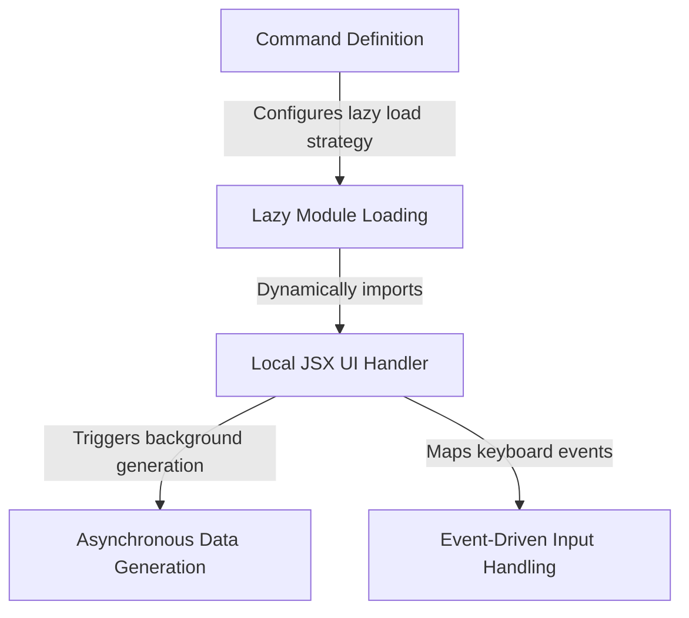

# Tutorial: mobile

This project creates a **CLI command** that displays QR codes in the terminal to download the Claude mobile app. It defines the command configuration upfront but uses **Lazy Module Loading** to fetch the actual interface code only when the user runs it. The visual interface is built with a **Local JSX UI Handler** that manages **Event-Driven Input Handling** for navigation and performs **Asynchronous Data Generation** to create the QR codes in the background.

## Chapters

1. [Command Definition](01_command_definition.md)
2. [Local JSX UI Handler](02_local_jsx_ui_handler.md)
3. [Event-Driven Input Handling](03_event_driven_input_handling.md)
4. [Asynchronous Data Generation](04_asynchronous_data_generation.md)
5. [Lazy Module Loading](05_lazy_module_loading.md)

---

Generated by [Code IQ](https://github.com/adityasoni99/Code-IQ)