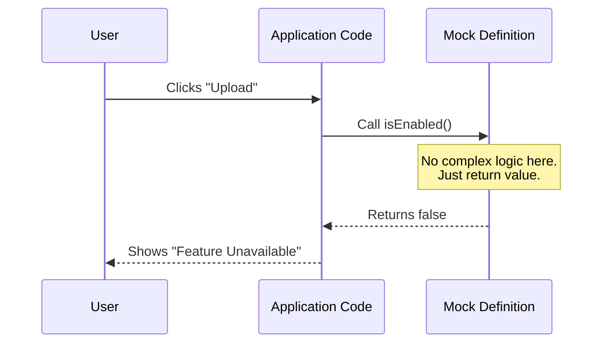

# Chapter 1: Mock Definition

Welcome to the first chapter of the **mock-limits** tutorial! If you are new to software development or testing frameworks, you are in the right place. We are going to start with the most fundamental building block of this library.

## Why do we need this?

Imagine you are filming a movie. You need a scene where a car crashes into a wall. You wouldn't put your lead actor in the car for that dangerous scene, right? Instead, you use a **Crash Test Dummy**.

In software, we often face a similar situation. You might be building a "Pro Feature" for your application, but the complex logic to check if a user has paid isn't written yet. If your application tries to check for that permission and finds nothing, the app crashes.

We need a "prop" or a "dummy" that stands in for the real logic. It sits there, looks like a real limit, and responds politely so the system keeps running smoothly.

**The Central Use Case:**
You want to prepare your code to handle a feature flag called `upload_limit`, but you haven't decided on the actual rules for it yet. You need a placeholder to prevent errors while you build the User Interface.

## What is a Mock Definition?

A **Mock Definition** is the structural skeleton of a limit. It fulfills the "contract" expected by your application.

Think of an electrical outlet. The "contract" is that it has two (or three) holes. If you plug something in, it fits. A **Mock Definition** is like a plastic child-safety outlet cover. It fits perfectly into the wall (fulfilling the structural requirement), but it doesn't actually deliver electricity (no real logic).

It allows your code to ask, "Is this allowed?" and get a safe answer (usually "No") without triggering an error.

## How to create a Mock Definition

Let's look at how to create the simplest possible Mock Definition to solve our use case.

We need an object that answers three basic questions:
1.  **Is it enabled?** (Can the user do this?)
2.  **Is it hidden?** (Should we show this in the menu?)
3.  **What is it called?** (For debugging).

### The Code

Here is how you define a basic mock in your code:

```javascript
// A simple mock definition
const uploadLimitMock = {
  isEnabled: () => false, // 1. The Logic
  isHidden: true,         // 2. The Visibility
  name: 'stub'            // 3. The Identity
};
```

**Explanation:**
1.  `isEnabled`: This is a function. Right now, it simply returns `false`. It's a "hard no" to everything.
2.  `isHidden`: This is set to `true`. This tells your UI, "Don't show the upload button yet."
3.  `name`: We call it `'stub'`. A "stub" is a common programming term for something that stands in for missing code.

### Example Usage

If you run this code in your application:

```javascript
// Checking the limit
if (uploadLimitMock.isEnabled()) {
  console.log("You can upload!");
} else {
  console.log("Upload blocked.");
}
```

**Output:**
> Upload blocked.

The application ran successfully! It didn't crash because `isEnabled` existed, even though it didn't do any real calculation.

## Under the Hood: Internal Implementation

What actually happens inside the `mock-limits` module when we use this definition?

When the application asks for a limit, the system doesn't run off to a database or a remote server. It looks at this static definition directly. It is a synchronous, instant process.

Here is the flow of a Mock Definition in action:



### The Source Code

Internally, the `mock-limits` library defines a default export that serves as the blueprint for all mocks. This is located in `index.js`.

Let's look at the implementation. It is intentionally minimal:

```javascript
// --- File: index.js ---

// The default "Crash Test Dummy"
export default { 
  isEnabled: () => false, 
  isHidden: true, 
  name: 'stub' 
};
```

**Why is it built this way?**

*   **Safety First**: By defaulting `isEnabled` to return `false`, the system fails safely. It is better to accidentally block a user than to accidentally give them free access to a paid feature.
*   **Simplicity**: It requires no external data.

## Moving Beyond the Stub

Right now, our mock is very "dumb." It says "No" to everyone, regardless of who they are.

But in a real application, you might want to say "Yes" if the user is an Admin, and "No" if they are a Guest. To do that, the Mock Definition needs to know *who* is asking.

This concept of identifying the user is handled in the next distinct abstraction of our system.

## Conclusion

In this chapter, you learned that a **Mock Definition** is a safe placeholder. It acts like a movie prop or a crash test dummy, ensuring your application has a structure to talk to, even if the real logic isn't there yet.

You learned how to define a basic stub that always returns `false` and remains hidden.

In the next chapter, we will learn how to pass user information to our mock so it can start making smarter decisions.

[Next: Chapter 2 - Identity Management](02_identity_management.md)

---

Generated by [Code IQ](https://github.com/adityasoni99/Code-IQ)