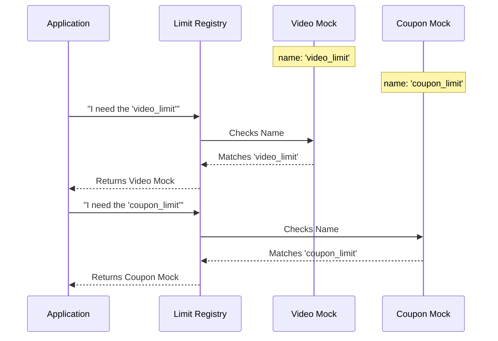

# Chapter 2: Identity Management

Welcome to the second chapter of the **mock-limits** tutorial!

In the previous chapter, [Mock Definition](01_mock_definition.md), we created a "Crash Test Dummy"—a basic object that sat in for our missing code. It prevented crashes, but it was generic.

If you had five different crash test dummies in a room, how would you tell them apart? They all look the same. This introduces a problem when debugging complex applications.

## The Motivation: The "Unlabeled Box" Problem

**The Central Use Case:**
Imagine you are building an e-commerce dashboard. You have two distinct limits you need to mock:
1.  `VideoUploadLimit`: Prevents users from uploading huge videos.
2.  `coupon_limit`: Prevents users from applying too many discount codes.

If both of these use the generic "stub" we built in Chapter 1, and your error log simply says: *"Error: Limit 'stub' blocked the action,"* you have no idea which feature caused the issue. Was it the video or the coupon?

We need to stick a label on these mocks. We need **Identity Management**.

## What is Identity Management?

In the context of `mock-limits`, Identity Management is handled by a simple property called `name`.

Think of it like a **Nametag** at a conference, or a **Label** on a moving box.
*   It does not change *how* the code behaves (it doesn't make the limit strict or loose).
*   It changes *how we recognize* the code.

By assigning a unique `name`, the larger system can identify, log, or reference this specific mock distinct from other features in the application's registry.

## How to Assign Identity

Let's solve our use case by giving our `VideoUploadLimit` a unique identity.

### The Code

We simply add (or override) the `name` property in our definition.

```javascript
// Defining a specific mock for Video Uploads
const videoLimit = {
  isEnabled: () => false, 
  isHidden: true,
  
  // This is the Identity
  name: 'video_upload_feature' 
};
```

**Explanation:**
1.  We kept the logic (`isEnabled`) and visibility (`isHidden`) the same.
2.  We explicitly set `name` to `'video_upload_feature'`.

Now, this object isn't just *a* limit; it is *the* video upload limit.

### Example Usage

Let's see how this helps us in a logging scenario.

```javascript
function logAccessAttempt(limitObject) {
  // We can now print the specific name of the limit
  console.log("Checking permission for:", limitObject.name);
  
  if (!limitObject.isEnabled()) {
    console.log("Access Denied.");
  }
}
```

**Input:**
Passing our `videoLimit` object into this function.

**Output:**
> Checking permission for: video_upload_feature
>
> Access Denied.

Because we managed the identity, the logs are now meaningful. We know exactly which feature was checked.

## Under the Hood: Internal Implementation

How does the library handle this identity internally?

The system is designed to treat the `name` as a unique key for debugging and registry lookups. When an application requests a limit, it usually asks for it by name.

Here is the flow of how Identity allows the system to distinguish between mocks:



### The Source Code

In [Chapter 1](01_mock_definition.md), we looked at `index.js`. Let's look at it again to see the default identity.

```javascript
// --- File: index.js ---

export default { 
  isEnabled: () => false, 
  isHidden: true, 
  
  // The default identity
  name: 'stub' 
};
```

**Why 'stub'?**
If you forget to give your mock a name, `mock-limits` assigns it the name `'stub'` by default. This is a safety mechanism.

*   If you see `'stub'` in your logs, it is a signal to the developer: *"Hey, you forgot to name this specific limit!"*
*   It ensures the code never crashes when trying to read `.name`.

## Conclusion

In this chapter, we learned that **Identity Management** is about giving your mock a specific `name`. This turns a generic "Crash Test Dummy" into a specific, recognizable entity like "Video Upload Feature" or "Coupon Limit."

This makes debugging easier and allows the system to track different limits separately.

However, our mock is still very rigid. It has a name now, but it still blindly says "No" (`false`) to every request. In the next chapter, we will learn how to make the logic dynamic so it can say "Yes" or "No" based on the situation.

[Next: Chapter 3 - State Evaluation](03_state_evaluation.md)

---

Generated by [Code IQ](https://github.com/adityasoni99/Code-IQ)