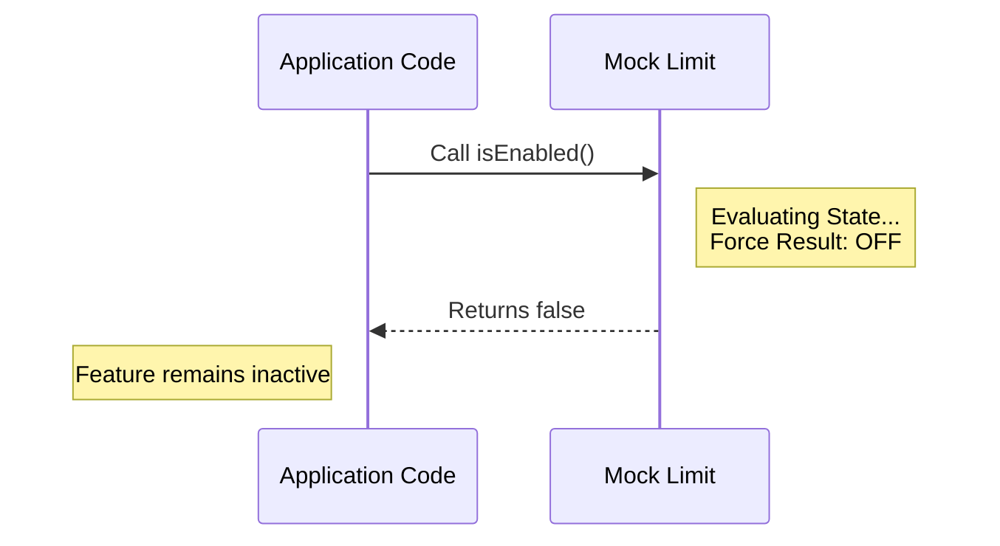

# Chapter 3: State Evaluation

Welcome to the third chapter of the **mock-limits** tutorial!

In the previous chapter, [Identity Management](02_identity_management.md), we learned how to give our mocks unique names using the `name` property. We stopped treating them as generic dummies and started giving them specific labels like "Video Upload Feature."

However, a label is just a sticker. It doesn't actually *do* anything.

Now, we need to define how the limit behaves. We need to answer the most critical question in permission logic: **"Is this active right now?"**

## The Motivation: The "Under Construction" Sign

**The Central Use Case:**
Imagine you are building a new "Dark Mode" for your website. You have built the button in the settings menu, but the code that actually changes the colors isn't finished yet.

If a user clicks that button now, the site might look broken.

You need a way to keep the code in your codebase but prevent it from running. You need a **Master Switch** that is permanently taped to the "OFF" position while you finish your work.

## What is State Evaluation?

In the `mock-limits` library, **State Evaluation** is handled by the `isEnabled` function.

Think of it like a **Circuit Breaker** in your house.
*   If the circuit is open (Enabled), electricity flows, and the lights turn on.
*   If the circuit is tripped (Disabled), the flow stops immediately.

In a real production environment, this function might check complex rules (e.g., "Is the user a Premium member?" or "Is it a Tuesday?").

But here, in our **Mock** context, we want safety above all else. Therefore, State Evaluation is hardwired to be a strict **"No."**

## How to use State Evaluation

Let's look at how to check the state of a limit in your application to solve our "Dark Mode" use case.

### The Code

You interact with State Evaluation by calling the `isEnabled()` function on your limit object.

```javascript
// Assume 'darkThemeLimit' is our mock object
const darkThemeLimit = require('./index');

// We ask the question: Is this enabled?
if (darkThemeLimit.isEnabled()) {
  // This code will NOT run
  activateDarkTheme();
} else {
  // This code WILL run
  console.log("Dark Theme is currently disabled.");
}
```

**Explanation:**
1.  We call `darkThemeLimit.isEnabled()`.
2.  Because this is a mock, it instantly returns `false`.
3.  Our application safely skips the dangerous `activateDarkTheme()` code.

### Example Output

If you run the code above, the output will always be:

> Dark Theme is currently disabled.

This guarantees that no matter what your UI does, the feature remains safely locked.

## Under the Hood: Internal Implementation

What happens inside the library when we ask `isEnabled()`?

Since this is a mock, the library doesn't perform any calculations. It doesn't check a database, it doesn't check user cookies, and it doesn't check the time of day. It is a "Stub"—a piece of code designed to return a fixed value.

Here is the flow of the State Evaluation:



### The Source Code

Let's look at the `index.js` file again to see exactly how this "Master Switch" is implemented.

```javascript
// --- File: index.js ---

export default { 
  // This is the State Evaluation
  isEnabled: () => false, 
  
  isHidden: true, 
  name: 'stub' 
};
```

**Breaking it down:**
1.  **`isEnabled`**: This is the property key.
2.  **`() => false`**: This is an arrow function.
    *   It takes no arguments `()`.
    *   It returns `false` immediately.

**Why use a function instead of just `false`?**
You might wonder, why not just write `isEnabled: false`? Why make it a function?

We use a function to mimic the "contract" of a real limit. In the future, when you replace this mock with real logic, `isEnabled` might need to do some math. By making the mock a function now, you won't have to rewrite your application code later when you switch from the Mock to the Real implementation.

## Conclusion

In this chapter, you learned about **State Evaluation**.

You learned that `isEnabled` acts as a safety switch. In the context of `mock-limits`, it is hardcoded to return `false`. This ensures that any feature backed by this mock is strictly disabled, preventing unfinished code from running during development.

But wait—if a feature is disabled, should the user even see the button for it? Or should the button disappear entirely?

In the next chapter, we will learn how to control the visibility of our features using **Presentation Control**.

[Next: Chapter 4 - Presentation Control](04_presentation_control.md)

---

Generated by [Code IQ](https://github.com/adityasoni99/Code-IQ)