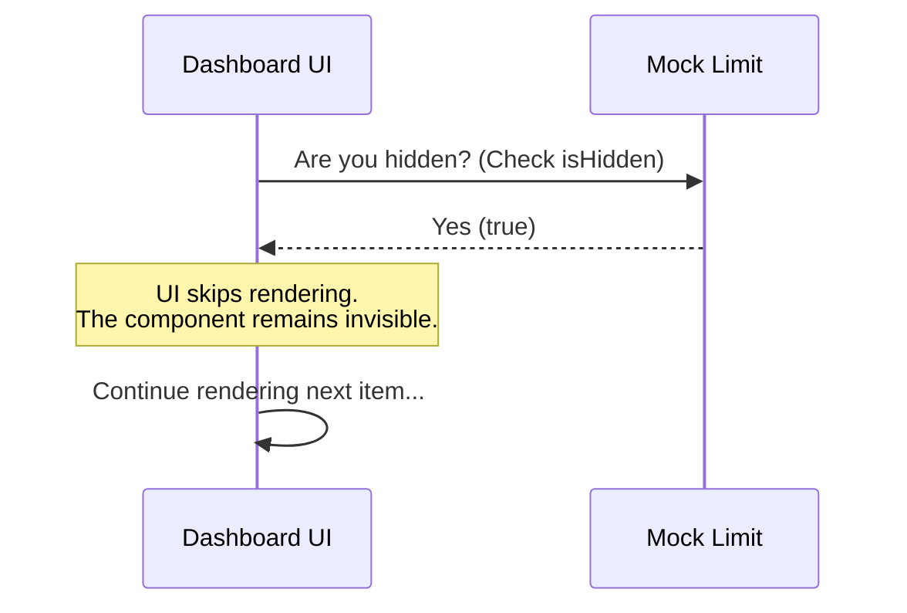

# Chapter 4: Presentation Control

Welcome to the fourth chapter of the **mock-limits** tutorial!

In the previous chapter, [State Evaluation](03_state_evaluation.md), we learned how to use the `isEnabled()` function. We created a "Master Switch" that safely cuts the power to our unfinished features, ensuring that even if a user tries to use them, the code won't crash.

However, we are left with a User Experience (UX) problem. We have a button that doesn't crash... but it also doesn't work. It just sits there.

## The Motivation: The "Broken Button" Problem

**The Central Use Case:**
Imagine you are building an "Admin Dashboard." You have created a placeholder for a **"Delete All Users"** button.

Using what we learned in Chapter 3, you have disabled the logic. When you click the button, nothing happens.
1.  **The Good News:** The database is safe.
2.  **The Bad News:** The user is confused. They click the button. Nothing happens. They click it harder. Still nothing. They assume your website is broken and send a support ticket.

We need a way to tell the User Interface (UI) to hide this button entirely until the logic is truly ready. We need **Presentation Control**.

## What is Presentation Control?

In `mock-limits`, Presentation Control is handled by the `isHidden` property.

Think of your computer's file system. There are thousands of system files in your folders that handle configuration, but you never see them. They have a special **"Hidden"** attribute.
*   The file exists on the disk.
*   The operating system knows it is there.
*   **But the user is not shown the file.**

The `isHidden` property works the same way. It tells your dashboard or menu system: *"I exist in the code, but I am irrelevant to the end-user right now. Do not draw me."*

## How to use Presentation Control

Let's look at how to use this property to clean up our User Interface.

### The Code

In your UI code (for example, when building a menu list), you should check this property before drawing the item.

```javascript
// Assume 'deleteLimit' is our mock object
const deleteLimit = require('./index');

// Check visibility before rendering
if (deleteLimit.isHidden) {
  // Option A: Do nothing (Render nothing)
  return null;
} else {
  // Option B: Render the button
  renderDeleteButton();
}
```

**Explanation:**
1.  We access `deleteLimit.isHidden`. This is a simple boolean (true/false), not a function.
2.  If it is `true`, we `return null`. In most UI frameworks (like React or Vue), returning `null` means "draw nothing here."
3.  The button essentially vanishes from the screen.

### Example Outcome

**Input:**
`deleteLimit.isHidden` is `true`.

**Output:**
The "Delete All Users" button does not appear on the dashboard. The user doesn't know the feature is even being developed, so they cannot be confused by a non-functional button.

## Under the Hood: Internal Implementation

How does the `mock-limits` library define this internally?

When the UI layer is deciding what to put on the screen, it acts like a bouncer at a club. It checks the ID of every feature. If the feature is marked "Hidden," it isn't allowed on the visual stage.

Here is the flow of the Presentation Control:



### The Source Code

Let's look at our trusty `index.js` file one last time to see the default setting.

```javascript
// --- File: index.js ---

export default { 
  isEnabled: () => false, 
  
  // Presentation Control defaults to TRUE
  isHidden: true, 
  
  name: 'stub' 
};
```

**Why is the default `true`?**

In software development, we prefer "Safe Defaults."
*   **Mocks** usually represent code that isn't written yet.
*   Code that isn't written shouldn't be used *or* seen.

By defaulting `isHidden` to `true`, the library ensures that your work-in-progress features remain invisible "Ghost" features until you explicitly decide to reveal them by changing this value to `false`.

## Conclusion

In this chapter, you learned about **Presentation Control**.

You learned that the `isHidden` property acts like an invisibility cloak. It allows you to keep code in your project without cluttering the user interface with broken or unfinished buttons.

### Tutorial Wrap-up

Congratulations! You have completed the **mock-limits** beginner tutorial. Let's review what we built:

1.  **[Mock Definition](01_mock_definition.md)**: We created a structural placeholder to prevent crashes.
2.  **[Identity Management](02_identity_management.md)**: We gave the mock a `name` so we can identify it in logs.
3.  **[State Evaluation](03_state_evaluation.md)**: We used `isEnabled()` to safely disable the logic.
4.  **Presentation Control**: We used `isHidden` to clean up the UI.

You now possess a safe, robust object that you can use as a "Crash Test Dummy" for any missing feature in your application!

---

Generated by [Code IQ](https://github.com/adityasoni99/Code-IQ)