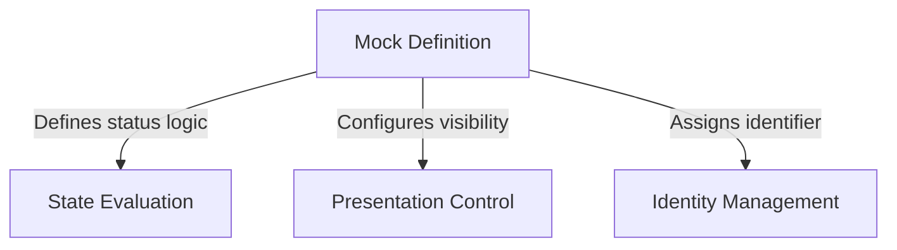

# Tutorial: mock-limits

This project creates a **Mock Definition** which serves as a *placeholder* or "stub" for a feature limit within an application. It ensures that the specific feature is permanently **disabled** (via State Evaluation) and **hidden** from the user interface (via Presentation Control), while still providing a valid **identity** so the rest of the system can safely interact with it without crashing.

## Chapters

1. [Mock Definition](01_mock_definition.md)
2. [Identity Management](02_identity_management.md)
3. [State Evaluation](03_state_evaluation.md)
4. [Presentation Control](04_presentation_control.md)

---

Generated by [Code IQ](https://github.com/adityasoni99/Code-IQ)