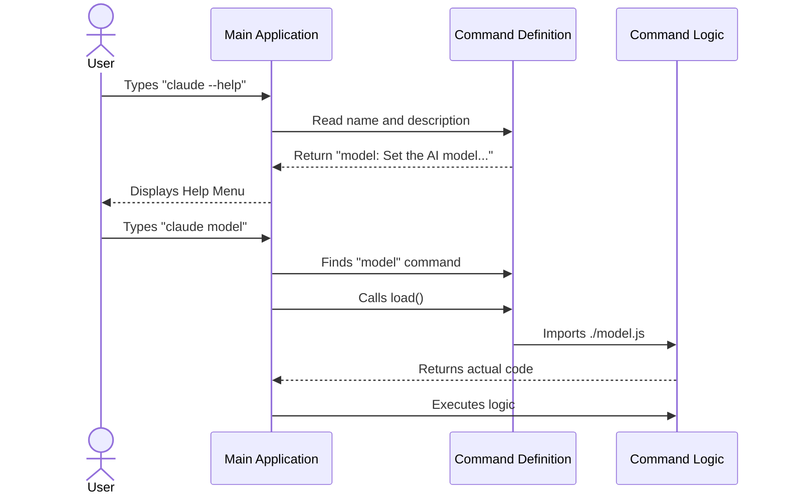

# Chapter 1: Command Definition

Welcome to the first chapter of the **model** project tutorial! 🎉

In this guide, we are going to learn how to build a Command Line Interface (CLI) tool. Before we can write the complex logic that makes our tool smart, we need to tell the system that our command simply **exists**.

## Why do we need a Command Definition?

Imagine you walk into a restaurant. Before you get your food, you look at a **Menu**.

The Menu tells you:
1.  **Name:** "Cheeseburger"
2.  **Description:** "Beef patty with cheddar on a bun."
3.  **Price/Hint:** "$10"

The menu **is not the food**. It is just a list of what is available. The kitchen doesn't start cooking (loading the heavy ingredients) until you actually order.

In our project, the **Command Definition** is that menu entry. It allows our application to start up very quickly by listing all available commands without loading the heavy code behind them until the user actually types the command.

## The Use Case

We want to create a command called `model`.
*   **Goal:** When the user types `model`, the CLI should know which AI model is currently selected.
*   **Problem:** We don't want to load the entire AI engine just to see the help text for the command.
*   **Solution:** We create a lightweight definition file (`index.ts`).

## Breaking Down the Code

Let's look at how we define this "Menu Entry" in code. We will look at the file `index.ts`.

### 1. Basic Metadata
First, we define the command's identity. This includes its name and a description that appears in the help menu.

```typescript
export default {
  type: 'local-jsx',
  name: 'model',
  // A hint shown to the user about arguments
  argumentHint: '[model]',
  // ... more properties below
```

*   **`name`**: This is what the user types in the terminal (e.g., `$ claude model`).
*   **`argumentHint`**: Tells the user they can optionally type a specific model name after the command.

### 2. Dynamic Description
Sometimes, a description needs to be smart. Instead of a static string, we use a "getter" to generate the description dynamically.

```typescript
import { getMainLoopModel, renderModelName } from '../../utils/model/model.js'

// ... inside the object
  get description() {
    // Returns: "Set the AI model for Claude Code (currently Claude 3.5 Sonnet)"
    return `Set the AI model for Claude Code (currently ${renderModelName(getMainLoopModel())})`
  },
```

*   **`get description()`**: This runs every time the menu is displayed. It fetches the *current* model so the help text is always accurate.

### 3. Lazy Loading (The Magic Sauce) 🍝
This is the most important part. We tell the CLI where to find the *real* code, but we don't load it yet.

```typescript
  // This function is NOT called immediately at startup
  load: () => import('./model.js'),

} satisfies Command
```

*   **`load`**: This is a function that returns a Promise. It uses `import()` to load the heavy logic only when the user actually runs the `model` command.
*   **`satisfies Command`**: This ensures our object follows the strict rules of what a "Command" should look like (TypeScript validation).

## Under the Hood: The Discovery Process

How does the application use this definition? Let's visualize the flow when you run the CLI.

1.  **Startup:** The App scans all folders for these lightweight `index.ts` files.
2.  **Registration:** It builds a list of available commands (the "Menu").
3.  **Execution:** When you type `model`, it finds the definition with `name: 'model'` and triggers the `load()` function.



## Internal Implementation Details

The definitions act as a bridge. While the code we wrote above is simple, the system reading it (the "Router" or "Registry") handles the complexity.

When the application starts, it likely does something like this (simplified):

```typescript
// Pseudocode for the Application Registry
const commands = [];

// 1. Import ONLY the definition (lightweight)
import modelCommandDef from './commands/model/index.js';

// 2. Add to the list
commands.push(modelCommandDef);

// 3. Later, when user types 'model'...
const cmd = commands.find(c => c.name === 'model');
if (cmd) {
  // 4. Load the HEAVY file
  const realCommand = await cmd.load();
  // 5. Run it
}
```

This architecture ensures that if you have 100 commands, the application still starts up instantly. It also prepares the ground for [Model Governance & Validation](03_model_governance___validation.md) later, as we can check permissions before `load()` is ever called.

### The `immediate` Flag
You might have noticed this snippet in the original code:

```typescript
import { shouldInferenceConfigCommandBeImmediate } from '../../utils/immediateCommand.js'

  get immediate() {
    return shouldInferenceConfigCommandBeImmediate()
  },
```

This is a special instruction. Usually, commands go into a queue. However, if `immediate` is true, this command cuts the line and runs right away. This is useful for configuration changes that need to happen before an AI response is generated.

## Summary

In this chapter, we learned:
1.  **Command Definitions** act like a menu, separating metadata from logic.
2.  **Lazy Loading** (`load`) keeps the application fast by importing heavy code only when needed.
3.  **Dynamic Properties** allow descriptions to update based on the system state.

Now that we have defined *what* our command is, it is time to define *how* it looks and behaves when the user runs it.

[Next Chapter: React-based Command Implementation](02_react_based_command_implementation.md)

---

Generated by [Code IQ](https://github.com/adityasoni99/Code-IQ)