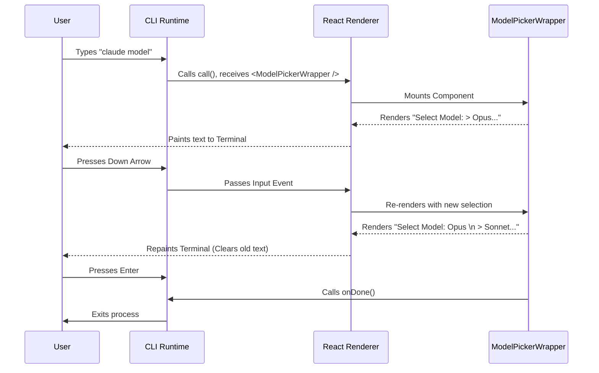

# Chapter 2: React-based Command Implementation

Welcome to the second chapter! In the previous guide, [Command Definition](01_command_definition.md), we created the "Menu Entry" for our command. We told the system that `model` exists.

Now, we need to build the **Kitchen**. When the user actually orders the "Cheeseburger" (runs the command), we need to cook it.

In this project, we don't just write simple linear scripts. We use **React** to render our terminal commands.

## Why React in a Terminal? 🖥️

You might know React for building websites. Why use it for a black-and-white text console?

1.  **Interactivity:** Standard scripts just output text and exit. We want menus you can navigate with arrow keys.
2.  **State Management:** We need to remember which option you highlighted.
3.  **Live Updates:** We want to replace text on the screen (like a loading spinner) without printing a million new lines.

Instead of `<div>` and `<span>`, we use components that render text strings.

## The Entry Point: The `call` Function

Every command file exports a function named `call`. This is where the CLI passes control to us.

Unlike a standard script, we don't just write `console.log`. We return a **React Component**.

### Handling Arguments

The `call` function looks at what the user typed (the `args`) and decides which Component to show.

```typescript
// model.tsx
export const call: LocalJSXCommandCall = async (onDone, _context, args) => {
  const cleanArgs = args?.trim() || '';

  // Case 1: User typed "claude model --help"
  if (COMMON_HELP_ARGS.includes(cleanArgs)) {
    onDone('Run /model to open the menu...');
    return;
  }
```
*   **`args`**: The text typed after the command.
*   **`onDone`**: A special function we call when the command is finished to close the app.

### Routing to Components

If the user wants to set a specific model (e.g., `claude model opus`), we mount a "Logic Component". If they just typed `claude model`, we mount the "Interactive Menu".

```typescript
  // Case 2: User typed specific model "claude model opus"
  if (cleanArgs) {
    return <SetModelAndClose args={cleanArgs} onDone={onDone} />;
  }

  // Case 3: User typed "claude model" (Show Menu)
  return <ModelPickerWrapper onDone={onDone} />;
};
```
*   **Return Value**: Notice we are returning JSX (`<Component />`), not a string. The CLI's renderer will take this and draw it to the terminal.

## Concept 1: The Interactive Menu (`ModelPickerWrapper`)

This component handles the "Video Game" aspect. It listens for keypresses and updates the screen.

```typescript
function ModelPickerWrapper({ onDone }) {
  // 1. Hook into Global State
  const mainLoopModel = useAppState(s => s.mainLoopModel);
  const setAppState = useSetAppState();

  // 2. Define what happens when user presses Enter
  const handleSelect = (model) => {
    setAppState(prev => ({ ...prev, mainLoopModel: model }));
    onDone(`Set model to ${chalk.bold(model)}`);
  };
```

This wrapper acts as a controller. It grabs the current state from [Application State Management](04_application_state_management.md) and passes it down to the UI.

### Rendering the UI
The wrapper returns the actual visual component:

```typescript
  return (
    <ModelPicker
      initial={mainLoopModel}
      onSelect={handleSelect}
      onCancel={() => onDone('Cancelled')}
    />
  );
}
```
*   **`ModelPicker`**: This is a pure UI component (likely using a library like `ink-select-input`). It handles the arrow keys and highlighting logic.
*   **`onSelect`**: When the user picks an item, `ModelPickerWrapper` updates the state and calls `onDone`.

## Concept 2: Logic-only Components (`SetModelAndClose`)

Sometimes, we use React components that render **nothing** (`null`).

Why? Because we want to use **Hooks** (like `useAppState` or `useEffect`) to run logic, even if we don't need to show a UI.

### The Lifecycle
When `SetModelAndClose` mounts, it runs a `useEffect`.

```typescript
function SetModelAndClose({ args, onDone }) {
  const setAppState = useSetAppState();

  React.useEffect(() => {
    // Logic runs immediately on mount
    validateAndSetModel(args);
  }, [args]);

  // It renders nothing!
  return null;
}
```

### The Logic Implementation
Inside that effect, we validate the input and update the global store.

```typescript
    async function validateAndSetModel(modelName) {
      // 1. Validation (See Chapter 3)
      const { valid } = await validateModel(modelName);
      
      if (valid) {
        // 2. Update State
        setAppState(prev => ({ ...prev, mainLoopModel: modelName }));
        onDone(`Set model to ${modelName}`);
      } else {
        onDone(`Error: Model ${modelName} not found`);
      }
    }
```
By using a component, we ensure this logic participates in the React lifecycle, ensuring the app state is ready before we try to change it.

## Under the Hood: The Render Cycle

How does text appear on your screen? Here is the flow when you run `claude model`:



## Summary

In this chapter, we learned how to implement the logic for our command using React:

1.  **The `call` function** acts as the router, deciding which Component to load based on arguments.
2.  **`ModelPickerWrapper`** handles interactive UI, connecting user keypresses to application state.
3.  **`SetModelAndClose`** demonstrates how to use React for "invisible" logic flows, leveraging hooks for state management.

We briefly touched on validation (checking if a model exists). But what if a user isn't *allowed* to use a specific model?

In the next chapter, we will dive deep into security and rules.

[Next Chapter: Model Governance & Validation](03_model_governance___validation.md)

---

Generated by [Code IQ](https://github.com/adityasoni99/Code-IQ)