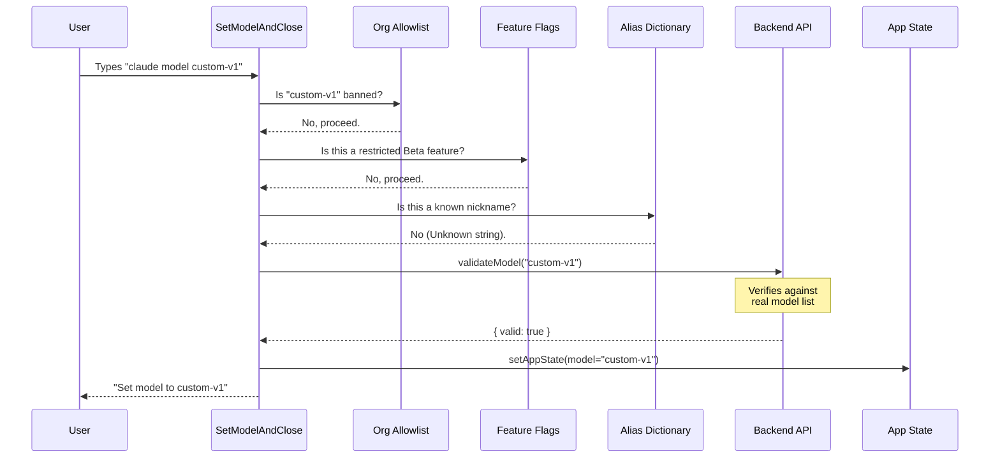

# Chapter 3: Model Governance & Validation

Welcome to Chapter 3! In the previous chapter, [React-based Command Implementation](02_react_based_command_implementation.md), we built the visual menu and the basic logic for the `model` command.

We can now accept user input, but we have a new problem. **Trust.**

Just because a user types `claude model super-secret-god-mode`, it doesn't mean:
1.  That model actually exists.
2.  The user's account has access to it (e.g., Beta features).
3.  The user's organization allows them to use it.

This chapter is about **Governance**. It is the layer of logic that acts as a gatekeeper before we actually change the system configuration.

## The Gatekeeper Analogy 🛡️

Imagine entering a high-security office building. You don't just walk into the CEO's office. You pass through several checkpoints:

1.  **ID Check:** Do you work here? (Organization Allowlist)
2.  **Clearance Level:** Do you have the keycard for the server room? (Account Capabilities like 1M Context)
3.  **Nicknames:** If you say "I'm going to see Bob," the guard knows you mean "Robert Smith, Head of Accounting." (Alias Resolution)

In our code, this happens inside the `SetModelAndClose` component we saw earlier. Let's break down these checkpoints.

## Checkpoint 1: Organization Allowlist

Enterprises often restrict which AI models employees can use to ensure data compliance. We check this **first**. If your org says "No," we stop immediately.

Inside our command's logic:

```typescript
// model.tsx
import { isModelAllowed } from '../../utils/model/modelAllowlist.js';

// ... inside the effect
if (model && !isModelAllowed(model)) {
  // ⛔ STOP: Org policy blocks this
  onDone(`Model '${model}' is not available. Your organization restricts selection.`, {
    display: 'system'
  });
  return;
}
```

*   **`isModelAllowed`**: This utility checks a central configuration file (allowlist) defined by the system administrator.
*   **`return`**: We exit the function immediately. We do not proceed to API validation.

## Checkpoint 2: Account Capabilities (Feature Flags)

Some features, like the massive **1 Million Token Context Window**, are exclusive to specific account tiers. Even if the model exists, *you* might not be allowed to drive it.

We check for specific suffixes (like `[1m]`) and verify account permissions.

```typescript
// model.tsx
// Check for Opus 1M access
if (model && isOpus1mUnavailable(model)) {
  onDone(`Opus 4.6 with 1M context is not available for your account.`, {
    display: 'system'
  });
  return;
}
```

This helper function hides the complex logic:
1.  Does the model name contain `opus` and `[1m]`?
2.  Does the user's account flag `checkOpus1mAccess()` return true?
3.  If name matches but access is false -> **Reject**.

## Checkpoint 3: Aliases (The Friendly Names)

Users hate typing `claude-3-opus-20240229`. They just want to type `opus`.

We maintain a list of "Known Aliases." If the user types a known shortcut, we skip the expensive API validation call because we *know* `opus` maps to a valid model internally.

```typescript
// model.tsx
import { MODEL_ALIASES } from '../../utils/model/aliases.js';

function isKnownAlias(model: string): boolean {
  return MODEL_ALIASES.includes(model.toLowerCase().trim());
}

// In the main logic:
if (isKnownAlias(model)) {
  // ✅ PASS: It's a trusted shortcut
  setModel(model);
  return;
}
```

This makes the CLI feel snappy. We don't need to ask the server "Is 'opus' real?" because our internal dictionary says "Yes."

## Checkpoint 4: API Validation (The Final Check)

If the user typed something custom that isn't on our blocklist, isn't a special feature, and isn't a known alias (e.g., a brand new model ID `claude-3-5-sonnet-new`), we ask the API.

```typescript
// model.tsx
import { validateModel } from '../../utils/model/validateModel.js';

// ... inside try/catch
const { valid, error } = await validateModel(model);

if (valid) {
  // ✅ PASS: The API confirmed this exists
  setModel(model);
} else {
  // ⛔ FAIL: The API has never heard of this
  onDone(error || `Model '${model}' not found`);
}
```

This is an **asynchronous** operation. It's the "heaviest" check, which is why we save it for last.

## Under the Hood: The Validation Flow

Let's visualize the journey of a string text `args` when passed to `SetModelAndClose`.



## Internal Implementation Details

All of this logic is wrapped inside a React `useEffect` hook within `model.tsx`.

Why `useEffect`?
Because validation is a **side effect**. We can't validate during the *render* phase (drawing the UI). We must render the component first (which is invisible/null), then run the async validation checks, and finally trigger the `onDone` callback or update the state.

```typescript
// model.tsx (Simplified Structure)
function SetModelAndClose({ args, onDone }) {
  // 1. Get the setter for global state
  const setAppState = useSetAppState();

  // 2. Run validation logic when component mounts
  React.useEffect(() => {
    async function runChecks() {
      // ... Run Checkpoints 1, 2, 3, 4 ...
      
      // If all pass:
      setAppState(prev => ({ ...prev, mainLoopModel: args }));
      onDone(`Success!`);
    }
    
    runChecks();
  }, [args]); // Re-run if args change

  return null; // Don't draw anything
}
```

### Handling "Default"
There is one special keyword: `default`.
If `args === 'default'`, we bypass most checks and set the model to `null`.
When the model is `null`, the system falls back to its hardcoded standard model (e.g., Claude 3.5 Sonnet).

## Summary

In this chapter, we learned that accepting user input requires rigorous checking:
1.  **Security:** Org Allowlist (`isModelAllowed`).
2.  **Access Control:** Account Checks (`isOpus1mUnavailable`).
3.  **Usability:** Aliases (`isKnownAlias`) for speed.
4.  **Verification:** API Validation (`validateModel`) for correctness.

Once a model passes all these gates, we are finally allowed to update the global configuration. But where does that configuration live? And how do other parts of the app know it changed?

[Next Chapter: Application State Management](04_application_state_management.md)

---

Generated by [Code IQ](https://github.com/adityasoni99/Code-IQ)