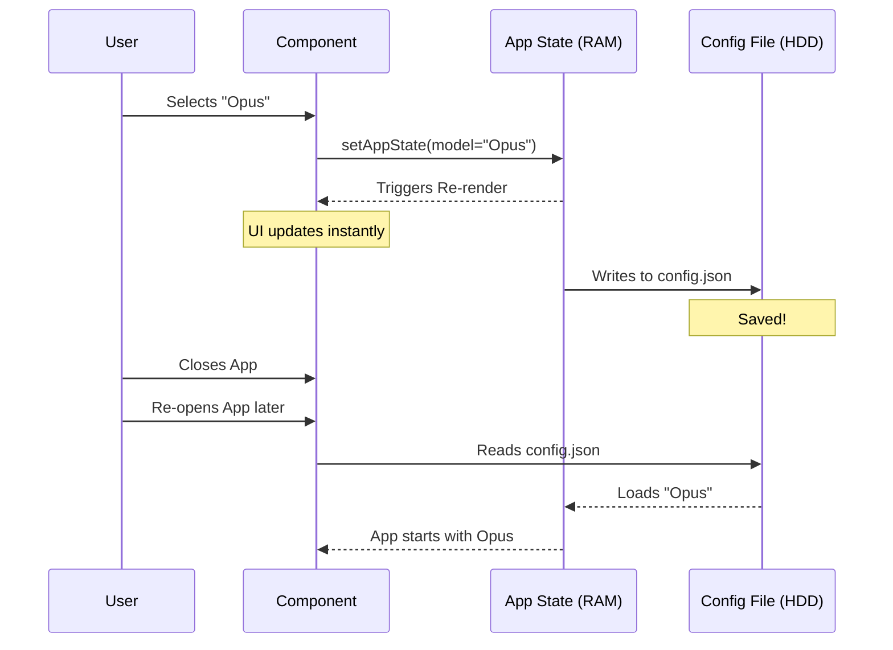

# Chapter 4: Application State Management

Welcome to Chapter 4! 👋

In the previous chapter, [Model Governance & Validation](03_model_governance___validation.md), we acted as "Security Guards," checking IDs and permissions before allowing a model change.

Now, we face a new challenge: **Memory**.

Imagine you tell the CLI, "I want to use the Opus model." The CLI says "Okay!" and runs your command. But five minutes later, when you run a new command, the CLI has forgotten everything and goes back to the default settings. That is frustrating, right?

We need a "Brain" that remembers your preferences even after you close the terminal. This is **Application State Management**.

## The Problem: The Goldfish Memory 🐠

By default, computer programs are like goldfish: they have very short memories. Variables in code only exist while the program is running.

```typescript
// ❌ This variable dies when the command finishes
let currentModel = 'claude-3-opus'; 
```

To build a professional tool, we need:
1.  **Global Access:** Any part of the app (Menu, Logic, Help) can read the settings.
2.  **Persistence:** Settings are saved to a file on your computer, so they survive a restart.
3.  **Reactivity:** If the setting changes, the UI updates instantly.

## The Solution: The AppState Hooks 🪝

In our project, we use a centralized store accessed via **Hooks**. If you have used React before, this will feel very familiar. If not, think of it as a magical library where you can check out books (data) and return them updated.

We have two main tools:

1.  **`useAppState`**: To **READ** data.
2.  **`useSetAppState`**: To **WRITE** data.

Let's look at how to use them to solve our use case: persisting the AI Model selection.

### Concept 1: Reading State 📖

To see what the current model is, we don't look at a local variable. We ask the global store.

```typescript
import { useAppState } from '../../state/AppState.js';

// Inside your component
const currentModel = useAppState(state => state.mainLoopModel);

console.log(currentModel); // Outputs: "claude-3-5-sonnet"
```

*   **`state`**: Represents the entire configuration of the app.
*   **Selector (`s => s.model`)**: We specifically ask for just the `mainLoopModel`. This is efficient because our component only re-renders if *this specific* value changes.

### Concept 2: Writing State ✍️

To change the setting, we need the "Setter."

```typescript
import { useSetAppState } from '../../state/AppState.js';

// 1. Get the tool
const setAppState = useSetAppState();

// 2. Use the tool to update
setAppState(prevState => ({
  ...prevState,           // Keep all other settings (Fast Mode, etc.)
  mainLoopModel: 'opus'   // Only change the model
}));
```

*   **`prevState`**: We always look at the *current* state before making changes to avoid overwriting other data.
*   **Spread (`...prevState`)**: This is crucial! It copies all existing settings so we don't accidentally delete them while changing the model.

## The Use Case: Wiring Up the Model Picker

Let's revisit the `ModelPickerWrapper` from [React-based Command Implementation](02_react_based_command_implementation.md). Now we can see exactly how it connects to the brain.

### Step 1: Connecting the UI
We need the UI to show which model is currently active (highlighted).

```typescript
function ModelPickerWrapper({ onDone }) {
  // Read the current state so the UI knows where to start
  const activeModel = useAppState(s => s.mainLoopModel);
  const setAppState = useSetAppState();
  
  // ... render logic
}
```

### Step 2: Saving the Selection
When the user presses "Enter" on a new model, we save it.

```typescript
  const handleSelect = (newModel) => {
    // Write to the global brain
    setAppState(prev => ({ 
      ...prev, 
      mainLoopModel: newModel 
    }));
    
    onDone(`Saved! You are now using ${newModel}`);
  };
```

### Step 3: Complex State Dependencies
State management isn't just about saving one string. Sometimes, changing one setting affects another.

**Example:** "Fast Mode" is a setting that makes the AI faster but less smart.
*   *Scenario:* You are in "Fast Mode". You switch to a Model that doesn't support Fast Mode.
*   *Logic:* We must turn Fast Mode **OFF** automatically.

```typescript
// Inside handleSelect...
if (isFastModeOn && !supportsFastMode(newModel)) {
  
  // Update TWO things at once
  setAppState(prev => ({
    ...prev,
    mainLoopModel: newModel,
    fastMode: false // Force turn off
  }));

}
```
This ensures our application state is always consistent and valid.

## Under the Hood: How Persistence Works ⚙️

You might be wondering: *"Where does this data actually go?"*

When you call `setAppState`, a few things happen in the background to ensure the data persists across sessions.

### The Flow
1.  **Memory Update:** The React state updates immediately (UI updates).
2.  **Serialization:** The state object is converted into a JSON string.
3.  **File Write:** The system writes this JSON to a config file on your hard drive (e.g., `~/.claude/config.json`).



### The Implementation Details

While we consume `useAppState`, the backend of this system is likely built on a library designed for persistent state.

In our file `state/AppState.js`, the code looks something like this (simplified):

```typescript
import { create } from 'zustand'; // A popular state library
import { persist } from 'zustand/middleware';

export const useAppState = create(
  persist(
    (set) => ({
      mainLoopModel: 'claude-3-5-sonnet', // Default
      fastMode: false,
      // ... other settings
    }),
    {
      name: 'claude-cli-storage', // Key for local storage/file system
    }
  )
);
```

Because of this structure:
1.  We don't need to write file I/O code (reading/writing files) in our commands.
2.  We don't need to parse JSON manually.
3.  We just treat it like a JavaScript object, and the persistence layer handles the "heavy lifting."

## Summary

In this chapter, we gave our application a **Memory**.

1.  **`useAppState`** allows us to read global settings from anywhere.
2.  **`useSetAppState`** allows us to update settings safely.
3.  **Persistence** happens automatically, so the user doesn't lose their configuration when they close the terminal.

We now have a command that exists (Chapter 1), has a UI (Chapter 2), is secure (Chapter 3), and remembers its settings (Chapter 4).

But how do we know if anyone is actually using it? Is the "Opus" model popular, or does everyone stick to "Sonnet"? To answer this, we need to track usage data.

[Next Chapter: Analytics & Telemetry](05_analytics___telemetry.md)

---

Generated by [Code IQ](https://github.com/adityasoni99/Code-IQ)