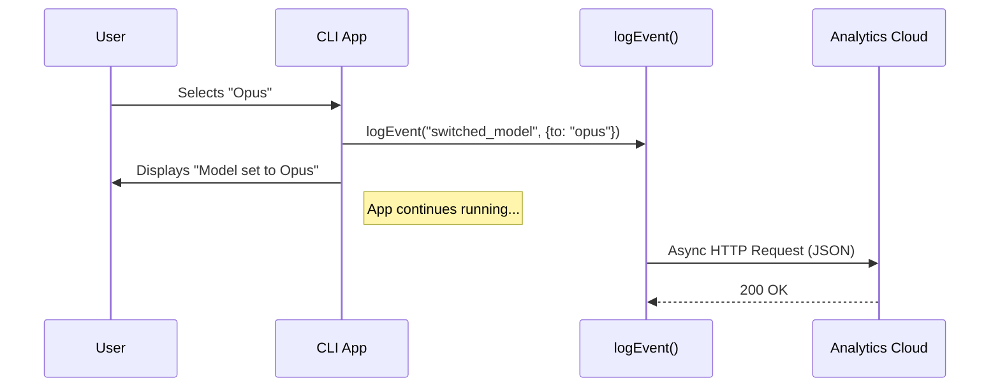

# Chapter 5: Analytics & Telemetry

Welcome to the final chapter of our tutorial series! 🎓

In the previous chapter, [Application State Management](04_application_state_management.md), we gave our CLI a "memory" so it could remember user preferences.

Now, we are going to give our CLI a **voice** to talk back to us, the developers.

## The Problem: Flying Blind 🕶️

Imagine you are a chef. You send plates of food out to the dining room.
*   Do people finish the meal?
*   Do they send it back?
*   Do they struggle to cut the steak?

In a physical restaurant, you can just look. But in a CLI tool installed on thousands of computers, **you are blind**. You don't know if users love your new "Opus" model feature or if they are getting frustrated and cancelling the menu.

## The Solution: Telemetry 📡

**Telemetry** is the automated process of collecting data from remote points. In our context, it means the CLI sends small "events" to our server whenever a user performs a specific action.

We use a function called `logEvent`. It does not change how the app works for the user, but it gives us critical insights.

## The Use Case

We want to answer these questions:
1.  How often do users type `claude model` (Menu Mode) vs `claude model opus` (Direct Mode)?
2.  When users open the menu, which models are they switching **from** and **to**?
3.  How often do users open the menu and then hit "Escape" (Cancel)?

## Concept 1: The Event 📦

An event consists of two things:
1.  **Event Name:** A unique label (e.g., `tengu_model_command_menu`).
2.  **Metadata:** Contextual details (e.g., "User selected Opus").

Let's look at how we track when a user enters the command directly.

```typescript
// model.tsx (The 'call' function)
import { logEvent } from '../../services/analytics/index.js';

// ... inside call()
if (args) {
  // 1. Log that the user typed arguments directly
  logEvent('tengu_model_command_inline', {
    args: args
  });
  
  return <SetModelAndClose args={args} onDone={onDone} />;
}
```

*   **`tengu_model_command_inline`**: This is our internal name for "User typed the model name manually."
*   **`args`**: We record exactly what they typed (e.g., "opus").

## Concept 2: Tracking Transitions 🔀

Telemetry is most powerful when it tells a story. Knowing a user selected "Opus" is good. Knowing they switched **from** "Sonnet" **to** "Opus" is better—it tells us they wanted an upgrade.

In our `ModelPickerWrapper` component (from [React-based Command Implementation](02_react_based_command_implementation.md)), we handle the selection logic.

```typescript
// model.tsx inside handleSelect
const handleSelect = (model) => {
  // 1. Log the transition
  logEvent("tengu_model_command_menu", {
    action: model,       // What they picked
    from_model: mainLoopModel, // What they had before
    to_model: model      // What they have now
  });

  // 2. Update state (Business Logic)
  setAppState(prev => ({ ...prev, mainLoopModel: model }));
  // ...
};
```

By recording `from_model` and `to_model`, we can build charts showing migration patterns between different AI models.

## Concept 3: Tracking Negative Actions 🛑

It is just as important to know when users **don't** complete a task. If 50% of users open the menu and then Cancel, maybe our menu is confusing.

```typescript
// model.tsx inside handleCancel
const handleCancel = () => {
  // 1. Log the specific 'cancel' action
  logEvent("tengu_model_command_menu", {
    action: "cancel"
  });

  // 2. Close the app
  onDone('Cancelled');
};
```

Notice we use the **same event name** (`tengu_model_command_menu`) but a different `action`. This groups all menu interactions together in our dashboard.

## Under the Hood: The Data Flow 🌊

How does this data get from a user's terminal to our dashboard without slowing down the CLI?

1.  **Fire and Forget:** The `logEvent` function is usually non-blocking. The CLI doesn't wait for the server to reply before showing the next screen.
2.  **Buffering:** Events might be stored briefly in memory.
3.  **Transmission:** The data is sent via an HTTPS request to an analytics provider.



## Internal Implementation Details

The `logEvent` function is a wrapper around a more complex analytics service. It ensures type safety. You might see types like `AnalyticsMetadata_I_VERIFIED...` in the code.

This is a safety mechanism to ensure developers don't accidentally log sensitive data (like API keys or file contents) into the analytics system.

```typescript
// Simplified pseudo-code for services/analytics/index.js
export function logEvent(eventName, metadata) {
  // 1. Validate that metadata is safe/allowed
  if (!isSafe(metadata)) return;

  // 2. Add system info (OS, App Version) automatically
  const payload = {
    event: eventName,
    data: metadata,
    system: getSystemInfo() 
  };

  // 3. Send to server (background process)
  sendToIngestionServer(payload);
}
```

## Tutorial Series Conclusion 🎉

Congratulations! You have completed the **model** project tutorial. Let's review the journey we took to build this feature:

1.  **[Command Definition](01_command_definition.md)**: We defined the `model` command in the "Menu" so the CLI knew it existed.
2.  **[React-based Command Implementation](02_react_based_command_implementation.md)**: We built the UI (`ModelPicker`) and the logic routers using React.
3.  **[Model Governance & Validation](03_model_governance___validation.md)**: We added security checks to ensure users only accessed allowed models.
4.  **[Application State Management](04_application_state_management.md)**: We gave the app a persistent memory to save the user's choice.
5.  **Analytics & Telemetry**: We added sensors to track how the feature is used in the real world.

You now have a complete understanding of how a professional-grade CLI command is architected, from the first keystroke to the final data packet!

Happy Coding! 🚀

---

Generated by [Code IQ](https://github.com/adityasoni99/Code-IQ)