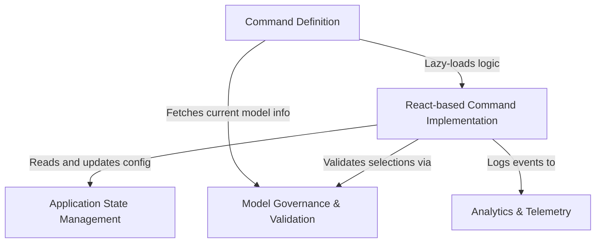

# Tutorial: model

This project implements a **CLI command** that allows users to view and configure the active AI model. It utilizes an interactive **React-based interface** to handle user inputs, verifies selections against **governance rules** (such as organization allowlists), persists changes to the **global application state**, and tracks usage via **analytics**.

## Chapters

1. [Command Definition](01_command_definition.md)
2. [React-based Command Implementation](02_react_based_command_implementation.md)
3. [Model Governance & Validation](03_model_governance___validation.md)
4. [Application State Management](04_application_state_management.md)
5. [Analytics & Telemetry](05_analytics___telemetry.md)

---

Generated by [Code IQ](https://github.com/adityasoni99/Code-IQ)