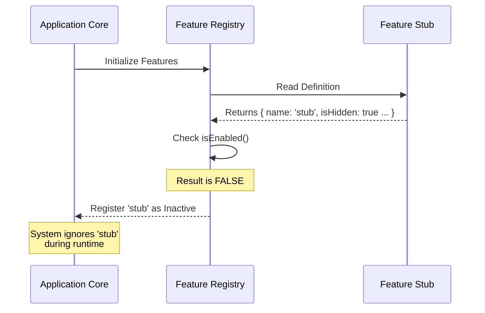

# Chapter 1: Feature Definition Stub

Welcome to the `oauth-refresh` project! In this first chapter, we are going to look at the most fundamental building block of our system: the **Feature Definition Stub**.

## Why do we need this?

Imagine you are building a massive application. You want to add a new feature, like a "Dark Mode" or a "User Profile," but you haven't written the actual logic for it yet.

If you start writing complex code immediately, you might break the rest of the application. Instead, we need a safe way to tell the system: *"Hey, I'm planning to put a feature here, but don't let anyone use it yet."*

### The Central Use Case
We want to introduce a new component into our system without activating it or showing it to the user. We need a "placeholder" that satisfies the system's requirements but does absolutely nothing.

## The Analogy: The "Coming Soon" Storefront

Think of your application as a **Shopping Mall**.

*   **The Feature:** A new shop (e.g., a bakery) inside the mall.
*   **The Stub:** A "Coming Soon" storefront.

The Mall Management (the system) allocates a space number and puts up a plywood wall.
1.  **Identity:** It has a number/name on the mall map so Management knows it's there.
2.  **Visibility:** The windows are covered (Hidden).
3.  **Capability:** The doors are locked; customers cannot buy bread yet (Disabled).

This allows the mall to stay open and organized while the bakery is being built behind the scenes.

## The Solution

To solve our use case, we create a **Feature Definition Stub**. This is a small JavaScript object that defines the "contract" of our feature.

Here is the code structure for our stub:

```javascript
// File: index.js
export default {
  isEnabled: () => false,
  isHidden: true,
  name: 'stub'
};
```

### Explanation
When the system reads this file, three things happen:
1.  **`name: 'stub'`**: The system registers this feature under the ID "stub".
2.  **`isHidden: true`**: The system knows not to display this in any menus.
3.  **`isEnabled: () => false`**: The system knows that even if someone tries to access it, the feature is turned off.

## Under the Hood: How it works

Let's look at the flow of data when the application starts up and encounters this stub.

### The Process
1.  The Application asks for a list of all available features.
2.  It loads our `index.js` file.
3.  It checks the properties (`name`, `isHidden`, `isEnabled`).
4.  Because it is a stub, the Application acknowledges it but marks it as inactive.

### Visualizing the Flow



### Implementation Details

Let's look closer at the specific code provided in `index.js`. We will break it down line-by-line.

#### 1. The Identity
```javascript
// giving the feature a unique ID
name: 'stub'
```
*   **What it does:** Assigns a string identifier.
*   **Why:** The system needs a key to reference this module in logs or databases.

#### 2. The Visibility
```javascript
// hiding the feature from the UI
isHidden: true
```
*   **What it does:** A simple boolean flag (true/false).
*   **Why:** If `true`, the UI will not render links or buttons for this feature. It's like the plywood covering the shop windows.

#### 3. The Capability (The Lock)
```javascript
// ensuring the logic never runs
isEnabled: () => false
```
*   **What it does:** This is a function that returns `false`.
*   **Why:** This is the most critical part of the stub. By returning `false`, we guarantee that no code related to this feature gets executed.

## Summary

In this chapter, we learned how to create a **Feature Definition Stub**. This allows us to reserve space in our application for a future module without risking stability or exposing unfinished work to users.

It acts exactly like a "Coming Soon" sign in a mall:
*   It has a **Name**.
*   It is **Hidden**.
*   It is **Disabled**.

In the next chapter, we will learn how to unlock the door and actually turn the feature on.

[Next Chapter: Activation Logic](02_activation_logic.md)

---

Generated by [Code IQ](https://github.com/adityasoni99/Code-IQ)