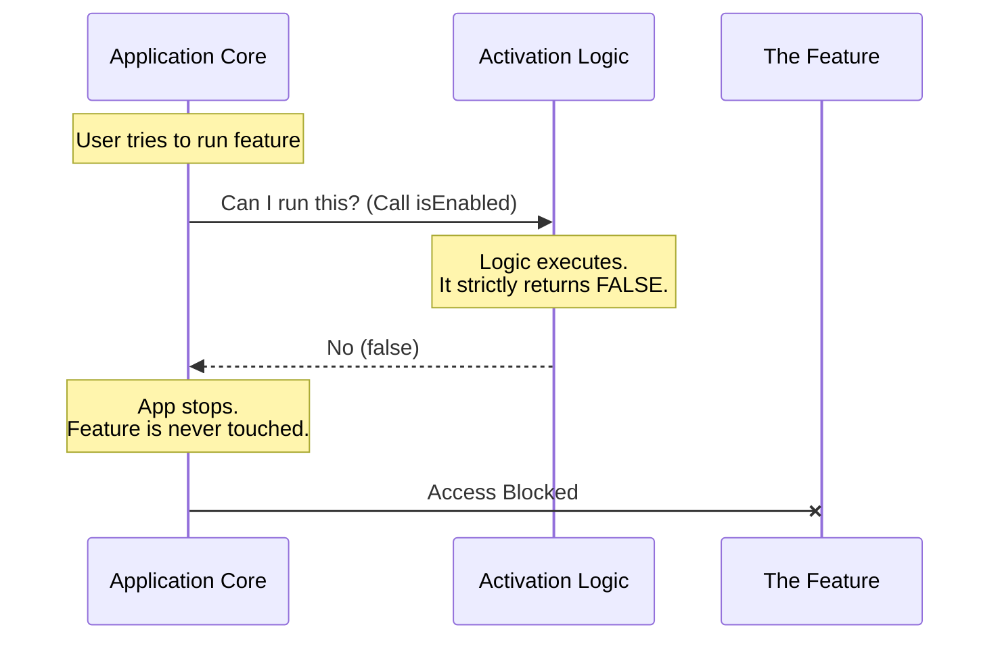

# Chapter 2: Activation Logic

Welcome back! In the previous chapter, [Chapter 1: Feature Definition Stub](01_feature_definition_stub.md), we built the "shell" or the "storefront" for our new feature. We gave it a name and hid it from view.

However, hiding a feature isn't enough. Experienced users might guess the URL, or a bug might accidentally reveal the button. We need a guarantee that the feature cannot run.

In this chapter, we will learn about **Activation Logic**.

## Why do we need this?

Imagine you are wiring a house. You have installed a new outlet, but you aren't sure if the wiring is perfect yet. You don't want anyone plugging a toaster in and causing a spark.

### The Central Use Case
We have code for a feature that is currently incomplete or untested. We need a mechanism that acts as a **Hardcoded Safety Fuse**.

We want to tell the system: *"Under no circumstances should this feature be allowed to execute."*

## The Analogy: The Master Circuit Breaker

Think of the Activation Logic as a **Circuit Breaker** in your home.

*   **The Feature:** The electrical outlet.
*   **The Logic:** The breaker switch in the basement.

Even if you plug a lamp into the outlet (try to use the feature), if the breaker is switched to **OFF**, electricity will not flow. It is a physical break in the circuit.

## The Solution

To implement this safety fuse, we use a specific property called `isEnabled`.

In our specific context for the `oauth-refresh` project, we are going to implement the strictest possible logic: a function that **always** says "No".

Here is the code:

```javascript
// File: index.js
export default {
  // ... other properties like name and isHidden ...

  // The Activation Logic
  isEnabled: () => false
};
```

### Understanding the Syntax
If you are new to JavaScript, `() => false` is a short way of writing a function.
*   **Input:** `()` means it takes no arguments. It doesn't care who you are or what time it is.
*   **Output:** `false` means the answer is always "No".

## Under the Hood: How it works

Let's walk through what happens when a user (or the system) tries to run this feature.

### The Process
1.  **Request:** The App tries to start the feature.
2.  **Gatekeeper:** The App looks at the `isEnabled` property.
3.  **Execution:** The App runs the function.
4.  **Verdict:** The function returns `false`.
5.  **Block:** The App immediately stops and denies access.

### Visualizing the Flow

Here is a diagram showing how the Activation Logic acts as a wall between the App and the Feature.



### Implementation Details

Let's look at the code snippet again to understand exactly why we write it this way.

```javascript
isEnabled: () => false
```

#### Why use a Function?
You might wonder, why not just write `isEnabled: false` (a simple value)?

We use a function (`() => ...`) because in the future, we might want to change the logic. Later, we might want to say:
*   *"Enable if the user is an Admin"*
*   *"Enable if the date is after Christmas"*

By using a function now, we establish a standard way for the Application to "ask questions." Today, the answer is always "False." Tomorrow, the answer might be calculated.

## Testing the Logic

When you run your application with this logic in place, you can verify it works by looking at the behavior:

1.  **Input:** The system attempts to load the module defined as `stub`.
2.  **Logic Check:** The system calls `isEnabled()`.
3.  **Output:** `false`.
4.  **Result:** The feature code is skipped entirely. It is as if the feature doesn't exist.

## Summary

In this chapter, we implemented the **Activation Logic** for our feature stub.

We learned:
1.  **Safety First:** We need a way to completely disable code that isn't ready.
2.  **The Kill Switch:** We implemented `isEnabled: () => false`.
3.  **The Contract:** By using a function, we allow the system to ask "Can I run this?" and we provide a hard "No" as the answer.

You now have a safe, registered, but completely dormant feature in your system. This completes the setup for the `oauth-refresh` project stubs!

[Return to Chapter 1: Feature Definition Stub](01_feature_definition_stub.md)

---

Generated by [Code IQ](https://github.com/adityasoni99/Code-IQ)