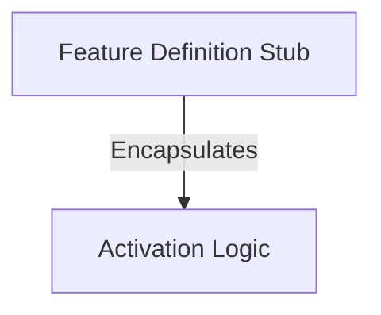

# Tutorial: oauth-refresh

This project serves as a **placeholder** for a future feature within the system. It establishes a *standard definition* that is currently hardcoded to be **disabled** and **hidden**, ensuring that the incomplete functionality remains inactive and invisible to users.

## Chapters

1. [Feature Definition Stub](01_feature_definition_stub.md)
2. [Activation Logic](02_activation_logic.md)

---

Generated by [Code IQ](https://github.com/adityasoni99/Code-IQ)