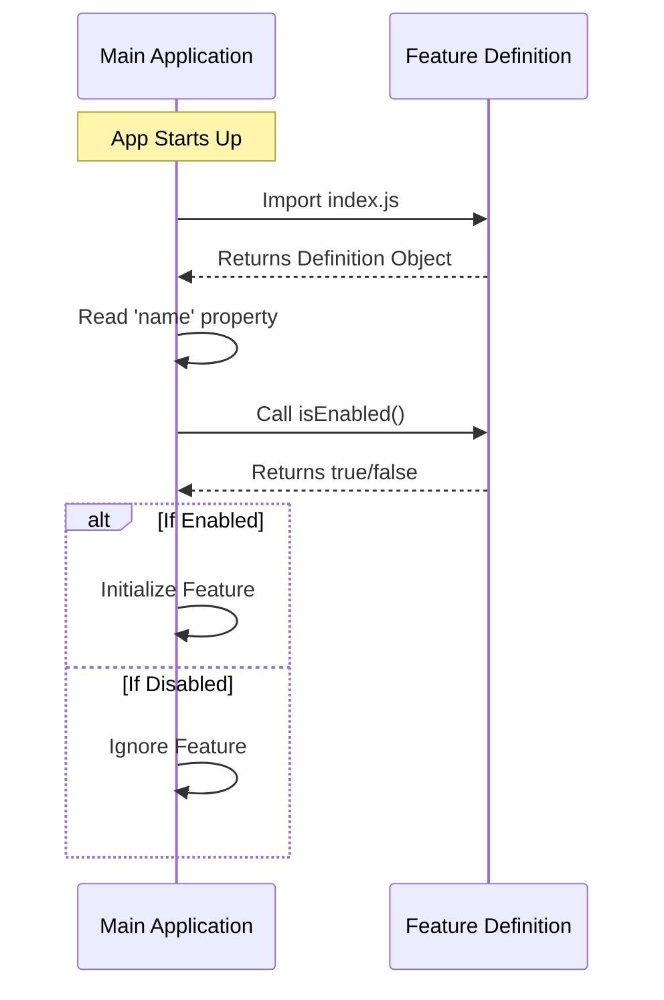

# Chapter 1: Feature Definition

Welcome to the **onboarding** project! Since this is the very first chapter, we are going to lay the foundation for everything else you will build.

## The Motivation: Who are you?

Imagine you are building a social media app. Every user has a **Profile**. This profile tells the app the user's name, their settings, and whether they are currently online. Without a profile, the user is just a ghost—the app doesn't know what to call them or how to treat them.

In our system, every piece of code (which we call a **Feature** or **Module**) needs a profile too.

**The Use Case:**
We want to create a new feature (like a "Dark Mode" button). However, we need a standard way to tell the main application:
1.  What is this feature called?
2.  Should it be visible on the screen?
3.  Is it turned on or off?

We solve this by creating a **Feature Definition**.

## What is a Feature Definition?

The Feature Definition is a single JavaScript object that acts as a contract between your specific code and the rest of the application. It creates a standardized "identity card" for your feature.

It consists of three main concepts:

1.  **Identity:** The unique name of the feature.
2.  **Behavior:** Rules for whether the feature is active.
3.  **Visibility:** Rules for whether the feature is hidden from the UI.

## How to Use It

To define a feature, we create an `index.js` file. This file must export a single object containing our definitions.

Here is how you define a basic, active feature:

```javascript
// File: index.js
export default {
  name: 'dark-mode-toggle', // The Identity
  isHidden: false,          // The Visibility
  isEnabled: () => true     // The Activation Logic
};
```

**Explanation:**
*   `export default`: This tells JavaScript that this object is the main thing this file provides.
*   `name`: A simple string acting as the ID. We will cover this more in [Module Identity](02_module_identity.md).
*   `isEnabled`: A function that returns `true` or `false`. This determines if the logic works. See [Activation Logic](03_activation_logic.md).

## Internal Implementation: Under the Hood

How does the application actually use this definition?

Think of the Application as a **Security Guard** at a club, and your Feature Definition as an **ID Card**. The Guard (Application) reads the ID Card (Feature Definition) to decide if the person (Code) gets into the club.

### The Flow

Here is what happens step-by-step when the application starts up:



### The "Stub" Implementation

In many cases, you might want to create a placeholder for a feature that isn't ready yet or should be disabled by default. We call this a "Stub".

Here is the actual implementation you will find in our codebase for a default feature definition:

```javascript
// File: index.js
export default { 
  isEnabled: () => false, 
  isHidden: true, 
  name: 'stub' 
};
```

**Code Walkthrough:**
1.  `isEnabled: () => false`: By returning `false`, we ensure this feature is turned **off** by default.
2.  `isHidden: true`: This tells the UI rendering engine to not display any icons or menus for this feature. You will learn more about this in [Visibility Control](04_visibility_control.md).
3.  `name: 'stub'`: This labels the feature as a placeholder. We discuss this specific pattern in depth in [Stub Pattern](05_stub_pattern.md).

## Conclusion

In this chapter, you learned that a **Feature Definition** is simply a JavaScript object exported from `index.js`. It serves as the "User Profile" for your code, telling the application what the feature is named and how it should behave.

Now that we have the basic structure, let's look closer at the first property of our definition: the name.

[Next Chapter: Module Identity](02_module_identity.md)

---

Generated by [Code IQ](https://github.com/adityasoni99/Code-IQ)