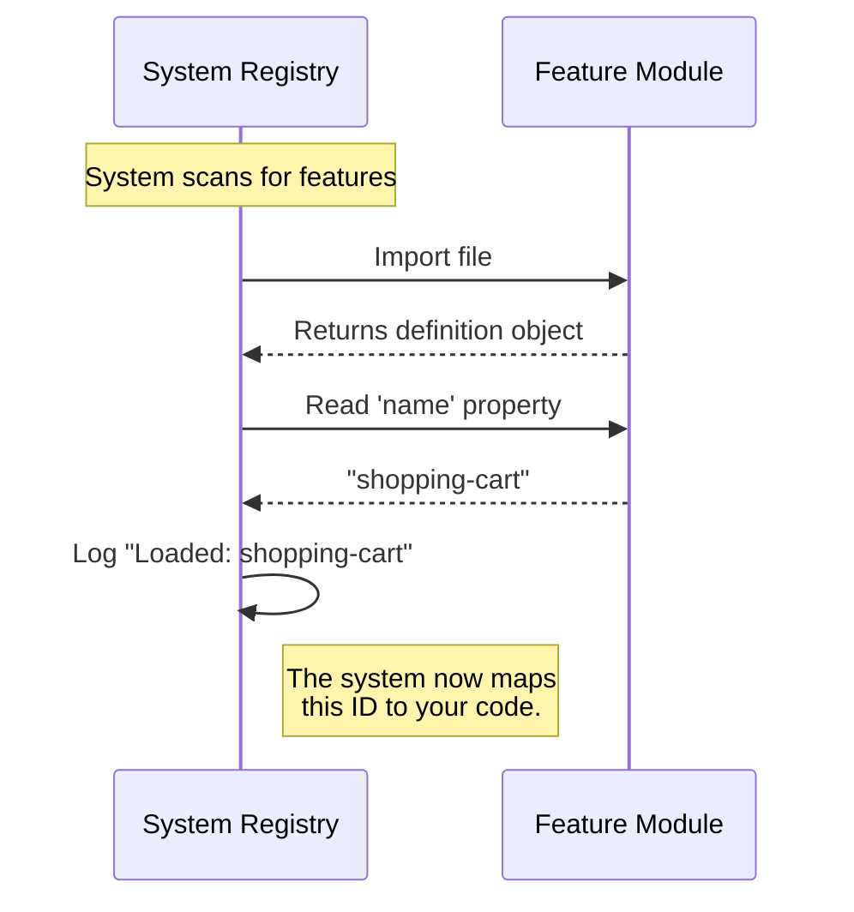

# Chapter 2: Module Identity

In the previous chapter, [Feature Definition](01_feature_definition.md), we established that every piece of code needs a "Profile" (an exported object) to exist in our application.

Now, we are going to focus on the most fundamental part of that profile: **The Name**.

## The Motivation: The "Nametag" Problem

Imagine you are at a large conference. You meet hundreds of people. If everyone wore a mask and refused to give their name, it would be impossible to talk to them, reference them later, or find them in a crowd.

The same problem exists in software. Your application might load 50 different modules (Dark Mode, Chat, Notifications, etc.).

**The Use Case:**
When the application starts, it prints a list of loaded features to the console log.
*   **Without Identity:** The log would read: `Object`, `Object`, `Object`. This is useless for debugging.
*   **With Identity:** The log reads: `dark-mode`, `chat-widget`, `stub`.

We need a way to give each feature a unique string identifier so the system (and the developers) can recognize it.

## What is Module Identity?

Module Identity is simply a text string attached to your feature definition. Think of it as a **Nametag** or an **ID Badge**.

It serves two purposes:
1.  **System Reference:** It allows the central system to track this specific module in lists or configurations.
2.  **Developer Communication:** It tells other programmers what this file is supposed to represent.

## How to Use It

To give your module an identity, you assign a string to the `name` property inside your `index.js` file.

Here is how you would name a "Shopping Cart" feature:

```javascript
// File: index.js
export default {
  name: 'shopping-cart', // The unique ID
  isHidden: false,
  isEnabled: () => true
};
```

**Explanation:**
*   `name`: The key required by our system.
*   `'shopping-cart'`: The value. This should be unique (no two features should share a name) and descriptive (use dashes instead of spaces).

## Internal Implementation: Under the Hood

How does the system use this name?

Think of the Application as a **Hotel Receptionist**. When a guest (your Feature) arrives, the Receptionist asks for their name to write it in the Guest Log.

### The Flow

Here is what happens when the system encounters your file:



### The "Stub" Implementation

Now, let's look at the actual code provided in the project `onboarding`. You will notice the name isn't descriptive like `'shopping-cart'`. It is set to `'stub'`.

```javascript
// File: index.js
export default { 
  isEnabled: () => false, 
  isHidden: true, 
  name: 'stub' 
};
```

**Why is it named 'stub'?**

In software development, a **Stub** is a placeholder. It is like a "Under Construction" sign.

By naming this module `'stub'`, we are explicitly signaling to other developers:
> "This file exists, but it doesn't contain real business logic yet. It is just a template."

This is a safety measure. If you see `'stub'` in your logs, you know this feature hasn't been fully built yet.

As you develop your feature, one of your first tasks will be changing `'stub'` to a real name (like `'user-profile'`).

## Conclusion

In this chapter, you learned that **Module Identity** is a string property (`name`) that acts as an ID badge for your code. It allows the system to log, track, and manage your feature. You also learned that we currently use `'stub'` as a placeholder name for new files.

However, having a name doesn't mean the feature actually *works* yet. We need to decide if the feature is turned on or off.

[Next Chapter: Activation Logic](03_activation_logic.md)

---

Generated by [Code IQ](https://github.com/adityasoni99/Code-IQ)