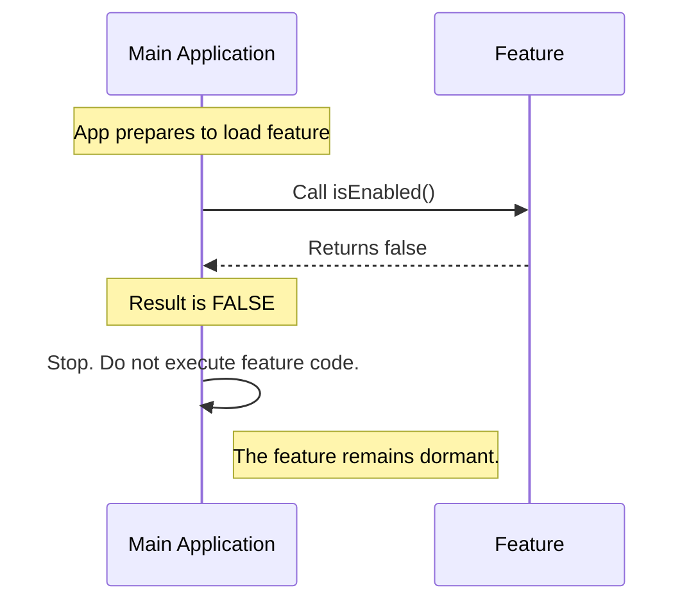

# Chapter 3: Activation Logic

In the previous chapter, [Module Identity](02_module_identity.md), we learned how to give our code a name using the `name` property. We essentially printed an ID badge for our feature.

However, just because a person has an ID badge doesn't mean they are allowed to start working immediately. In this chapter, we will learn how to control whether your feature is actually running or completely shut down.

## The Motivation: The Master Switch

Imagine you have a lamp plugged into a wall socket. Even though electricity is flowing to the socket, the lamp doesn't light up until you flip the switch.

In software, we have the same need. We often write code that we don't want to run yet.

**The Use Case:**
Imagine you are building a special "Holiday Theme" for your app.
1.  The code is written and deployed in November.
2.  However, you don't want it to run until December 1st.
3.  You don't want to delete the code and re-type it later.

We need a **Master Power Switch**. We need a way to keep the code in the project but prevent it from executing until we are ready.

## What is Activation Logic?

Activation Logic is the decision-making process that determines if a feature is "alive." In our system, this is represented by the `isEnabled` property.

It acts as a **Gatekeeper**. Before the application runs any logic for your feature, it asks the Gatekeeper: *"Are we allowed to run this?"*

## How to Use It

To control your feature, you define the `isEnabled` property inside your `index.js` file. This property must be a **function** that returns `true` (On) or `false` (Off).

Here is an example of a feature that is turned **ON**:

```javascript
// File: index.js
export default {
  name: 'holiday-theme',
  // This function returns true, so the feature runs
  isEnabled: () => true, 
  isHidden: false
};
```

**Explanation:**
*   `() => true`: This is JavaScript arrow function syntax. It means "a function that takes no arguments and immediately gives back the value `true`."
*   Because it returns `true`, the application flips the switch ON.

## Internal Implementation: Under the Hood

How does the application use this switch?

Think of the Application as an **Electrician**. Before doing any work on a circuit (your Feature), the Electrician checks if the breaker is on.

### The Flow

Here is the conversation that happens between the Main App and your Feature:



### The "Stub" Implementation

Now, let's look at the specific code used in the `onboarding` project. You will see that our "stub" (placeholder) is permanently turned off.

```javascript
// File: index.js
export default { 
  isEnabled: () => false, // <--- The Focus of this Chapter
  isHidden: true, 
  name: 'stub' 
};
```

**Why `() => false`?**

In this stub context, the switch is permanently taped to the "Off" position.

1.  **Safety:** This is a placeholder file. It doesn't contain real logic yet. If we accidentally turned it on, it might break the app.
2.  **Control:** By returning `false`, we ensure that even though this file exists in the project folder, the system ignores it completely during execution.

**Why is it a function?**

You might wonder, why not just write `isEnabled: false`? Why make it a function `() => false`?

Using a function is powerful because it allows for dynamic logic later!

```javascript
// Future Example: Only enable on weekends
isEnabled: () => {
    const today = new Date().getDay();
    return today === 6 || today === 0; // Returns true on Sat/Sun
}
```

By defining it as a function now (even a simple one), we make it easy to add complex rules later without changing the structure of the application.

## Conclusion

In this chapter, you learned about **Activation Logic**. You discovered that `isEnabled` acts as a master power switch for your code.

*   If it returns `true`: The feature runs.
*   If it returns `false`: The feature sleeps.
*   In our **Stub**, it is set to `false` to prevent the placeholder code from running accidentally.

Now we have a feature that has a name, and we know how to turn it on or off. But suppose we turn it ON—does that mean the user sees it? Not necessarily. We need to handle the visuals separately.

[Next Chapter: Visibility Control](04_visibility_control.md)

---

Generated by [Code IQ](https://github.com/adityasoni99/Code-IQ)