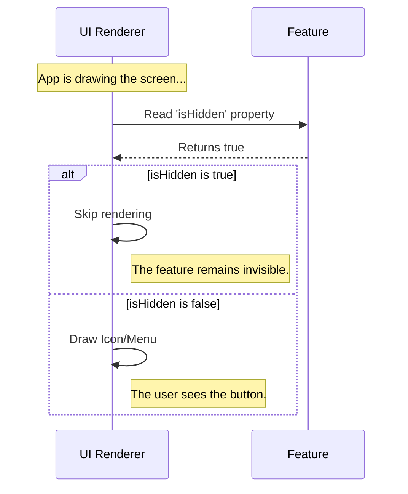

# Chapter 4: Visibility Control

In the previous chapter, [Activation Logic](03_activation_logic.md), we learned how to use the Master Switch (`isEnabled`) to determine if our feature's code is allowed to run.

However, running code and showing something to the user are two different things. Just because a machine is turned on doesn't mean you want to put it in the front window of your shop.

In this chapter, we will learn how to control the **Visual Presence** of your feature independently from its logic.

## The Motivation: The "Backstage" Concept

Imagine a theater stage.
*   **The Actor** is your Feature.
*   **The Stage** is the User Interface (your app screen).

Sometimes, an actor is in the building, dressed up, and reciting lines (Logic is ON), but they are standing behind the curtain waiting for their cue. They are working, but the audience cannot see them yet.

**The Use Case:**
You are building a **Music Player** feature.
1.  **Logic:** The music player needs to load in the background so it can buffer songs. It must be active.
2.  **UI:** However, the user is currently on the "Login Screen." You don't want the Play/Pause buttons floating over the username field.

We need a way to say: *"Keep the feature running, but hide the buttons."*

## What is Visibility Control?

Visibility Control is managed by the `isHidden` property in your feature definition. It controls the user-facing aspect of the feature separate from its logic.

*   `isEnabled`: Controls the **Brains** (Does it think?).
*   `isHidden`: Controls the **Face** (Can we see it?).

## How to Use It

To control visibility, we set the `isHidden` property to either `true` or `false` in our `index.js` file.

### Scenario A: The Invisible Worker
You want the feature to exist, but not appear in menus or toolbars.

```javascript
// File: index.js
export default {
  name: 'background-music-loader',
  isEnabled: () => true, // Logic is RUNNING
  isHidden: true         // UI is HIDDEN
};
```
**Result:** The code executes, but no icons appear on the screen.

### Scenario B: Center Stage
You are ready for the user to interact with the feature.

```javascript
// File: index.js
export default {
  name: 'music-player-ui',
  isEnabled: () => true, // Logic is RUNNING
  isHidden: false        // UI is VISIBLE
};
```
**Result:** The application renders your feature's buttons/menus on the screen.

## Internal Implementation: Under the Hood

How does the application know when to draw your feature?

Think of the Application's UI renderer as a **Stage Manager**. Before the curtain rises, the Stage Manager checks the list of actors.

### The Flow

Here is the decision process the UI engine goes through:



### The "Stub" Implementation

Let's look at the default code provided in the `onboarding` project again.

```javascript
// File: index.js
export default { 
  isEnabled: () => false, 
  isHidden: true,       // <--- The Focus of this Chapter
  name: 'stub' 
};
```

**Why is `isHidden` set to `true`?**

Since this is a "Stub" (a placeholder), it acts like a construction barrier.
1.  **Safety:** We don't want a button labeled "Stub" appearing in our beautiful application menu.
2.  **Cleanliness:** Developers can add 10 new features to the project codebase without cluttering the screen until they are actually ready to be shown.

Even if you were to accidentally flip `isEnabled` to `true`, `isHidden: true` ensures that the user won't see a broken interface. It is a second layer of safety.

## Conclusion

In this chapter, you learned about **Visibility Control**.

You discovered that `isHidden` allows you to separate the "doing" (Logic) from the "showing" (UI).
*   `isHidden: true` keeps the feature functioning but invisible (Backstage).
*   `isHidden: false` puts the feature on the screen (On Stage).

We have now covered the Name, the Activation, and the Visibility. You might have noticed that our example code keeps using the name `'stub'`. What exactly *is* a Stub in the context of this project?

[Next Chapter: Stub Pattern](05_stub_pattern.md)

---

Generated by [Code IQ](https://github.com/adityasoni99/Code-IQ)