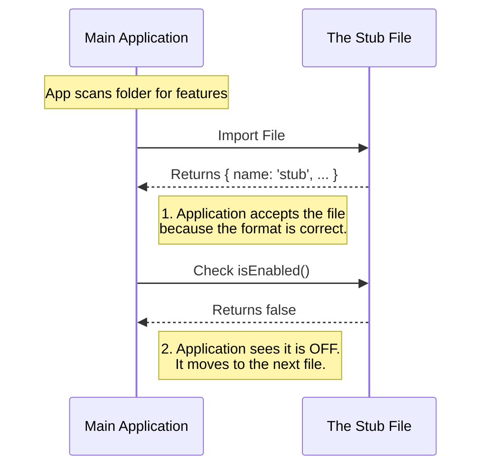

# Chapter 5: Stub Pattern

In the previous chapter, [Visibility Control](04_visibility_control.md), we learned how to hide a feature from the user interface while keeping the code active.

Throughout this entire tutorial, we have been analyzing a specific snippet of code. We have looked at its name, its logic, and its visibility. Now, in this final chapter, we will look at the file as a whole.

We call this specific configuration the **Stub Pattern**.

## The Motivation: The "Missing Piece" Problem

Imagine you are building a jigsaw puzzle. You have the frame built, but there is a hole in the middle where a piece is missing. If you try to pick up the puzzle, it might fall apart because the structure isn't complete.

Software architecture is similar. The Main Application often expects certain files to exist and behave in a specific way.

**The Use Case:**
You are planning a new "Chat" feature.
1.  You want to create the file `chat/index.js` so it exists in your project folder.
2.  However, you haven't written the chat code yet.
3.  If you leave the file empty, the Application will crash because it tries to read a "Feature Definition" that isn't there.

We need a way to create a valid file that does absolutely nothing, safely.

## What is a Stub?

A **Stub** is a placeholder. It is a piece of code that satisfies all the requirements to be part of the system (it imports and exports correctly) but performs no actual work.

### The Analogy: The Reserved Table
Think of your application as a busy restaurant.
*   **A Real Feature** is a table full of people eating dinner.
*   **A Missing File** is a hole in the floor. Waiters (the System) might fall in!
*   **A Stub** is a table with a **"Reserved"** sign on it.

The table exists. It takes up space in the floor plan. The waiters know it is there. But no one is eating, and no food is being served. It allows the restaurant to be fully set up before the guests actually arrive.

## How to Use It

To use the Stub Pattern, you simply copy the standard "blank" definition into your new file. This is the code we have been analyzing all along:

```javascript
// File: index.js
export default { 
  isEnabled: () => false, 
  isHidden: true, 
  name: 'stub' 
};
```

**Why this combination?**
1.  **Valid Object:** It exports an object, so the system doesn't crash when importing it.
2.  **`name: 'stub'`:** As we learned in [Module Identity](02_module_identity.md), this explicitly tells developers "This is just a placeholder."
3.  **`isEnabled: false`:** As seen in [Activation Logic](03_activation_logic.md), this ensures the empty code never runs.
4.  **`isHidden: true`:** As seen in [Visibility Control](04_visibility_control.md), this ensures the user never sees it.

## Internal Implementation: Under the Hood

How does the system handle these "Reserved Tables"?

Think of the Application as a **Building Inspector**. It goes from room to room (file to file) checking if everything is up to code.

### The Flow

Here is what happens when the Application encounters a Stub:



If we didn't use the Stub Pattern and just left the file empty, step 1 would fail, and the application would stop working entirely.

### Code Walkthrough

The "Stub" works because it strictly follows the **Feature Definition** contract we learned in Chapter 1.

The Main Application might look something like this (simplified):

```javascript
// Main Application Logic
import feature from './my-new-feature/index.js';

// The app EXPECTS 'feature' to be an object
if (!feature) {
    throw new Error("App Crashed: Feature is missing!");
}

// The app EXPECTS a name
console.log("Loaded:", feature.name); 
```

**If you use the Stub:**
1.  `feature` exists (Crash avoided).
2.  `feature.name` is `'stub'` (Logged successfully).
3.  The app continues running smoothly.

**The Lifecycle of a Stub:**
1.  **Creation:** You create a new file and paste the Stub code.
2.  **Architecture:** You connect this file to your main app. The app runs without errors.
3.  **Development:** You slowly replace the stub properties with real values (`name: 'chat'`, `isEnabled: true`).
4.  **Completion:** The Stub is no longer a stub; it is now a Feature.

## Conclusion

In this tutorial series, we have built a complete mental model of how the `onboarding` project manages code.

1.  **[Feature Definition](01_feature_definition.md):** We learned that every feature needs a profile.
2.  **[Module Identity](02_module_identity.md):** We learned to name our features (`name`).
3.  **[Activation Logic](03_activation_logic.md):** We learned to turn features on and off (`isEnabled`).
4.  **[Visibility Control](04_visibility_control.md):** We learned to hide features from the UI (`isHidden`).
5.  **Stub Pattern:** We learned that combining these concepts allows us to create safe placeholders for future work.

You are now ready to start creating your own features. Remember: every great feature starts as a simple **Stub**.

Happy Coding!

---

Generated by [Code IQ](https://github.com/adityasoni99/Code-IQ)