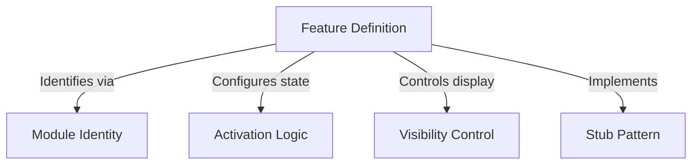

# Tutorial: onboarding

This project outlines a structural framework for managing **feature toggles** within an application. It utilizes a **Stub Pattern** to safely introduce new modules that are present in the system but currently *invisible* and *inactive*, acting as secure placeholders for future development.

## Chapters

1. [Feature Definition](01_feature_definition.md)
2. [Module Identity](02_module_identity.md)
3. [Activation Logic](03_activation_logic.md)
4. [Visibility Control](04_visibility_control.md)
5. [Stub Pattern](05_stub_pattern.md)

---

Generated by [Code IQ](https://github.com/adityasoni99/Code-IQ)