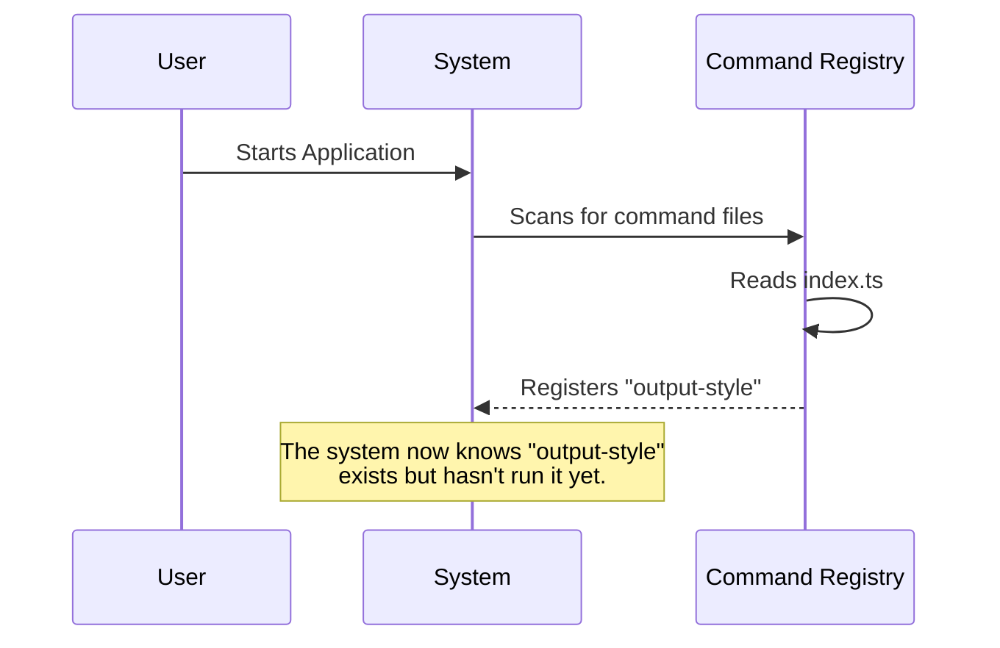

# Chapter 1: Command Registration Interface

Welcome to the first chapter of the `output-style` project tutorial!

## The Concept: The Restaurant Menu

Imagine you walk into a restaurant. Before you can eat anything, you need to look at a **menu**. The menu tells you:
1.  **Name:** What the dish is called.
2.  **Description:** What's in it.
3.  **Type:** Is it an appetizer, main course, or dessert?

In our code, the **Command Registration Interface** is exactly like a single item on that menu. It doesn't cook the food (run the logic) yet; it just tells the system, "Hello, I exist, and here is my name."

### The Use Case

We want to add a command called `output-style` to our application. When the user types this command, the system needs to recognize it as valid. If we don't register it, the system will just say, "Unknown command."

By the end of this chapter, you will understand how to define this entry point so the system knows who your command is.

---

## Defining the Command

To register a command, we create a simple object. This object acts like an ID card. We will break down the code found in `index.ts`.

### Step 1: Naming and Description

First, we give the command a name and a description. This helps the user know what the command does.

```typescript
// From File: index.ts

const outputStyle = {
  // The command name users will type or reference
  name: 'output-style',
  
  // A helper text explaining what this does
  description: 'Deprecated: use /config to change output style',
  
  // ... more properties below
}
```

**Explanation:**
*   `name`: This is the unique ID. The system looks for this specific string.
*   `description`: This is text shown in help menus. In this specific case, it tells the user this command is old (deprecated).

### Step 2: Visibility and Type

Next, we define what kind of command it is and whether everyone should see it immediately.

```typescript
// ... inside the object

  // Defines the category or execution style
  type: 'local-jsx',
  
  // 'true' hides this from the main help list (like a secret menu item)
  isHidden: true,

// ...
```

**Explanation:**
*   `type`: This helps the system decide how to handle the command later.
*   `isHidden`: Since this command is deprecated (old), we set this to `true`. It still exists and works, but it won't clutter the main menu.

### Step 3: Connecting the Logic

Finally, we need to link this "Menu Item" to the "Kitchen" (the code that actually runs).

```typescript
import type { Command } from '../../commands.js'

// ... inside the object
  // This points to the file containing the actual logic
  load: () => import('./output-style.js'),
} satisfies Command

export default outputStyle
```

**Explanation:**
*   `load`: This is a function. Notice it uses `import`. It tells the system: "Don't load the heavy logic code yet. Only load `./output-style.js` when someone actually asks for this command."
*   `satisfies Command`: This checks our spelling. It ensures our object follows the strict rules of a `Command`.

---

## Under the Hood: How Registration Works

When you start the application, the system needs to build its "Menu." It doesn't run the commands; it just collects their names.

### The Registration Flow

Here is a simplified view of what happens when the application starts up:



### Why do we do it this way?

You might wonder why we split the **Definition** (this chapter) from the **Logic** (the actual code that runs).

1.  **Speed:** The system can read `index.ts` very quickly because it's small. It knows *about* the command without reading the heavy code behind it.
2.  **Organization:** It keeps the "ID card" separate from the "implementation."

This separation relies heavily on a concept called the **Lazy Loading Strategy**. We will explore exactly how that `load` function works in [Chapter 3: Lazy Loading Strategy](03_lazy_loading_strategy.md).

Once the command is running, it will likely need to talk back to the user. This is handled by the [Feedback/Output System](02_feedback_output_system.md).

---

## Conclusion

Congratulations! You've just learned how to introduce a new command to the system. You created a "Menu Item" that contains:
1.  **Name & Description:** Identity.
2.  **Visibility:** Whether it shows up in lists.
3.  **Link to Logic:** Where to find the code to run.

However, we haven't actually *run* the command yet, nor have we seen what happens when the user interacts with it.

In the next chapter, we will look at how the system talks back to the user once a command is triggered.

[Next Chapter: Feedback/Output System](02_feedback_output_system.md)

---

Generated by [Code IQ](https://github.com/adityasoni99/Code-IQ)