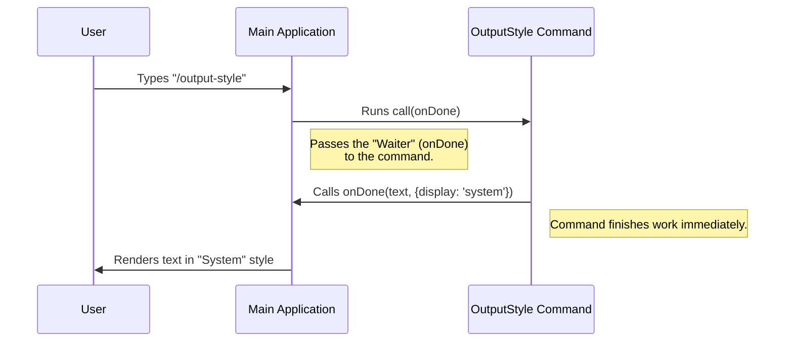

# Chapter 2: Feedback/Output System

Welcome to the second chapter of the `output-style` tutorial!

In the previous chapter, [Chapter 1: Command Registration Interface](01_command_registration_interface.md), we learned how to create a "Menu Item" for our command. We gave it a name (`output-style`) so the system knows it exists.

But right now, if a user clicks that menu item, nothing comes out of the kitchen. We need a way to serve the result back to the user.

## The Concept: The Waiter (Callback)

Imagine you are a chef in a kitchen (the Command Logic). You cook a dish (process data), but you cannot walk out to the table to serve it yourself. You are busy cooking!

Instead, you hand the dish to a **Waiter**. You tell the waiter:
1.  **The Dish:** "Here is the food."
2.  **Instructions:** "Please serve this on the special 'System' plates."

In our code, this "Waiter" is a function called `onDone`.

### The Use Case

When the user runs the command `/output-style`, we don't need to calculate heavy math. We just need to tell them a specific message:
> "This command is old. Please use /config instead."

We want this message to appear as a **System Notification**, not as a regular chat message. This helps distinguish it from normal conversation.

---

## Using the Feedback System

To use this system, we work inside the `output-style.tsx` file. This is the "Kitchen" where the work happens.

### Step 1: Receiving the Waiter

When our command function (`call`) starts, the system hands us the `onDone` tool.

```typescript
// File: output-style.tsx
import type { LocalJSXCommandOnDone } from '../../types/command.js';

// The system gives us 'onDone' when it calls this function
export async function call(onDone: LocalJSXCommandOnDone) {
  
  // We will use onDone inside here...

}
```

**Explanation:**
*   `call`: This is the main function of our command.
*   `onDone`: This is our "Waiter." It is a function that we can call whenever we are ready to send a message back.

### Step 2: Sending the Message

Now that we have the waiter, let's hand over the message.

```typescript
// Inside the call function...

  const message = '/output-style has been deprecated. Use /config...';

  // We call the function to send the data back
  onDone(message, {
    // We provide instructions on how to look
    display: 'system'
  });
```

**Explanation:**
*   **First Argument (`message`):** This is the actual text content. "The Dish."
*   **Second Argument (`options`):** This object `{ display: 'system' }` tells the interface how to render the text. "The Serving Instructions."

### Why "System" display?

By setting `display: 'system'`, we decouple the **logic** from the **rendering**.
*   The command doesn't need to know *how* to draw a grey box or a warning icon.
*   It just requests the 'system' style, and the User Interface handles the colors and fonts.

---

## Under the Hood: The Output Flow

How does the message actually get from your code to the user's screen?

### The Sequence

Here is what happens when the `call` function executes:



### Decoupling Logic

The most important takeaway here is that `output-style.tsx` does **not** draw pixels on the screen. It simply hands data to the callback.

1.  **Command:** "I have a result."
2.  **Callback (`onDone`):** Transports the result.
3.  **App UI:** "I see a result with `display: 'system'`, so I will draw it in a grey box."

This means if we later change the "System" style to be red instead of grey, we **don't** have to change the command code. We only change the UI code.

---

## Connecting the Pieces

You might be wondering: *"Wait, how did the system find this file to run it?"*

In [Chapter 1](01_command_registration_interface.md), we pointed to this file, but we didn't explain *how* the file is loaded into memory efficiently. We don't want to load every single command when the app starts, or it would be very slow.

This brings us to the **Lazy Loading Strategy**, which ensures we only pay the "cost" of loading this code when the user actually types the command.

---

## Conclusion

You have effectively implemented the logic for the `/output-style` command!
1.  You accepted the `onDone` callback (the Waiter).
2.  You sent a message back to the user.
3.  You styled it using `{ display: 'system' }`.

Now that our command is defined and logically implemented, we need to understand how the application manages these files to keep performance high.

[Next Chapter: Lazy Loading Strategy](03_lazy_loading_strategy.md)

---

Generated by [Code IQ](https://github.com/adityasoni99/Code-IQ)