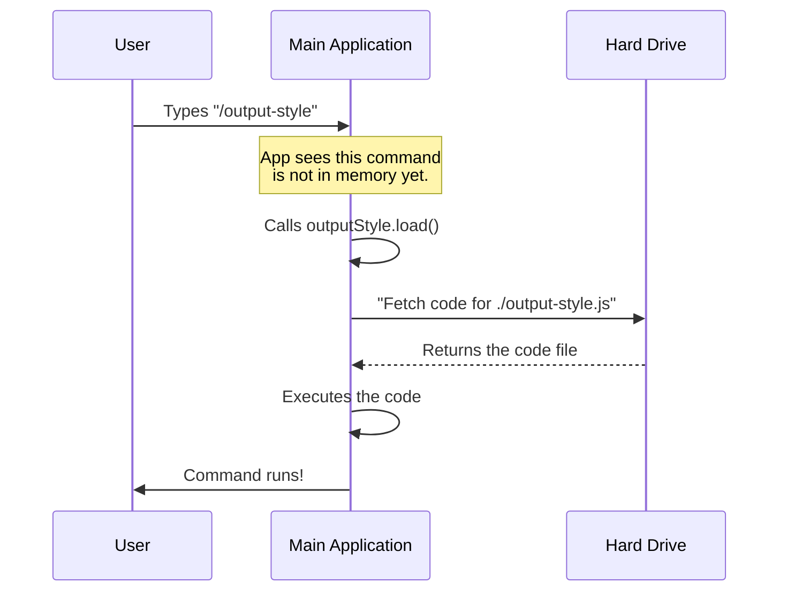

# Chapter 3: Lazy Loading Strategy

Welcome to the third chapter of the `output-style` tutorial!

In the previous chapter, [Chapter 2: Feedback/Output System](02_feedback_output_system.md), we learned how our command talks back to the user using the "Waiter" (`onDone`).

However, we skipped a very important question: **When** does the code for our command actually get loaded into the computer's memory?

## The Concept: The Digital Bookshelf

Imagine you are walking into a massive library. This library has millions of books (commands).
1.  **The "Greedy" Approach:** As soon as you walk in the door, the librarian piles *every single book* into your arms. You can't move! You are weighed down by books you aren't even reading.
2.  **The "Lazy" Approach:** You walk in with empty hands. You look at the catalog (the menu). Only when you say, "I want to read *Harry Potter*," does the librarian go fetch that specific book for you.

In software, this is called **Lazy Loading**.

### The Use Case

Our application might have hundreds of commands. If we load the code for all of them the moment the app starts, the user will stare at a loading screen for 10 seconds. That is a bad experience.

We want the app to start instantly. To do that, we leave the heavy code sitting on the hard drive until the user specifically asks for it.

---

## Implementing Lazy Loading

We implement this strategy inside our definition file (`index.ts`). We use a special JavaScript feature called **Dynamic Imports**.

### Step 1: The "load" Property

Let's look at the `output-style` definition again. Pay attention to the `load` property.

```typescript
// File: index.ts

const outputStyle = {
  // ... name and description ...

  // THE LAZY LOADING MAGIC:
  load: () => import('./output-style.js'),

} satisfies Command
```

**Explanation:**
*   `load`: This is a function that the system calls *only* when needed.
*   `() => ...`: This is an arrow function. It wraps the import so it doesn't run immediately.
*   `import(...)`: This tells the computer to go find the file `./output-style.js` and load it into memory right now.

### Step 2: Immediate vs. Lazy

To understand why this works, compare these two styles:

**The Slow Way (Static Import):**
```typescript
// At the very top of the file
import myHeavyCommand from './heavy-file.js'; 

// This runs immediately when the app starts!
```

**The Fast Way (Dynamic Import):**
```typescript
// Inside a function
const loadMyCommand = () => import('./heavy-file.js');

// This code sits here doing nothing until we call loadMyCommand()
```

By putting the `import` inside a function (the `load` property), we delay the heavy lifting.

---

## Under the Hood: The Loading Sequence

What happens when a user actually types `/output-style`? The system has to act fast to fetch the code.

### The Fetch Flow

Here is the sequence of events that turns a "Menu Item" into running code:



### The "Promise" of Code

In programming, reading a file from the hard drive takes time (even if it's just milliseconds). Because of this, the `import()` function returns a **Promise**.

Think of a **Promise** like a restaurant pager/buzzer:
1.  The App asks for the code.
2.  The System gives the App a buzzer (Promise).
3.  The App waits...
4.  *Bzzzt!* The file is ready.
5.  Now the App runs the command.

This all happens so fast the user usually doesn't notice, but it saves massive amounts of memory.

---

## How the System Uses the Loaded File

Once the file is loaded via `import('./output-style.js')`, the system gets access to the functions exported inside it.

If you remember from [Chapter 2: Feedback/Output System](02_feedback_output_system.md), our logic file looked like this:

```typescript
// File: output-style.tsx (The target file)

export async function call(onDone) {
  // ... logic here
}
```

The `load` function in `index.ts` essentially hands this entire file over to the main application. The application then looks for the function named `call` and runs it.

---

## Conclusion

You have now learned the **Lazy Loading Strategy**.

1.  **Performance:** We keep startup fast by not loading unused code.
2.  **On-Demand:** We use `load: () => import(...)` to fetch code only when the user types the command.
3.  **Efficiency:** The system handles the "Promise" of the file arriving and then executes it.

At this point, we have:
1.  Registered the command name (Chapter 1).
2.  Defined the output feedback (Chapter 2).
3.  Loaded the file efficiently (Chapter 3).

The final piece of the puzzle is understanding exactly how the system orchestrates running that loaded `call` function and manages the lifecycle of the command execution.

[Next Chapter: Command Handler Implementation](04_command_handler_implementation.md)

---

Generated by [Code IQ](https://github.com/adityasoni99/Code-IQ)