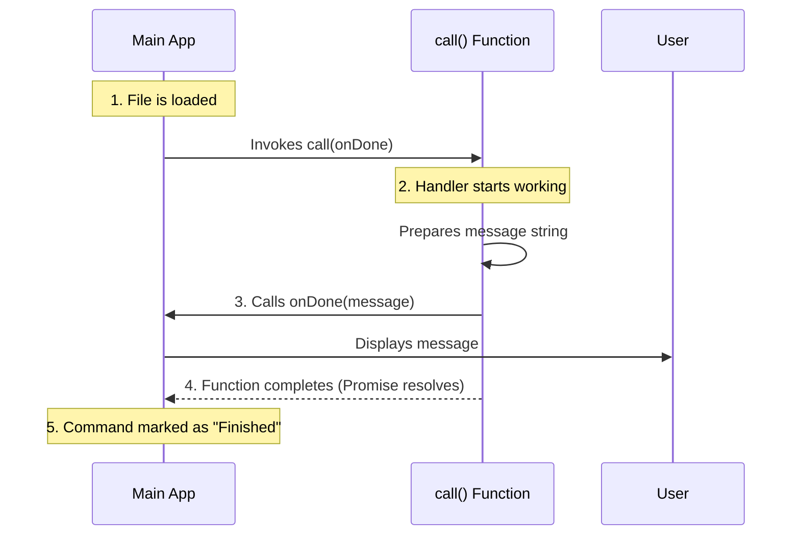

# Chapter 4: Command Handler Implementation

Welcome to the fourth and final chapter of the `output-style` project tutorial!

In the previous chapter, [Chapter 3: Lazy Loading Strategy](03_lazy_loading_strategy.md), we learned how the system efficiently fetches the code file from the "library" only when needed.

Now that the file is loaded into memory, the system needs to know exactly **which function to run** to make the command happen. It's time to look at the specific instructions that execute the task.

## The Concept: The Recipe

Let's revisit our restaurant analogy one last time:
1.  **Menu (Chapter 1):** The user points to "Output Style".
2.  **Library (Chapter 3):** The kitchen staff retrieves the specific cookbook for that item.
3.  **Waiter (Chapter 2):** The person ready to carry the result to the table.

The **Command Handler** is the **Recipe** itself. It is the step-by-step set of instructions that the chef follows to prepare the dish. In our code, this recipe is contained within a specific function named `call`.

### The Use Case

The system has loaded `output-style.tsx`. It needs a standard entry point—a "Start Here" button. We cannot just write code loosely in the file; we must wrap it in a function that the system expects.

The goal of this chapter is to understand the structure of the `call` function, which acts as the "Worker" that ties everything together.

---

## The Anatomy of the Handler

To implement a command handler, we define an exported function. Let's break down the code in `output-style.tsx`.

### Step 1: The Function Signature

The system expects a specific setup. It looks for a function named `call`.

```typescript
// File: output-style.tsx

import type { LocalJSXCommandOnDone } from '../../types/command.js';

// We export 'call' so the system can see it
export async function call(onDone: LocalJSXCommandOnDone) {
  
  // Logic goes here...

}
```

**Explanation:**
*   `export`: This keyword unlocks the door. It allows the main system to "see" and use this function from outside this file.
*   `async`: This marks the function as asynchronous. Even if our task is quick, commands often need to wait for data (like fetching from the internet). `async` allows the system to keep running while this command works.
*   `call`: This is the standard name. The system is programmed to look for `call()` inside every command file.

### Step 2: Accepting Tools

Notice the argument inside the parenthesis: `(onDone: LocalJSXCommandOnDone)`.

When the system runs your command, it hands you a toolbox. In this specific command type (`local-jsx`), the most important tool is `onDone`.

*   **The System says:** "Here is the `onDone` tool. Use it when you are finished to talk to the user."
*   **The Handler says:** "Thank you, I will use this to send my deprecation warning."

### Step 3: Execution (The Logic)

Inside the curly braces `{ ... }` is where the actual work happens.

```typescript
// Inside the call function...

  // We use the tool provided to us
  onDone(
    '/output-style has been deprecated. Use /config...', 
    { display: 'system' }
  );

  // The function reaches the end and finishes
```

**Explanation:**
*   This is the "Business Logic." For this specific command, the logic is very simple: send a text message.
*   In more complex commands, you might calculate math, call an API, or read a database *before* calling `onDone`.
*   We detailed how `onDone` works in [Chapter 2: Feedback/Output System](02_feedback_output_system.md).

---

## Under the Hood: The Execution Lifecycle

How does the main application manage this handler? It follows a strict lifecycle to ensure the command runs safely.

### The Sequence

Here is what happens the moment the file is loaded and the system is ready to run the command:



### Why is this abstraction useful?

By forcing every command to use a standard `export async function call`, the system doesn't need to know *what* the command does.

*   The system doesn't care if `call` calculates Pi to the 100th digit or just says "Hello."
*   It simply triggers `call` and waits for it to finish.
*   This makes adding new commands easy. You just copy the structure, change the logic inside, and you're done.

---

## Putting It All Together

We have now covered the entire lifecycle of the `output-style` command across four chapters.

Let's look at the complete picture of what we built:

1.  **Registration ([Chapter 1](01_command_registration_interface.md)):**
    We created an ID card in `index.ts` so the system knows the command name is `output-style`.

2.  **Lazy Loading ([Chapter 3](03_lazy_loading_strategy.md)):**
    We told the system to wait and only download `output-style.tsx` when the user actually asks for it.

3.  **Handler Implementation (This Chapter):**
    We defined `export async function call(...)` as the standard entry point for our logic.

4.  **Feedback ([Chapter 2](02_feedback_output_system.md)):**
    Inside that handler, we used `onDone` to safely send a result back to the user interface.

### Final Code Review

Here is the complete file `output-style.tsx` one last time, with your new understanding of all the parts:

```typescript
import type { LocalJSXCommandOnDone } from '../../types/command.js';

// The Handler (Chapter 4)
export async function call(onDone: LocalJSXCommandOnDone) {
  
  // The Feedback System (Chapter 2)
  onDone(
    '/output-style has been deprecated...', 
    { display: 'system' }
  );
  
}
```

---

## Conclusion

Congratulations! You have completed the tutorial on the `output-style` project.

You now understand how a modern command-line application structure works:
*   **Decoupling:** Separating the menu (registration) from the cooking (handler).
*   **Efficiency:** Loading code only when necessary.
*   **Standardization:** Using a consistent `call` function so the system can run any command blindly.

You are now ready to create your own commands by following this same pattern!

---

Generated by [Code IQ](https://github.com/adityasoni99/Code-IQ)