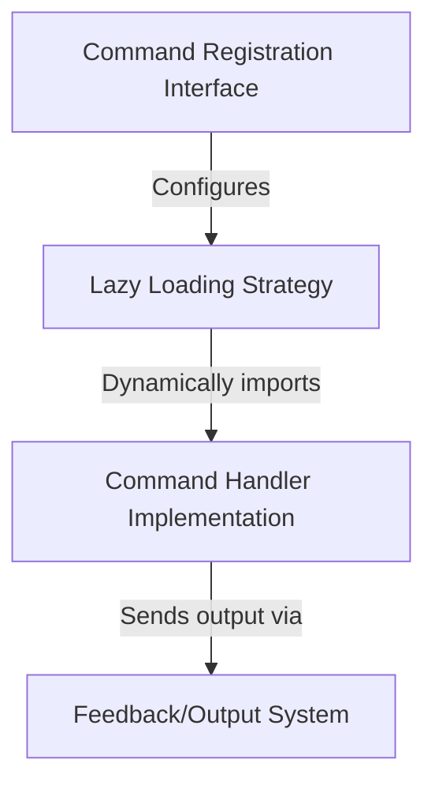

# Tutorial: output-style

This project defines a specific **slash command** named `/output-style` which has been deprecated. Its primary function is to *intercept the user's request* and immediately provide feedback instructing them to use the `/config` command instead. To ensure the application remains fast, it uses a **lazy loading strategy** so that the code for this command is only loaded into memory if the user actually tries to run it.

## Chapters

1. [Command Registration Interface](01_command_registration_interface.md)
2. [Feedback/Output System](02_feedback_output_system.md)
3. [Lazy Loading Strategy](03_lazy_loading_strategy.md)
4. [Command Handler Implementation](04_command_handler_implementation.md)

---

Generated by [Code IQ](https://github.com/adityasoni99/Code-IQ)