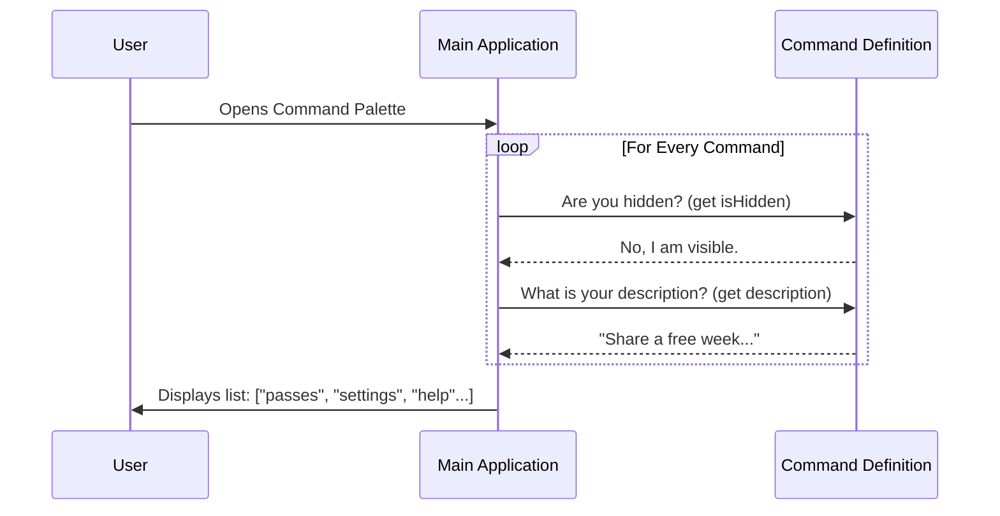

# Chapter 1: Command Definition Interface

Welcome to the **Passes** project! In this tutorial series, we will build a referral feature for a command-line application.

## The Problem: The "Restaurant Menu" Challenge

Imagine you are sitting down at a restaurant. Before you order food, you need a **menu**.

The menu tells you:
1.  **Name:** What the dish is called (e.g., "Spaghetti").
2.  **Description:** What ingredients are in it.
3.  **Availability:** Sometimes a sticker says "Sold Out" or "Seasonal Only."

Crucially, the menu is **not** the food itself. You don't get a plate of spaghetti the moment you walk in the door. You only get the food (the heavy processing) after you decide to order it.

In our application, we face a similar challenge. We have a cool feature called `passes` (for referring friends). However, we don't want to load all the complex code for it immediately when the app starts. That would make the app slow.

## The Solution: The Command Definition

The **Command Definition Interface** is our "Menu Item." It is a lightweight file (`index.ts`) that tells the main application *about* the feature without actually running the feature yet.

Let's look at how we build this "ID Card" for our command.

### 1. Basic Identity
First, we define who we are. We need a unique `name` so users can type it (like `/passes`), and a `type` to tell the system how to render it.

```typescript
import type { Command } from '../../commands.js'

export default {
  // Tells the app to render this using React components (covered in Ch 4)
  type: 'local-jsx', 

  // The keyword the user types to trigger this
  name: 'passes', 
} satisfies Command
```

**What happens here:**
The application reads this and adds `passes` to its internal list of known words. It knows *nothing* else yet, just the name.

### 2. The Dynamic Description
Next, we add a description. In static apps, this is just a text string. But here, we might want to change the text based on whether the user has a reward waiting!

```typescript
// inside the export default object...

get description() {
  // We check if a reward is cached (Details in Ch 5)
  const reward = getCachedReferrerReward()
  
  if (reward) {
    return 'Share a free week of Claude Code with friends and earn extra usage'
  }
  return 'Share a free week of Claude Code with friends'
},
```

**What happens here:**
We use a **getter** (`get description()`). This means the description is calculated *fresh* every time the user looks at the list.
*   *If reward exists:* User sees "earn extra usage".
*   *If no reward:* User sees the standard message.

*Note: We access global data here. We will explain how that works in [Global Configuration State](05_global_configuration_state.md).*

### 3. Controlling Visibility
Sometimes, we don't want the command to appear on the "menu" at all. Maybe the user isn't eligible, or the feature is offline.

```typescript
// inside the export default object...

get isHidden() {
  // Check eligibility logic (Details in Ch 2)
  const { eligible, hasCache } = checkCachedPassesEligibility()
  
  // Return true if it should be hidden
  return !eligible || !hasCache
},
```

**What happens here:**
Before showing the command list, the app asks: "Are you hidden?"
If this returns `true`, the `passes` command vanishes from the user's view entirely.

*We will dive deep into this logic in [Dynamic Feature Visibility](02_dynamic_feature_visibility.md).*

### 4. Lazy Loading (The "Kitchen")
Finally, if the user actually selects `/passes`, we need to tell the app where to find the *real* code.

```typescript
// inside the export default object...

// Only runs if the user actually executes the command
load: () => import('./passes.js'),
```

**What happens here:**
This uses a dynamic `import`. The heavy file `./passes.js` is **not** loaded when the app starts. It is only loaded the specific moment the user presses Enter.

*We explore this optimization in [Lazy Module Loading](03_lazy_module_loading.md).*

---

## Under the Hood: How the App Reads the Interface

When you start the main application, it scans the `index.ts` file to decide what to show the user. It does **not** execute the heavy logic yet.

Here is the conversation between the **Main App** and our **Command Definition**:



### Internal Implementation Details

The file `index.ts` serves as a **Manifest**. By exporting an object that satisfies the `Command` type, we verify that our "Menu Item" fits the standard format the application expects.

If we forgot the `name` or `load` function, TypeScript would throw an error immediately because of `satisfies Command`. This ensures safety even before we run the code.

## Putting It All Together

Here is the complete file. It is small, fast to read, and acts as the gatekeeper for our feature.

```typescript
import type { Command } from '../../commands.js'
import { checkCachedPassesEligibility, getCachedReferrerReward } from '../../services/api/referral.js'

export default {
  type: 'local-jsx',
  name: 'passes',
  get description() {
    const reward = getCachedReferrerReward()
    return reward 
      ? 'Share a free week... and earn extra usage' 
      : 'Share a free week...'
  },
  get isHidden() {
    const { eligible, hasCache } = checkCachedPassesEligibility()
    return !eligible || !hasCache
  },
  load: () => import('./passes.js'),
} satisfies Command
```

## Conclusion

You have successfully defined the "Face" of your feature!
1.  **Name:** `passes`
2.  **Type:** `local-jsx`
3.  **Description:** Dynamic based on rewards.
4.  **Visibility:** Dynamic based on eligibility.
5.  **Payload:** Loads only when needed.

However, we glanced over *how* we decide if the command should be hidden or shown. That logic is critical for creating a personalized user experience.

In the next chapter, we will learn exactly how to control that logic.

[Next Chapter: Dynamic Feature Visibility](02_dynamic_feature_visibility.md)

---

Generated by [Code IQ](https://github.com/adityasoni99/Code-IQ)