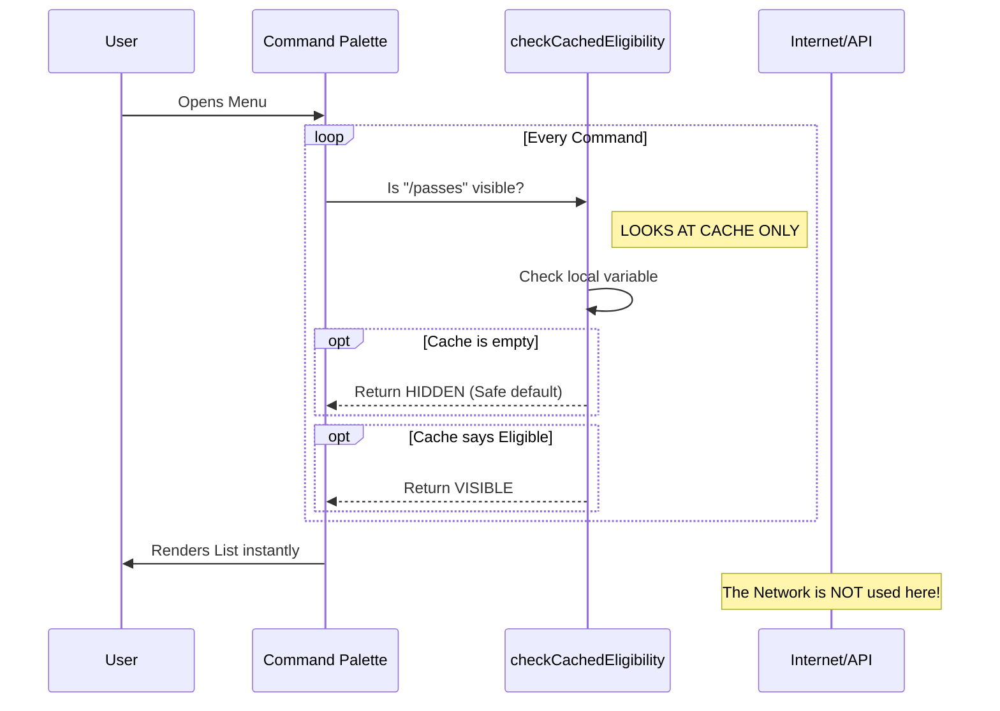

# Chapter 2: Dynamic Feature Visibility

In the previous [Command Definition Interface](01_command_definition_interface.md) chapter, we built the "ID Card" for our command. We defined its name and description. But we left one big question unanswered:

**How do we decide *when* to show this command?**

We don't want to clutter the user's menu with features they aren't allowed to use. We need a way to hide or show commands intelligently.

## The Motivation: The "Bouncer" Problem

Imagine a VIP club. There are two ways to check if someone can enter:

1.  **The Slow Way:** Every time a guest walks up, the doorman calls the club owner on the phone, waits for them to pick up, asks about the guest, and waits for an answer. The line outside would stop moving!
2.  **The Fast Way:** The doorman has a **clipboard (Cache)** with a list of names. He looks at the list and makes an instant decision.

In our app, checking the server (API) is the "Phone Call." It's slow. Checking local data is the "Clipboard." It's instant.

**Dynamic Feature Visibility** is our Bouncer with a Clipboard. It allows the menu to render instantly while still enforcing rules.

## The Solution: Cached Eligibility

We want to show the `/passes` command only if the user is eligible. However, we cannot perform an asynchronous network request (fetching data from the internet) inside the menu rendering loop because it would freeze the interface.

Instead, we rely on a **Synchronous Check**.

### How to use the Bouncer

We use a helper function called `checkCachedPassesEligibility`. This function looks at data we *already* have in memory.

Here is how we use it inside our command definition:

```typescript
// Inside index.ts
import { checkCachedPassesEligibility } from '../../services/api/referral.js'

// ... inside the object
get isHidden() {
  // 1. Ask the bouncer for the status
  const { eligible, hasCache } = checkCachedPassesEligibility()
  
  // 2. If not eligible OR we don't know yet (no cache), hide it.
  return !eligible || !hasCache
},
```

### Breakdown of the Code

1.  **`get isHidden()`**: This is a "getter." It runs every time the menu opens. It asks: "Should I be invisible?"
2.  **`checkCachedPassesEligibility()`**: This functions runs instantly. It returns two flags:
    *   `hasCache`: "Do we have data on this user?"
    *   `eligible`: "Is the user allowed?"
3.  **The Logic**: `!eligible || !hasCache`.
    *   If we aren't eligible... **Hide**.
    *   If we have no data (maybe the app just started)... **Hide**.

We default to **Hidden** to prevent a "flash" of invalid content.

---

## Under the Hood: How it Works

It is important to understand that this check does **not** touch the internet. It reads from a "Global Configuration State" that acts as our local memory.

Here is the flow of decision making:



### Internal Implementation

How does the `checkCachedPassesEligibility` function actually work? It is a wrapper around a global state object.

*Note: We will fully explain how this state is built in [Global Configuration State](05_global_configuration_state.md), but here is a simplified peek at the logic.*

#### The State Holder (Simplified)
Imagine a simple file somewhere in our app that holds the last known answer from the server.

```typescript
// simplified internal state
let state = {
  data: null, // Starts empty
  lastUpdated: 0
}
```

#### The Checker Function
The checker simply reads that variable.

```typescript
export function checkCachedPassesEligibility() {
  // 1. Check if we have data (The Cache)
  const hasCache = state.data !== null
  
  // 2. Check if the data says "eligible"
  // If no cache, default to false
  const eligible = hasCache ? state.data.isEligible : false

  // 3. Return the result instantly
  return { eligible, hasCache }
}
```

Because accessing a variable in memory takes nanoseconds, our menu remains buttery smooth.

## What if the data is old?

You might be asking: *"If we only check the cache, what if the user JUST became eligible, but our cache is empty?"*

Great question! The "Bouncer" (Visibility Check) is only half the story. Somewhere else in the background, we have a "Manager" who periodically calls the server to update the list.

1.  **Background:** App fetches new data from API -> Updates Cache.
2.  **Foreground:** User opens menu -> `isHidden` reads updated Cache -> Command appears.

This separates the **rendering** (which must be fast) from the **fetching** (which is slow).

## Conclusion

In this chapter, we learned how to implement **Dynamic Feature Visibility**.

1.  We defined `get isHidden()` in our command interface.
2.  We used `checkCachedPassesEligibility()` to act as a "Bouncer."
3.  We ensured our menu stays fast by making decisions based on **local data** instead of waiting for the network.

Now that our command is visible to the eligible users, what happens when they actually click it? We need to load the main code for the feature. But wait—we don't want to load *everything* at once!

In the next chapter, we will learn how to load code only when it's needed.

[Next Chapter: Lazy Module Loading](03_lazy_module_loading.md)

---

Generated by [Code IQ](https://github.com/adityasoni99/Code-IQ)