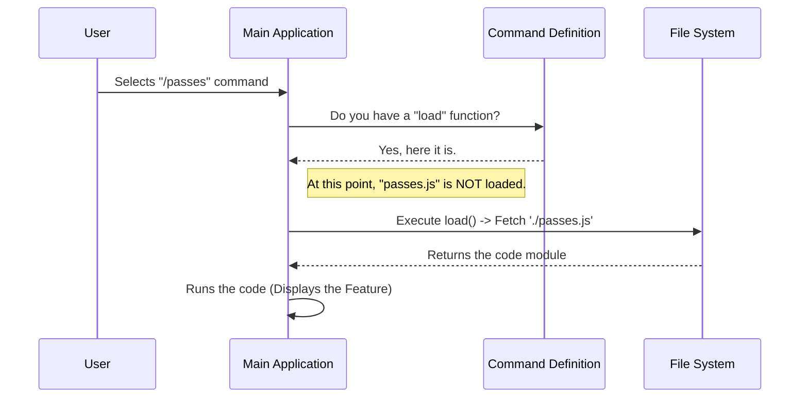

# Chapter 3: Lazy Module Loading

Welcome to Chapter 3! In the previous chapter, [Dynamic Feature Visibility](02_dynamic_feature_visibility.md), we learned how to act like a "Bouncer," deciding which commands to show or hide based on user eligibility.

Now that our `/passes` command is visible on the menu, we have a new problem: **Performance**.

## The Problem: The "Lights On" Dilemma

Imagine you live in a massive mansion with 50 rooms. When you come home and unlock the front door, you have two choices:

1.  **The Wasteful Way:** You immediately run around and turn on the lights in *every single room*, just in case you might go in there later. This takes a long time and wastes electricity.
2.  **The Smart Way:** You keep all lights off. You only flip the switch for the Kitchen when you actually walk into the Kitchen.

In software, **Code is heavy**. Loading a file takes memory and processing power.

The `passes` feature contains complex logic and user interface code (which lives in a file called `passes.tsx`). If we load all that code the moment the application starts—even if the user never types `/passes`—we are "turning on all the lights." The app will start slowly and feel sluggish.

## The Solution: Lazy Module Loading

**Lazy Loading** is the technique of waiting to load a piece of code until the very last possible moment.

In our project, we keep the heavy "Passes" logic disconnected from the main application startup. We only connect it when the user explicitly asks for it.

### How to use Lazy Loading

We implement this in our Command Definition (`index.ts`) using a special `load` property.

Instead of importing the file at the top of the script (which loads it immediately), we use a **Dynamic Import** function.

#### 1. The Standard (Eager) Way - DON'T DO THIS
Normally, imports look like this:

```typescript
// ❌ This loads the code immediately when the app starts!
import heavyCode from './passes.js' 

export default {
  name: 'passes',
  action: heavyCode // The code is already here
}
```

#### 2. The Lazy Way - DO THIS
We want to tell the application: *"Here is the address of the code, but don't go there yet."*

```typescript
// ✅ No import at the top!

export default {
  name: 'passes',
  
  // Only runs when the user selects the command
  load: () => import('./passes.js'), 
}
```

### Breakdown of the Code

1.  **`load:`**: This is a property in our command object. The main application knows to look for this.
2.  **`() => ...`**: This is an arrow function. It wraps the action, ensuring it doesn't run yet. It waits to be called.
3.  **`import('./passes.js')`**: This is a dynamic import. It returns a **Promise**. In plain English, it tells the computer: *"Go find this file on the disk, read it, and bring me the contents."*

---

## Under the Hood: How the App Executes Lazy Code

What actually happens when a user types `/passes`? The main application acts as a coordinator.

Here is the flow of events:



### Internal Implementation Details

The core application (the command runner) handles the heavy lifting. It checks if your command definition has a `load` function.

Here is a simplified version of what the main application logic looks like:

```typescript
// Simplified logic inside the Main Application Runner

async function runCommand(command) {
  // 1. Check if the command needs lazy loading
  if (command.load) {
    
    // 2. WAIT for the file to be imported
    const module = await command.load()
    
    // 3. The file is loaded! Now we can run the default export
    return module.default()
  }
}
```

**Why this matters:**
*   **Startup Speed:** Because `passes.js` isn't read initially, the app opens instantly.
*   **Memory Usage:** If the user stays in the main menu and never opens "Passes", that code never occupies the computer's RAM.

## Putting It All Together

Let's look at our `index.ts` file one more time. You can now see how all the pieces from Chapter 1, 2, and 3 fit together to make a highly efficient entry point.

```typescript
import type { Command } from '../../commands.js'
// ... imports for visibility checks ...

export default {
  type: 'local-jsx',
  name: 'passes',
  
  // Chapter 1 & 2: Metadata and Visibility
  get description() { ... },
  get isHidden() { ... },
  
  // Chapter 3: Performance Optimization
  load: () => import('./passes.js'),
  
} satisfies Command
```

## Conclusion

You have now mastered **Lazy Module Loading**!

1.  You learned that importing everything at the start makes apps slow.
2.  You used a dynamic `load` function to defer loading.
3.  You ensured the heavy `passes.js` file is only touched when the user actually wants to use it.

So, we have successfully fetched the code. But what does that code *do*? How do we draw buttons and text in a terminal window?

In the next chapter, we will explore the file we just loaded (`passes.tsx`) and learn how to build user interfaces for the command line.

[Next Chapter: Local JSX Action Handler](04_local_jsx_action_handler.md)

---

Generated by [Code IQ](https://github.com/adityasoni99/Code-IQ)