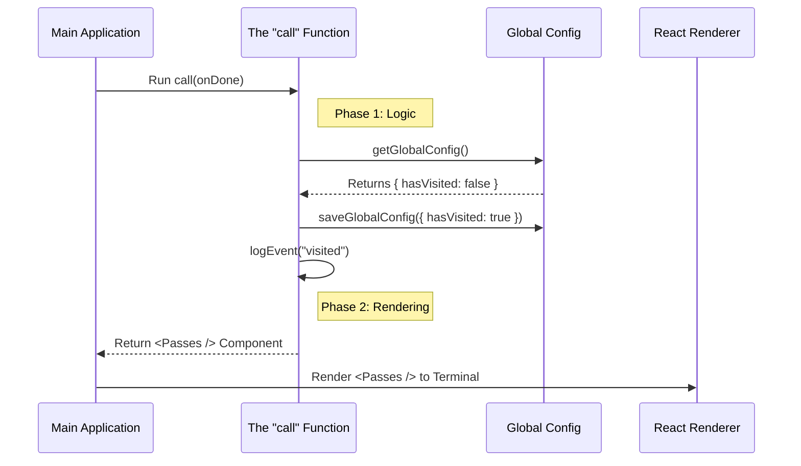

# Chapter 4: Local JSX Action Handler

In the previous [Lazy Module Loading](03_lazy_module_loading.md) chapter, we learned how to efficiently load the code for our feature only when the user asks for it.

Now, the code is loaded. The "Chef" is in the kitchen. It is time to cook the meal.

## The Motivation: More Than Just Text

In traditional command-line tools, programs usually just output text and exit.
> `User: date`
> `System: Mon Oct 23 2023`

But in our application, we want to create a **Rich, Interactive Experience**. We want buttons, layout, colors, and the ability for the user to navigate—just like a website, but inside the terminal.

To do this, we use **React (JSX)**.

The **Local JSX Action Handler** is the function that bridges the gap between the logic (updating databases, tracking analytics) and the visual interface (what the user sees).

## The Concept: The "Chef" (The `call` function)

Every command that renders a UI must have a specific function named `call`. Think of `call` as the **Head Chef**.

When the user types `/passes`, the Chef has two main responsibilities:
1.  **Prep Work (Logic):** Check the ingredients, update the inventory, and write down logs.
2.  **Plating (Rendering):** Arrange the final visual component (`<Passes />`) to be served to the user.

Let's break down how we build this Chef function step-by-step.

### 1. The Setup

The `call` function is an asynchronous function. It receives a tool called `onDone`, which allows the UI to tell the app "I am finished now" (like closing the menu).

```typescript
// passes.tsx
import * as React from 'react';
import { Passes } from '../../components/Passes/Passes.js';

// The "Chef" function
export async function call(onDone: LocalJSXCommandOnDone) {
  // Logic goes here...
  
  // UI goes here...
}
```

### 2. The Prep Work: Managing State

Before showing the screen, we often need to do some housekeeping. For our referral feature, we want to know: *"Has the user seen this screen before?"*

If it's their first time, we want to stop showing "New!" badges elsewhere in the app.

```typescript
// inside call()...

// 1. Get the current settings (See Chapter 5)
const config = getGlobalConfig();

// 2. Check if they have visited before
const isFirstVisit = !config.hasVisitedPasses;
```

*Note: We will learn how `getGlobalConfig` works in [Global Configuration State](05_global_configuration_state.md).*

### 3. The Side Effect: Updating Data

If this *is* the first visit, we need to save that fact. We also capture a snapshot of how many passes they have right now.

```typescript
// inside call()...

if (isFirstVisit) {
  const remaining = getCachedRemainingPasses();

  // Update the global state permanently
  saveGlobalConfig(current => ({
    ...current,
    hasVisitedPasses: true,
    passesLastSeenRemaining: remaining
  }));
}
```

**What is happening here?**
We are performing a **Side Effect**. We are changing the permanent state of the application *before* the user even sees the first pixel. This ensures our data is always consistent.

### 4. The Analytics: Leaving a Paper Trail

We also want to know how often people use this feature. We log an event to our analytics system.

```typescript
// inside call()...

// Log that the user opened the feature
logEvent('tengu_guest_passes_visited', {
  is_first_visit: isFirstVisit
});
```

### 5. The Plating: Serving the UI

Finally, after the logic is done, the function returns the Visual Component. This is where **JSX** comes in.

```typescript
// inside call()...

// Render the React component
return <Passes onDone={onDone} />;
```

The `<Passes />` component is a standard React component (built with a library like Ink). It draws the boxes, text, and handles keyboard input.

---

## Under the Hood: The Execution Flow

When the main application calls this handler, a specific sequence of events occurs to ensure the UI is reactive and the data is accurate.



### Internal Implementation Details

Let's look at the complete code for `passes.tsx`. We will see how it combines imports, logic, and rendering into one cohesive file.

#### Part A: Imports
We import the tools we need: React, the UI component, analytics, and state managers.

```typescript
import * as React from 'react';
import { Passes } from '../../components/Passes/Passes.js';
import { logEvent } from '../../services/analytics/index.js';
import { getGlobalConfig, saveGlobalConfig } from '../../utils/config.js';
// ... other imports
```

#### Part B: The Logic Block
This executes immediately when the command starts. It acts as the "Controller" in an MVC (Model-View-Controller) pattern.

```typescript
export async function call(onDone: LocalJSXCommandOnDone): Promise<React.ReactNode> {
  const config = getGlobalConfig();
  const isFirstVisit = !config.hasVisitedPasses;

  if (isFirstVisit) {
    // Logic to mark the feature as "seen"
    // and update local cache
    saveGlobalConfig(current => ({ 
      ...current, 
      hasVisitedPasses: true 
    }));
  }
  
  logEvent('tengu_guest_passes_visited', { is_first_visit: isFirstVisit });
  
  // ... continued below
```

#### Part C: The Render Block
The function ends by returning the UI. The main application takes this return value and hands it to the React renderer (Ink) to draw it in the terminal window.

```typescript
  // ... continued from above
  
  // Pass the 'onDone' callback so the UI can close itself
  return <Passes onDone={onDone} />;
}
```

## Why this approach is powerful

1.  **Separation of Concerns:** The `call` function handles the *business logic* (analytics, state updates), while the `<Passes />` component handles the *visuals*.
2.  **State Consistency:** By updating the config *before* rendering, we ensure the UI never shows stale data.
3.  **Rich Interactivity:** Because we return a React Node, we aren't limited to plain text. We can build complex, interactive dashboards.

## Conclusion

You have successfully implemented the **Local JSX Action Handler**!

1.  We created a `call` function as the entry point.
2.  We handled critical logic like state updates and analytics logging.
3.  We returned a visual React component to the user.

Throughout this chapter, we frequently used `getGlobalConfig` and `saveGlobalConfig` to remember if the user had visited the page. But where is that data actually stored? How do we ensure it persists when the user closes the app?

In the final chapter, we will dive into the memory system of our application.

[Next Chapter: Global Configuration State](05_global_configuration_state.md)

---

Generated by [Code IQ](https://github.com/adityasoni99/Code-IQ)