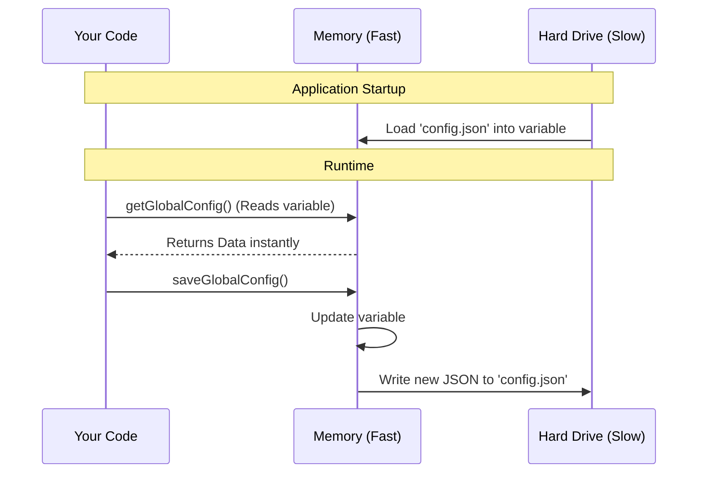

# Chapter 5: Global Configuration State

Welcome to the final chapter! In the previous [Local JSX Action Handler](04_local_jsx_action_handler.md) chapter, we built the visual interface for our feature. Inside that code, we called a function named `saveGlobalConfig` to remember that the user had seen the screen.

But we didn't explain how that actually works.

**How does an application remember things after you close it?**

## The Problem: The Application has Amnesia

Computer programs have two types of memory:
1.  **RAM (Short-term):** This is where variables live (`let score = 10`). It is fast, but it gets wiped clean the moment you close the application.
2.  **Disk (Long-term):** This is the hard drive. Files saved here stay forever (or until deleted).

If we only used variables, our application would act like a goldfish.
> *User opens app.*
> App: "Welcome! Here is a tour of the new feature."
> *User closes app.*
> *User opens app again.*
> App: "Welcome! Here is a tour of the new feature."

This is annoying. We need a permanent memory.

## The Solution: Global Configuration State

The **Global Configuration State** is the application's "Diary." It is a file saved on your computer's hard drive.

When the application wants to remember something (like "User has visited the Passes screen"), it writes it into this diary. When the application starts up again, it reads the diary to recall what happened last time.

### 1. Reading the Diary

To see what is in memory, we use `getGlobalConfig()`. This gives us an object containing all the saved settings.

```typescript
import { getGlobalConfig } from '../../utils/config.js';

// Read the current state
const config = getGlobalConfig();

// Access a specific memory
if (config.hasVisitedPasses) {
  console.log("Welcome back, old friend!");
}
```

**Explanation:**
*   `getGlobalConfig()`: Instantly returns the current settings.
*   It is **synchronous** (very fast) because the application loads the file into memory once when it starts, so we don't have to read the hard drive every single time we check a variable.

### 2. Writing to the Diary

Writing is slightly trickier. Imagine if you tore out all the pages of a diary just to write one new sentence. You would lose everything else!

To save data safely, we use an **Updater Pattern**. We take the *current* state, copy it, change one thing, and save the result.

```typescript
import { saveGlobalConfig } from '../../utils/config.js';

// We pass a function that receives the 'current' state
saveGlobalConfig((current) => ({
  // 1. Keep everything else exactly the same
  ...current,
  
  // 2. Overwrite only the specific flag we want to change
  hasVisitedPasses: true,
}));
```

**Explanation:**
*   `...current`: This is the **Spread Operator**. It says "Copy all existing properties from the current state." This ensures we don't accidentally delete other settings (like the user's theme or login token).
*   `hasVisitedPasses: true`: This adds or updates our specific field.

## Applying it to our Use Case

Let's look at the real-world scenario from our project. We want to show a "New!" animation only the first time a user visits.

Here is how we combine logic with state:

```typescript
// Inside our command logic

const config = getGlobalConfig();

// Check the memory. If undefined or false, it's their first time.
const isFirstVisit = !config.hasVisitedPasses;

if (isFirstVisit) {
  // TRIGGER LOGIC: Show the onboarding animation
  showOnboarding();

  // UPDATE MEMORY: Save this so we don't do it next time
  saveGlobalConfig(c => ({ ...c, hasVisitedPasses: true }));
}
```

**Result:**
1.  **Session 1:** `hasVisitedPasses` is `false`. Code runs. Config is saved.
2.  **Session 2:** `hasVisitedPasses` is `true`. Code is skipped.

---

## Under the Hood: How it Works

How does a JavaScript object turn into a file on your hard drive?

The system acts as a bridge between the fast world of RAM and the permanent world of the Disk.



### Internal Implementation Details

The core implementation handles the file system operations (reading and writing files). It usually relies on Node.js built-in `fs` (File System) module.

Here is a simplified version of what `saveGlobalConfig` does internally:

```typescript
import fs from 'fs';

// The internal variable (RAM)
let memoryCache = loadConfigFromFile(); 

export function saveGlobalConfig(updater) {
  // 1. Calculate new state based on old state
  const newState = updater(memoryCache);
  
  // 2. Update RAM (so next read is fast)
  memoryCache = newState;
  
  // 3. Update Disk (so it survives restart)
  // We turn the object into a text string
  const jsonString = JSON.stringify(newState, null, 2);
  fs.writeFileSync('./config.json', jsonString);
}
```

**Why is this important?**
*   **Performance:** By updating `memoryCache`, immediate subsequent reads are instant. We don't have to wait for the disk write to finish.
*   **Persistence:** By writing to `config.json`, we ensure the data exists tomorrow.

## Series Conclusion

Congratulations! You have completed the **Passes** tutorial series. Let's review the architecture you have learned:

1.  **[Command Definition Interface](01_command_definition_interface.md):** You created the "Menu Item" (`index.ts`) so the app knows your feature exists.
2.  **[Dynamic Feature Visibility](02_dynamic_feature_visibility.md):** You acted as a "Bouncer," using cached data to show or hide the command.
3.  **[Lazy Module Loading](03_lazy_module_loading.md):** You optimized performance by only loading heavy code when requested.
4.  **[Local JSX Action Handler](04_local_jsx_action_handler.md):** You built the "Chef" (`passes.tsx`) that cooks up the visual interface using React.
5.  **Global Configuration State (This Chapter):** You gave the application a long-term memory to create a personalized experience.

You now understand the core building blocks of a high-performance, interactive command-line application. You can use these patterns to build settings pages, complex dashboards, or interactive games right inside the terminal!

**End of Tutorial.**

---

Generated by [Code IQ](https://github.com/adityasoni99/Code-IQ)