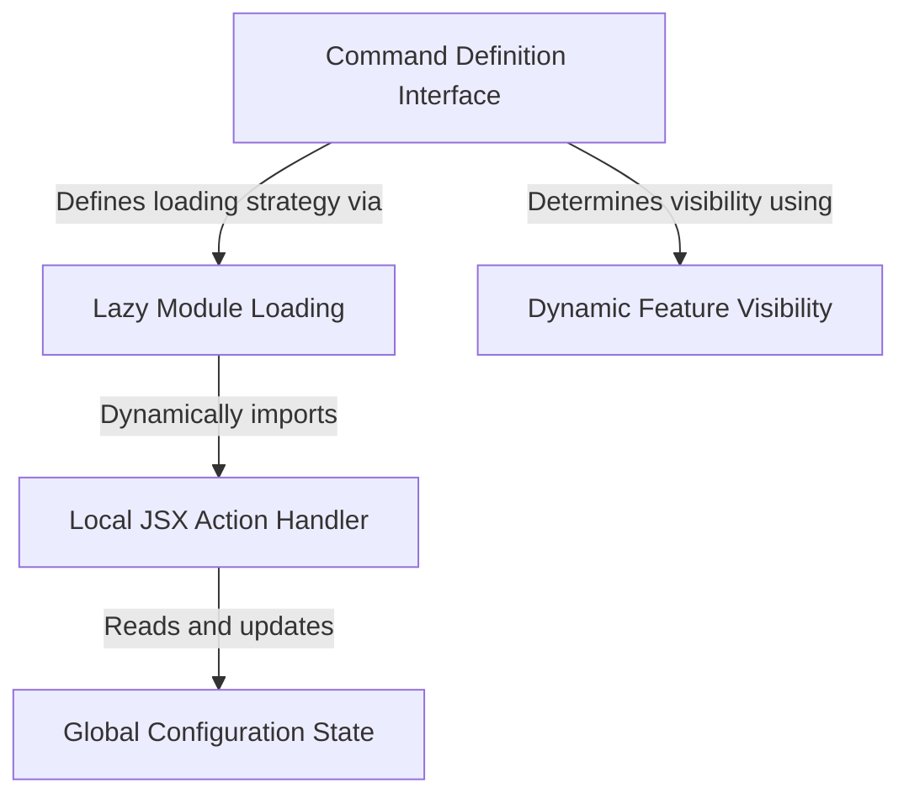

# Tutorial: passes

This project implements a **referral feature** (Passes) for a command-line tool, allowing users to share free access with friends via an interactive *terminal UI*. It optimizes startup performance by using **lazy loading** to fetch heavy code only when the command is selected, while a lightweight *visibility check* instantly determines if the feature should appear in the menu based on user eligibility.

## Chapters

1. [Command Definition Interface](01_command_definition_interface.md)
2. [Dynamic Feature Visibility](02_dynamic_feature_visibility.md)
3. [Lazy Module Loading](03_lazy_module_loading.md)
4. [Local JSX Action Handler](04_local_jsx_action_handler.md)
5. [Global Configuration State](05_global_configuration_state.md)

---

Generated by [Code IQ](https://github.com/adityasoni99/Code-IQ)