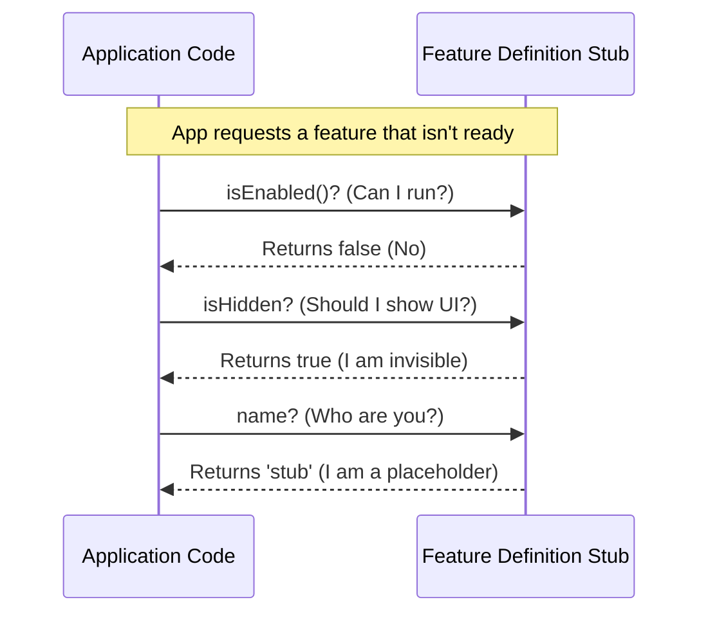

# Chapter 1: Feature Definition Stub

Welcome to the **perf-issue** project! We are going to build a robust system for handling features in an application. 

Every great journey begins with a single step. In our case, that step isn't building a complex feature—it's building the *absence* of one.

### The Motivation: Why do we need this?

Imagine you are building a house. You know you want a fancy "Smart Home Control Panel" on the wall, but the device hasn't arrived from the factory yet.

If you leave a hole in the wall with exposed wires, someone might touch it and get shocked (in programming terms, your application crashes).

Instead, you put a **plastic cover** over the hole. It looks like a control panel, but it doesn't actually do anything. It fills the space safely.

**The Use Case:**
You are writing code that tries to access a feature called `SuperFastCheckout`. However, this feature might be:
1. Not built yet.
2. Disabled for maintenance.
3. Removed entirely.

We need a safe, default object—a **Stub**—that your code can talk to without crashing, even if the real feature isn't there.

### How to Use It

The **Feature Definition Stub** is a simple JavaScript object that acts as the default "No". It politely tells the rest of your application, "I exist, but I am not active right now."

Here is how you would interact with a feature in your code, potentially receiving this stub.

#### Example: Checking a Feature

Imagine your app asks for a feature. If the real logic is missing, it receives the Stub.

```javascript
// Imagine 'feature' is our Feature Definition Stub
import feature from './index.js';

// We ask: Is this turned on?
if (feature.isEnabled()) {
  console.log("Running the feature!");
} else {
  console.log("Feature is off.");
}
```

**Output:**
```text
Feature is off.
```

Because this is a **Stub**, it always says "No" (returns `false`). This ensures that unfinished or broken features never accidentally run in production.

### Under the Hood: Internal Implementation

What is actually happening inside this abstraction? Let's look at the flow.

Think of the Stub as a "Movie Prop." On a movie set, a prop phone looks like a phone. You can pick it up. You can speak into it. But if you try to make a call, it just doesn't connect.

Here is the sequence of events when your application tries to access a missing feature:



#### The Code

Now, let's look at the actual code in `index.js`. It is intentionally very simple. It serves as the baseline contract for all features.

```javascript
// --- File: index.js ---

export default { 
  // 1. The Safety Switch
  isEnabled: () => false, 
  
  // 2. The Visibility Rule
  isHidden: true, 
  
  // 3. The Identity
  name: 'stub' 
};
```

**Explanation of the Code:**

1.  **`isEnabled: () => false`**: This is a function that returns `false`. This guarantees that if anyone tries to execute this feature, nothing happens. It prevents logic errors.
2.  **`isHidden: true`**: This property tells the UI that this feature should be invisible to the user. We will explore how to change this in [Chapter 3: Visibility Configuration](03_visibility_configuration.md).
3.  **`name: 'stub'`**: This gives the object an identity. It helps us debug by letting us know we are dealing with the placeholder, not the real thing.

### Summary

Congratulations! You've learned the foundational concept of the **Feature Definition Stub**. 

*   **What it is:** A placeholder object.
*   **What it does:** It prevents crashes by providing a safe "default" state (turned off and hidden).
*   **Why we use it:** It allows our application to function smoothly even when features are missing or broken.

Right now, our feature is permanently stuck in the "Off" position. But how do we turn it on when we are ready?

In the next chapter, we will learn how to create the mechanism to switch between this Stub and the real implementation.

[Next Chapter: Feature Toggling Interface](02_feature_toggling_interface.md)

---

Generated by [Code IQ](https://github.com/adityasoni99/Code-IQ)