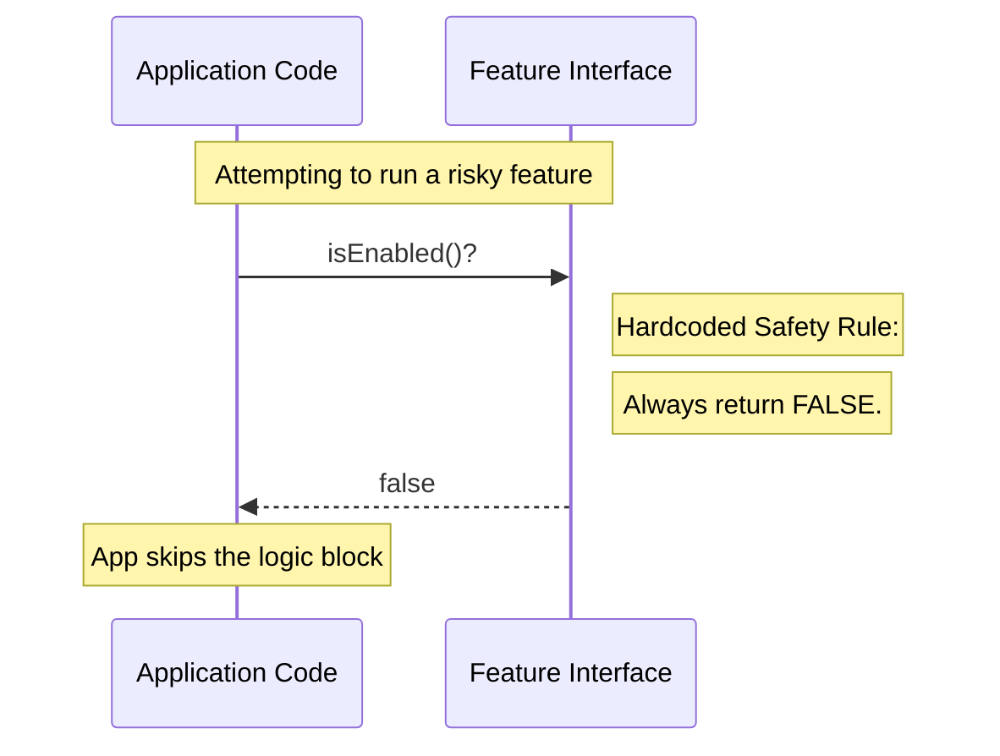

# Chapter 2: Feature Toggling Interface

Welcome back! 

In the previous chapter, [Chapter 1: Feature Definition Stub](01_feature_definition_stub.md), we created a "Stub"—a safety placeholder object that represents a feature that isn't ready yet.

Now, we are going to focus on the most critical part of that object: **The Switch**.

### The Motivation: The "Kill Switch"

Imagine you are an electrician wiring a new house. You install a master switch for the lights. Even if you haven't screwed in the lightbulbs yet, you want to make sure the switch is set to **OFF**.

Why? Because if there is a loose wire or a problem, you don't want electricity flowing. You want a guarantee of safety.

**The Use Case:**
You are deploying a new feature, `NewPaymentSystem`, to your live application. 
1. The code is there.
2. The UI is there.
3. But, you aren't ready for users to see it yet.

You need a **Feature Toggling Interface** that acts as a hard "Kill Switch." It guarantees that no matter what code attempts to run this feature, the answer is always **"No"**.

### How to Use It

The interface is simple. We use a standard method called `isEnabled`. 

When you are writing code in your application, you should never run feature logic blindly. You must always ask for permission first.

#### Example: Asking for Permission

Here is how you use the interface in your daily coding:

```javascript
import feature from './index.js';

// 1. Ask the interface for permission
const canRun = feature.isEnabled();

// 2. Decide what to do
if (canRun) {
   // This line will NEVER run in our current setup
   runComplexLogic(); 
} else {
   console.log("Safety mode: Logic skipped.");
}
```

**Output:**
```text
Safety mode: Logic skipped.
```

By wrapping your code in this `if` statement, you have created a safety barrier. Because `isEnabled()` returns `false`, the dangerous or unfinished code inside the `if` block is completely ignored by the computer.

### Under the Hood: Internal Implementation

How does this safety mechanism work internally? 

Think of a **Security Guard** standing in front of a VIP room. 
1. The App approaches the guard.
2. The App asks, "Can I go in?"
3. The Guard looks at their clipboard. The instructions say "Let NO ONE in."
4. The Guard says "False" (No).
5. The App walks away.

Here is the flow of that conversation:



#### The Code

Let's look at `index.js` again to see how this specific "Kill Switch" is implemented.

```javascript
// --- File: index.js ---

export default {
  // This is the Feature Toggling Interface
  // It is an Arrow Function that takes no arguments
  // and immediately returns false.
  isEnabled: () => false,

  isHidden: true,
  name: 'stub'
};
```

**Explanation:**

1.  **`isEnabled`**: This is the name of our interface. Every feature in our system must have this method so the app knows how to check it.
2.  **`() => false`**: This is a JavaScript Arrow Function.
    *   `()` means it accepts no inputs.
    *   `=> false` means "return `false` immediately."

It is hardcoded. There is no complex logic, no database lookup, and no API call. It is a permanent red light. This makes it incredibly fast and completely failsafe for features that should essentially be dead.

### Summary

You have learned about the **Feature Toggling Interface**.

*   **The Concept:** A standard method (`isEnabled`) used to gatekeep logic.
*   **The specific implementation:** A hardcoded `false` return value.
*   **The Benefit:** It acts as a safety fuse or kill switch, ensuring that associated code paths are strictly deactivated.

Now we have a feature that is safely turned off. But what about the user interface? Even if the logic doesn't run, we don't want a broken button appearing on the screen.

In the next chapter, we will learn how to control whether the feature is seen by the user.

[Next Chapter: Visibility Configuration](03_visibility_configuration.md)

---

Generated by [Code IQ](https://github.com/adityasoni99/Code-IQ)