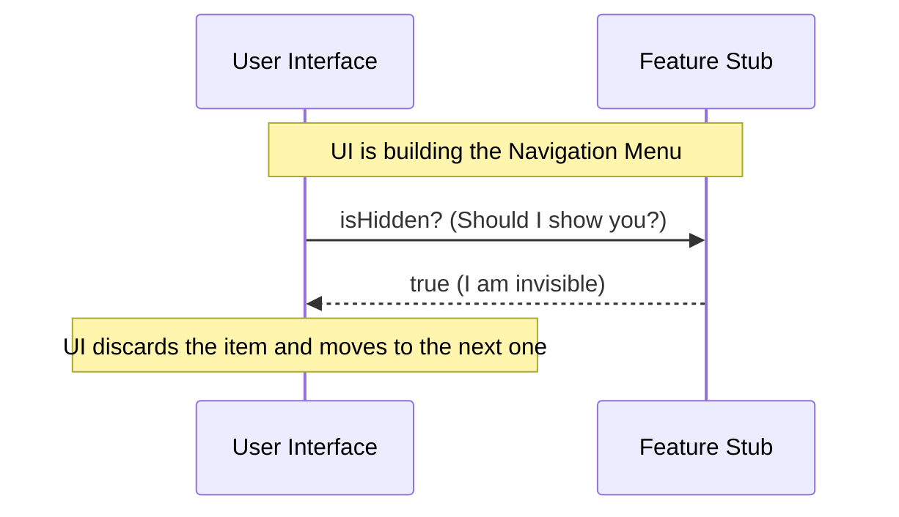

# Chapter 3: Visibility Configuration

Welcome to the third chapter of the **perf-issue** tutorial!

In the previous chapter, [Chapter 2: Feature Toggling Interface](02_feature_toggling_interface.md), we built a "Kill Switch" to prevent our feature's logic from running. We ensured the code is safe.

However, safety is only half the battle. Even if a button doesn't crash the app when clicked, **users shouldn't see the button at all** if the feature isn't ready.

### The Motivation: The "Staff Only" Door

Imagine you are in a restaurant. There is a door leading to the kitchen.
1.  **The Interface (`isEnabled`)**: The door is locked. Customers can't go in.
2.  **The Visibility (`isHidden`)**: If you put a bright neon sign saying "FREE PIZZA" on that locked door, customers will try to open it, get frustrated, and complain.

It is better to make the door look like part of the wall, or put a discreet "Staff Only" sign on it.

**The Use Case:**
You have a feature called `Dark Mode`. The code is disabled because it's buggy.
*   **Without Visibility Configuration:** The "Dark Mode" toggle switch appears in the Settings menu. Users click it, but nothing happens. They think the app is broken.
*   **With Visibility Configuration:** The toggle switch never appears in the menu. The user doesn't even know `Dark Mode` exists yet.

We need a way to tell the UI: "Do not show this."

### The Concept: `isHidden`

The **Visibility Configuration** is a simple property representing the state of concealment.

It allows us to separate **Logic** (does it work?) from **Presentation** (can I see it?).

*   **Logic:** Can I execute this function?
*   **Visuals:** Should I render this button?

### How to Use It

When building your User Interface (like a Menu or a Sidebar), you check this property before drawing the element on the screen.

#### Example: Building a Menu

Imagine your application is deciding which buttons to show on the navigation bar.

```javascript
import feature from './index.js';

// We check: Is this feature hidden?
if (feature.isHidden) {
  // Scenario A: Do nothing.
  console.log("Skipping this item. It is hidden.");
} else {
  // Scenario B: Draw the UI.
  console.log("Render the button!");
}
```

**Output:**
```text
Skipping this item. It is hidden.
```

Because `feature.isHidden` is `true`, the code inside the `else` block is never reached. The button is never drawn. The user experience remains clean and unconfused.

### Under the Hood: Internal Implementation

How does the Stub handle this request?

Think of the feature as a person wearing an **Invisibility Cloak**.
1. The UI looks at the feature.
2. The UI checks the `isHidden` property.
3. If it is `true`, the UI looks right through it effectively ignoring it.

Here is the interaction flow:



#### The Code

Let's look at `index.js` one last time to focus on this specific property.

```javascript
// --- File: index.js ---

export default {
  isEnabled: () => false,

  // This is the Visibility Configuration
  // It is a simple boolean value.
  isHidden: true,

  name: 'stub'
};
```

**Explanation:**

1.  **`isHidden: true`**: This is a direct property, not a function. It is a hardcoded fact about this object.
2.  **Why `true`?**: Since this is a **Stub** (a placeholder for missing features), the default safe assumption is that it should **not** be seen by the public.

By setting this to `true`, we ensure that any feature using this Stub definition will automatically vanish from menus, lists, and search results in the application, without us having to write extra logic in every UI component.

### Summary

You have completed the section on the **Feature Definition Stub**!

In this chapter, you learned about **Visibility Configuration**:
*   **What it is:** The `isHidden` property.
*   **What it solves:** It prevents users from seeing UI elements for features that are disabled or unfinished.
*   **How it works:** It acts as a filter, allowing the UI to skip rendering specific items.

**Recap of the Module:**
1.  We created a **Stub** to exist safely when the real feature is missing ([Chapter 1](01_feature_definition_stub.md)).
2.  We added a **Toggling Interface** (`isEnabled`) to stop logic from running ([Chapter 2](02_feature_toggling_interface.md)).
3.  We added **Visibility Configuration** (`isHidden`) to hide the feature from the user.

You now have a robust, crash-proof placeholder system. Whenever a feature is broken or not yet downloaded, your application will seamlessly swap in this Stub, ensuring safety (it won't run) and cleanliness (it won't show).

---

Generated by [Code IQ](https://github.com/adityasoni99/Code-IQ)