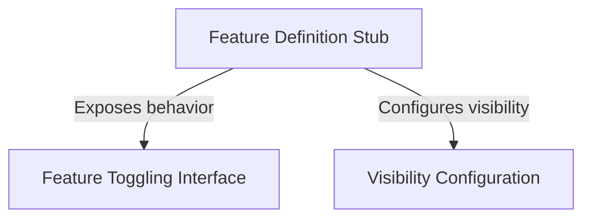

# Tutorial: perf-issue

This project defines a **Feature Definition Stub**, which acts as a safe, placeholder object for application modules that are not yet implemented or active. It utilizes a **Feature Toggling Interface** to ensure the logic is currently *disabled* and applies **Visibility Configuration** to keep the feature **hidden** from the user interface, preventing system crashes or unintended interactions.

## Chapters

1. [Feature Definition Stub](01_feature_definition_stub.md)
2. [Feature Toggling Interface](02_feature_toggling_interface.md)
3. [Visibility Configuration](03_visibility_configuration.md)

---

Generated by [Code IQ](https://github.com/adityasoni99/Code-IQ)