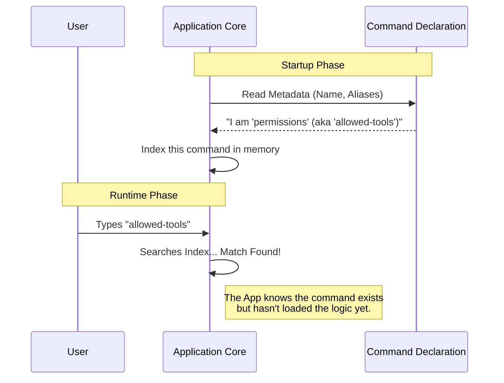

# Chapter 1: Command Declaration

Welcome to the `permissions` project! In this tutorial series, we are going to build a robust system for managing tool permissions.

Before we dive into writing complex logic, we need to introduce our tool to the main application. Imagine walking into a massive library. You don't have to read every single book to find the one you want; you check the catalog first.

The **Command Declaration** is that catalog entry.

## Why do we need this?

### The Problem
Imagine our application has 50 different tools (like a Calculator, a Weather checker, a Permissions manager, etc.). If the application tries to load the code for *all* 50 tools the moment it starts, the startup time would be incredibly slow, and it would use too much memory.

### The Solution
Instead of loading the heavy code immediately, we create a tiny, lightweight file that serves as a **Passport**. It tells the application:
1.  "My name is Permissions."
2.  "I can also be called 'allowed-tools'."
3.  "Here is a short description of what I do."
4.  "If the user actually wants to use me, *here* is where you find my heavy code."

### Central Use Case
We want a user to be able to search for **"allowed-tools"** in the application command bar. The application should instantly recognize this request and know it refers to our `permissions` tool, without having loaded the tool's logic beforehand.

## The Anatomy of a Command

Let's look at the `index.ts` file. This is the entry point for our command. It defines the "Passport" we discussed earlier.

We will break this file down into three simple steps.

### Step 1: Define the Type
First, we import the `Command` type to ensure our code follows the rules expected by the application.

```typescript
// --- File: index.ts ---
import type { Command } from '../../commands.js'
// We import the 'shape' that our command object must fit into.
```

### Step 2: The Passport Object
This is the core of this chapter. We create a simple Javascript object containing metadata.

```typescript
const permissions = {
  type: 'local-jsx',             // How the tool renders (more on this in Chapter 3)
  name: 'permissions',           // Unique ID
  aliases: ['allowed-tools'],    // Other names users might search for
  description: 'Manage allow & deny tool permission rules',
  // ... continued below
```

**Explanation:**
*   **type**: Tells the app how to display the tool.
*   **name**: The official internal name.
*   **aliases**: Nicknames. If a user types "allowed-tools", the app checks this list and finds a match.
*   **description**: A helper text shown in the search results.

### Step 3: The Lazy Loader & Export
Finally, we point to the heavy code and export the object.

```typescript
  // ... continued from above
  load: () => import('./permissions.js'),
} satisfies Command

export default permissions
```

**Explanation:**
*   **load**: This is a function that returns a Promise. It says, "Don't import the file `./permissions.js` yet! Only do it when this function is called." We will explore this deep magic in [Chapter 2: Lazy Module Loading](02_lazy_module_loading.md).
*   **satisfies Command**: A TypeScript check to make sure we didn't forget any required fields.

## Under the Hood: How it Works

When the application starts, it does **not** run the code inside `./permissions.js`. Instead, it only reads this lightweight `index.ts` file.

Here is what happens when a user interacts with the system:



### Internal Code Logic
To better understand how the application uses this declaration, let's look at a simplified version of what the **Application Core** does when it boots up.

The application loops through all available tools and stores their "Passports" in a registry (a simple list).

```typescript
// Simplified Application Core Logic
const commandRegistry = [];

// We import ONLY the declaration (the lightweight passport)
import permissionsDeclaration from './permissions/index.js';

// We register it. Note: We haven't loaded the heavy logic yet!
commandRegistry.push(permissionsDeclaration);
```

Later, when the user searches, the application looks through this `commandRegistry`:

```typescript
function findCommand(userInput) {
  return commandRegistry.find(cmd => 
    cmd.name === userInput || cmd.aliases.includes(userInput)
  );
}

// User types 'allowed-tools'
const match = findCommand('allowed-tools');
// Output: The 'permissions' object we defined earlier.
```

## Summary

In this chapter, we learned how to create a **Command Declaration**.

*   We defined a **"Passport"** (metadata) for our tool.
*   We gave it a name, description, and search aliases.
*   We learned that this approach keeps the application fast by avoiding loading heavy code until it's absolutely necessary.

This declaration points to a `load` function, but we haven't explained how that works yet. How does the application turn that `import` line into running code?

Let's find out in the next chapter: [Lazy Module Loading](02_lazy_module_loading.md).

---

Generated by [Code IQ](https://github.com/adityasoni99/Code-IQ)