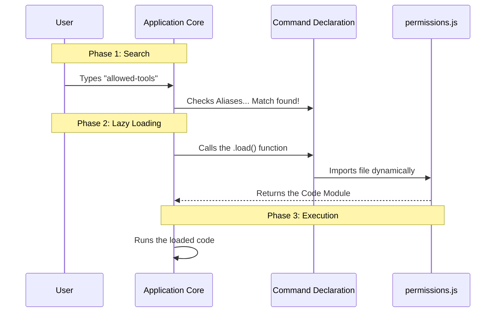

# Chapter 2: Lazy Module Loading

Welcome back! In the previous chapter, [Command Declaration](01_command_declaration.md), we created a "Passport" for our tool. We told the application *who* we are (name, aliases) without dragging along all our heavy luggage (the code logic).

Now, we need to answer the question: **How does the application actually pick up that luggage when it needs it?**

This brings us to **Lazy Module Loading**.

## The Motivation: The Restaurant Menu

To understand this concept, let's look at a central use case: **Optimizing Startup Speed.**

Imagine you go to a restaurant. You sit down and open the menu.
*   **The Menu (Declaration):** Lists "Steak," "Pasta," and "Salad."
*   **The Kitchen (The System):** Does the chef cook *every single dish* on the menu the moment the restaurant opens?

**No.** That would be wasteful, expensive, and the kitchen would be a chaotic mess. Instead, the chef waits. They only cook the steak **after** you specifically order it.

**Lazy Module Loading** works the exact same way:
1.  The Application loads the **Menu** (the `index.ts` from Chapter 1) instantly.
2.  The Application waits.
3.  The Application only loads the heavy **Cooking Instructions** (the logic code) when the user specifically types `allowed-tools`.

## Implementing the "Order" Button

Let's look at the `index.ts` file again. We briefly touched on the `load` property in the last chapter. Now, let's break it down.

### The Code
Here is the specific line that handles the magic:

```typescript
// --- File: index.ts ---
const permissions = {
  // ... name, aliases, etc.
  
  // This is our "Order Button"
  load: () => import('./permissions.js'),
} satisfies Command
```

### Concept 1: The Arrow Function `() =>`
Notice we didn't write `load: import(...)`. We wrote `load: () => import(...)`.

This is a wrapper. It tells the computer: **"Don't do this yet! Keep this instruction in your pocket. Only execute it when I call your function."**

If we removed the `() =>`, the application would load the file immediately at startup, defeating the whole purpose!

### Concept 2: Dynamic Import `import()`
This is a standard JavaScript feature. Unlike static imports (which happen at the top of a file), `import()` loads a file on demand.

*   **Input:** The path to the file (`./permissions.js`).
*   **Output:** It returns a **Promise**.

A **Promise** is like that buzzing pager restaurants give you. It doesn't give you the food immediately; it guarantees that *eventually* the food (code) will be ready.

## The Destination: The Heavy File

So, where does this point to? It points to `./permissions.js`. This is where our actual logic lives.

While we haven't written the complex logic yet, let's create the basic structure so the `load` function has something to grab.

```typescript
// --- File: permissions.js ---
// This is the file that gets loaded "Lazily"

export default function PermissionsTool() {
  console.log("The heavy code is now loaded!");
  return "UI Logic goes here"; 
}
```

**Explanation:**
*   This file is **not** read when the app starts.
*   It is **only** read when the user triggers the `load` function.

## Under the Hood: How it Works

What actually happens inside the Application Core when a user types a command?

### The Flow
Let's visualize the "Restaurant Order" process.



### Internal Code Logic

To truly understand this, let's look at a simplified version of the code running inside the **Application Core** that processes your command.

The core finds your command metadata, sees the `load` function, and executes it using `await`.

```typescript
// --- Application Core Logic ---

async function runCommand(userQuery) {
  // 1. Find the passport (from Chapter 1)
  const cmdDef = registry.find(c => c.aliases.includes(userQuery));

  // 2. COOK THE FOOD! Call the load function and wait
  const loadedModule = await cmdDef.load();

  // 3. Serve the food. Access the 'default' export.
  const toolLogic = loadedModule.default;
  
  // 4. Run the tool
  toolLogic();
}
```

**Explanation:**
1.  **Registry Find:** Matches "allowed-tools" to our `permissions` object.
2.  **`await cmdDef.load()`:** This creates the "pause." The app waits here for a millisecond while the file is fetched from the disk.
3.  **`loadedModule.default`:** This grabs the function we exported in `permissions.js`.

## Summary

In this chapter, we learned about **Lazy Module Loading**.

*   **The Problem:** Loading every tool at startup is slow.
*   **The Solution:** Use `load: () => import(...)` to load code only when requested.
*   **The Mechanism:** The application uses the Declaration to find the tool, then triggers the import to fetch the logic.

Now that the application has successfully loaded our heavy code file (`permissions.js`), we need to decide **what** that code actually does. We want to display an interactive interface to the user.

To do that, we need to learn about rendering. Let's move on to [Chapter 3: Local JSX Command Handler](03_local_jsx_command_handler.md).

---

Generated by [Code IQ](https://github.com/adityasoni99/Code-IQ)