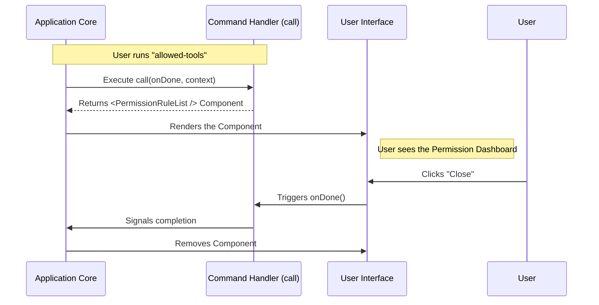

# Chapter 3: Local JSX Command Handler

Welcome back! In [Chapter 2: Lazy Module Loading](02_lazy_module_loading.md), we learned how the application fetches the code for our tool only when needed.

Now that the application has opened the file, it asks: **"Okay, I have the code. What do I *do* with it?"**

This brings us to the **Local JSX Command Handler**.

## The Motivation: From Text to Interface

### The Problem
Traditional command lines are boring. You type text, and you get text back. But for managing complex permissions (like seeing a list of 20 tools and toggling them on/off), text is terrible. You don't want to type `allow tool-A` twenty times.

### The Solution
We want our command to pop up a **Mini-App** (or Widget) right inside the chat interface. We want buttons, lists, and toggles.

### Central Use Case
When the user runs the `permissions` command, instead of printing "Active", we want to **render a React Component** called `PermissionRuleList`. This component will act as a visual dashboard.

## The Anatomy of the Handler

In our file `permissions.tsx`, we export a specific function called `call`. This is the entry point logic.

Let's break down the concepts used in this function.

### Concept 1: The `call` Function
The application looks for a function named `call`. Think of this as the "Run" button.
It must follow the `LocalJSXCommandCall` rule (type), which guarantees it returns a visual element (JSX).

### Concept 2: Lifecycle Hook (`onDone`)
The application passes us a "Remote Control" called `onDone`.
*   **Why?** Our mini-app covers the screen. The application doesn't know when the user is finished.
*   **How?** We attach this to a "Close" or "Exit" button. When clicked, we trigger `onDone`, telling the app, "We are finished here, you can remove this widget."

### Concept 3: The Context (`context`)
The application also passes a toolbox called `context`. This contains tools to talk back to the main app (like sending messages). We will explore this fully in [Chapter 4: Context-Aware Message Handling](04_context_aware_message_handling.md).

## Implementation

Let's write the code for `permissions.tsx`. We will do this in three small steps.

### Step 1: Imports and Types
We import React, our specific UI component (`PermissionRuleList`), and the type definition to ensure we follow the rules.

```typescript
// --- File: permissions.tsx ---
import * as React from 'react';
import { PermissionRuleList } from '../../components/permissions/rules/PermissionRuleList.js';
import type { LocalJSXCommandCall } from '../../types/command.js';
```

### Step 2: Defining the Handler
We define the `call` function. Notice the arguments: `onDone` (our exit switch) and `context` (our toolbox).

```typescript
// We define 'call' using the LocalJSXCommandCall type
export const call: LocalJSXCommandCall = async (onDone, context) => {
  
  // This function is expected to return a Visual Component (JSX)
  // ... see next step
};
```

### Step 3: Rendering the Mini-App
Inside the function, we return the React component. We connect the `onDone` hook to the component's `onExit` prop.

```typescript
  // ... inside the call function
  return (
    <PermissionRuleList
      // When the user clicks "Exit" inside the list, 
      // we trigger the app's 'onDone' hook.
      onExit={onDone}
      
      // We will handle specific logic here later
      onRetryDenials={() => { /* Logic hidden for now */ }}
    />
  );
```

**Explanation:**
When the command runs, it doesn't calculate 2+2. It simply creates and hands over a graphical interface (`<PermissionRuleList />`) to the application.

## Under the Hood: How it Works

How does the application turn this function into pixels on the screen?

### The Flow



### Internal Code Logic
Let's look at a simplified version of the **Application Core** that handles this command.

The core "waits" for the visual component to be returned, and then mounts it to the React tree.

```typescript
// --- Simplified Application Core Logic ---

async function executeCommand(commandModule) {
  // 1. Create a way to close the command
  const onDone = () => {
    removeComponentFromScreen(); // Internal cleanup
  };

  // 2. Run the user's command function
  const VisualComponent = await commandModule.call(onDone, globalContext);

  // 3. Paint it to the screen
  render(VisualComponent);
}
```

**Explanation:**
1.  **`onDone` Creation:** The app prepares the cleanup logic *before* running the command.
2.  **`commandModule.call`:** This is where our code from Step 3 runs. It returns the `<PermissionRuleList />`.
3.  **`render`:** The app takes that JSX and puts it on the DOM so the user can see it.

## Handling Interaction
You might have noticed `onRetryDenials` in the code snippet.

```typescript
  onRetryDenials={commands => {
    context.setMessages(prev => [...prev, createPermissionRetryMessage(commands)]);
  }}
```

This is where our widget talks back to the chat history. If a user tries to fix a permission error, we want to post a message in the chat saying "Retrying...".

To do this, we use the `context` object. But how does that work?

## Summary

In this chapter, we learned about the **Local JSX Command Handler**.

*   **The Concept:** Instead of just running scripts, we return **Interactive UI Components**.
*   **The Hook:** We use `onDone` to tell the application when to close our widget.
*   **The Result:** A rich, graphical user experience inside a command-line tool.

But we glossed over one major detail: **The Context**. How exactly does our command read the state of the application or post new messages to the chat stream?

Let's dive into the final piece of the puzzle in [Chapter 4: Context-Aware Message Handling](04_context_aware_message_handling.md).

---

Generated by [Code IQ](https://github.com/adityasoni99/Code-IQ)