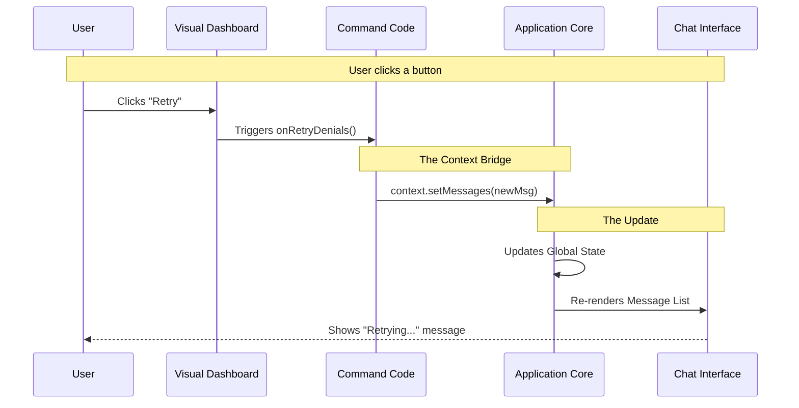

# Chapter 4: Context-Aware Message Handling

Welcome to the final chapter of this tutorial series!

In [Chapter 3: Local JSX Command Handler](03_local_jsx_command_handler.md), we built a beautiful visual dashboard using React. We learned how to render buttons and lists so the user can manage permissions easily.

However, we have a small problem. Our visual dashboard is currently a bit of a loner. It sits on the screen, but when interaction happens (like clicking a button), the main chat history doesn't know about it.

This brings us to **Context-Aware Message Handling**.

## The Motivation: The Court Stenographer

### The Problem
Imagine you are in a courtroom. The Judge and the Lawyers are having a sidebar conference (a private conversation). They agree on a decision. However, if the **Court Stenographer** doesn't type that decision into the official transcript, legally, it never happened.

In our app:
1.  **The Judge/Lawyers:** This is the User interacting with your UI (clicking "Retry Permission").
2.  **The Transcript:** This is the main Chat History stream.

If the user clicks "Retry," the action might happen, but the Chat History stays silent. The user is left wondering, "Did it work? Did the system record my request?"

### The Solution
We need a way for our visual interface to shout back to the main application: **"Write this down in the official record!"**

We achieve this using the `context` object. It acts as our connection to the "Stenographer."

### Central Use Case
When a user clicks the **"Retry"** button on a denied permission, we want to immediately insert a new message into the chat stream saying: *"Retrying permissions for tool: [Tool Name]..."*

## Key Concepts

To solve this, we need to understand three simple concepts regarding the `context` object.

### Concept 1: The Context Toolbox
Remember the `call` function from the last chapter?

```typescript
export const call: LocalJSXCommandCall = async (onDone, context) => { ... }
```

The `context` argument is a toolbox passed down from the Application Core. It contains specific tools that allow your isolated command to touch the rest of the app.

### Concept 2: `setMessages`
Inside the toolbox is a very powerful tool called `setMessages`.
If you know React, this is exactly like a state setter. It allows us to update the list of messages currently visible on the screen.

### Concept 3: Immutability (The History Book)
When we add a message, we don't erase the past. We take the *existing* history and add one line to the end.
*   **Don't do this:** "Erase history and write 'Retry'."
*   **Do this:** "Take previous history + 'Retry'."

## Implementation

Let's look at `permissions.tsx` again. We are going to wire up the "Retry" logic to the chat history.

### Step 1: The Setup
We need to access the `context` inside our handler.

```typescript
// --- File: permissions.tsx ---
import { createPermissionRetryMessage } from '../../utils/messages.js';

// We receive 'context' as the second argument
export const call: LocalJSXCommandCall = async (onDone, context) => {
  
  // ... rendering logic below
```

**Explanation:**
We import a helper (`createPermissionRetryMessage`) that generates the text we want to show. We also ensure we capture `context` in our function arguments.

### Step 2: Wiring the Button
Now, inside our JSX return statement, we handle the event.

```typescript
  return (
    <PermissionRuleList
      onExit={onDone}
      // Here is the feedback loop:
      onRetryDenials={(commands) => {
        const newMessage = createPermissionRetryMessage(commands);
        
        // Use context to update the chat
        context.setMessages(prev => [...prev, newMessage]);
      }}
    />
  );
};
```

**Explanation:**
1.  **`onRetryDenials`**: This triggers when the user clicks the button in the UI.
2.  **`createPermissionRetryMessage`**: Creates a message object (like `{ role: 'user', content: 'Retrying...' }`).
3.  **`context.setMessages`**: This is the magic.
    *   `prev`: Represents the current list of messages.
    *   `[...prev, newMessage]`: We copy the old list and tack the new message onto the end.

## Under the Hood: How it Works

What happens precisely when that line of code runs?

### The Flow
Let's visualize the "Stenographer" loop.



### Internal Code Logic
To truly understand the "Context", let's imagine what the **Application Core** looks like where this `context` is created.

The Application Core basically holds the "Master State" of the conversation.

```typescript
// --- Simplified Application Core ---

function App() {
  // 1. The Master List of all messages in the chat
  const [messages, setMessages] = useState([]);

  // 2. We package the setter into a toolbox
  const context = {
    setMessages: setMessages,
    // other tools...
  };

  // 3. We pass this toolbox to your command
  return <CommandRunner context={context} />;
}
```

**Explanation:**
1.  The App uses React's `useState` to keep track of the conversation.
2.  It passes the `setMessages` function *down* into your command via the `context` object.
3.  When you call `context.setMessages` in your file, you are actually triggering a state update in the main `App` component! This causes the entire chat window to refresh with the new data.

## Summary

In this chapter, we learned about **Context-Aware Message Handling**.

*   **The Problem:** The UI was isolated from the Chat History.
*   **The Solution:** We used the **Context Object** to bridge the gap.
*   **The Mechanism:** We used `context.setMessages` to inject new events into the official "Transcript" of the application, ensuring the user gets immediate feedback in the chat stream.

### Series Conclusion

Congratulations! You have completed the **Permissions Project Tutorial**.

Let's recap your journey:
1.  **[Command Declaration](01_command_declaration.md):** You created a "Passport" so the app knows who you are.
2.  **[Lazy Module Loading](02_lazy_module_loading.md):** You optimized performance by only loading code when the user asks for it.
3.  **[Local JSX Command Handler](03_local_jsx_command_handler.md):** You built a rich, interactive visual interface instead of just outputting text.
4.  **[Context-Aware Message Handling](04_context_aware_message_handling.md):** You connected that interface back to the main chat history, creating a seamless loop of interaction.

You now possess the knowledge to build powerful, efficient, and interactive tools for this system. Happy coding!

---

Generated by [Code IQ](https://github.com/adityasoni99/Code-IQ)