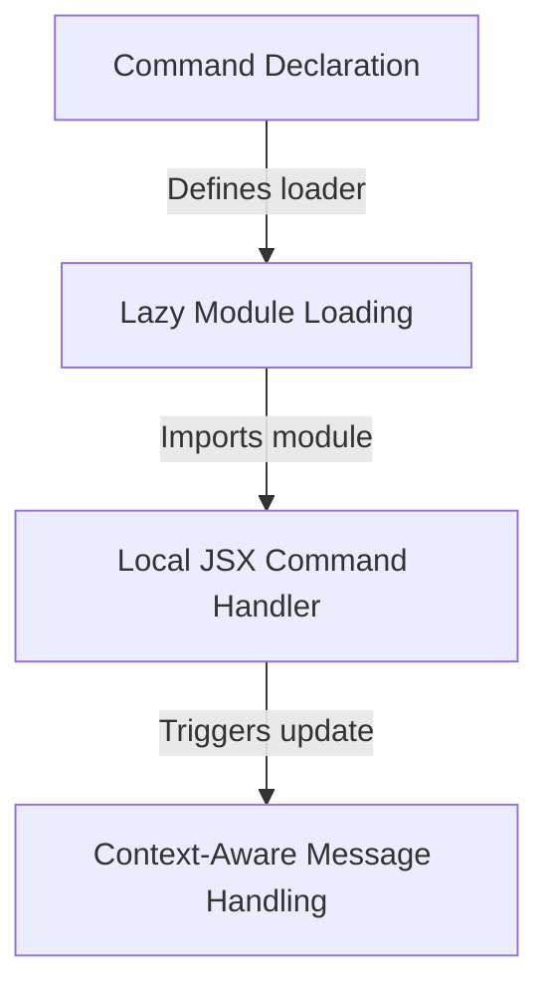

# Tutorial: permissions

This project implements a **permissions management** tool that allows users to view and modify allow/deny rules for application tools via a *visual interface*. To ensure high performance, it utilizes **lazy loading** to fetch the necessary code only when the command is activated, rather than at startup. It also features logic to update the conversation history based on user actions within the permissions UI.

## Chapters

1. [Command Declaration](01_command_declaration.md)
2. [Lazy Module Loading](02_lazy_module_loading.md)
3. [Local JSX Command Handler](03_local_jsx_command_handler.md)
4. [Context-Aware Message Handling](04_context_aware_message_handling.md)

---

Generated by [Code IQ](https://github.com/adityasoni99/Code-IQ)